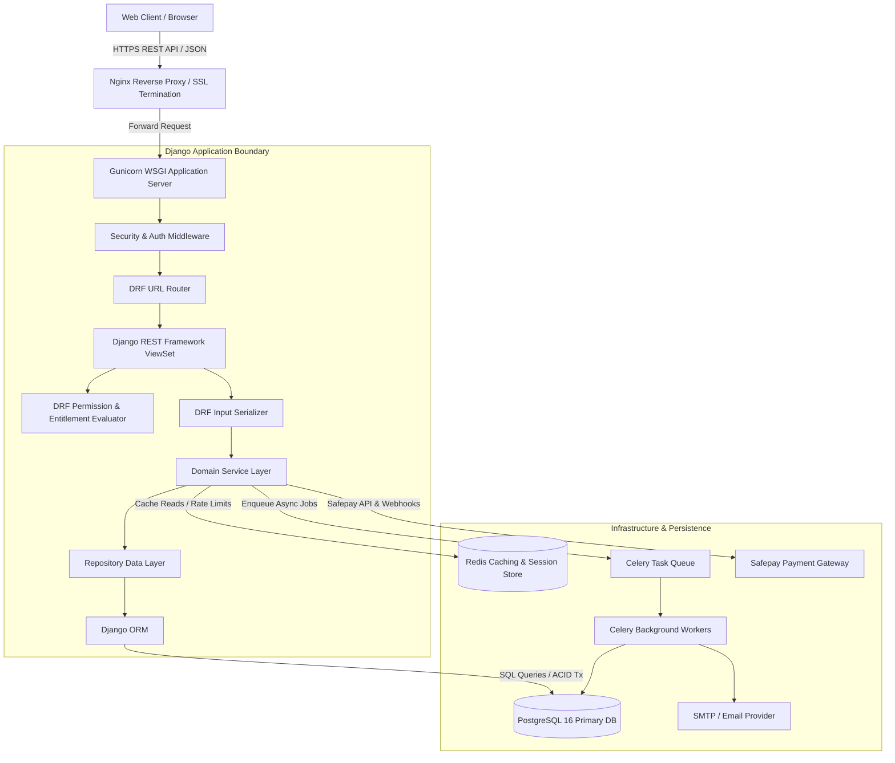
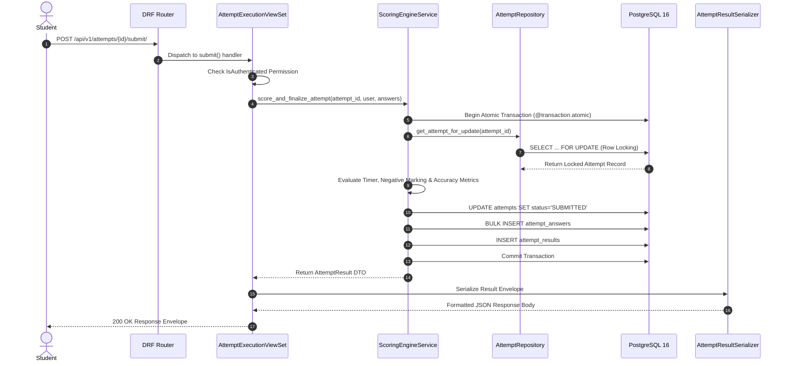
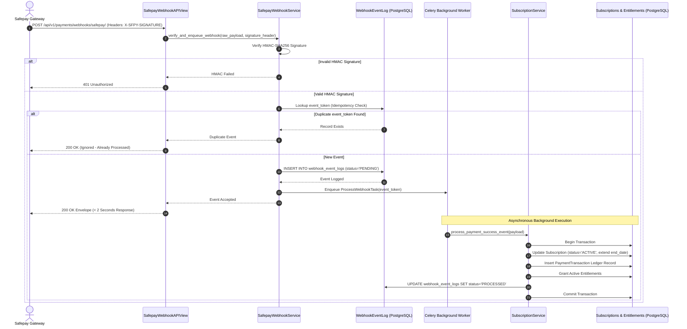

# Prepora Backend Architecture & Project Structure Blueprint

> **Document Status:** Official Architectural & Directory Blueprint  
> **Target Framework:** Django 5.x / Django REST Framework (DRF) 3.15+  
> **Database:** PostgreSQL 16+  
> **Author:** Principal Django Software Architect & Senior Backend Engineer  
> **Single Source of Truth:** [PROJECT_PLAN.md](file:///d:/Prepora/docs/PROJECT_PLAN.md), [DATABASE_PLAN.md](file:///d:/Prepora/docs/DATABASE_PLAN.md), [DOMAIN_MODEL.md](file:///d:/Prepora/docs/DOMAIN_MODEL.md), [BUSINESS_WORKFLOWS.md](file:///d:/Prepora/docs/BUSINESS_WORKFLOWS.md), [ER_DIAGRAM.md](file:///d:/Prepora/docs/ER_DIAGRAM.md), [POSTGRESQL_SCHEMA.md](file:///d:/Prepora/docs/POSTGRESQL_SCHEMA.md), [API_DESIGN.md](file:///d:/Prepora/docs/API_DESIGN.md)

---

## 1. Backend Architecture Overview

### 1.1 Architectural Style: Clean Modular Monolith
Prepora's backend architecture is engineered as a **Clean Modular Monolith**. This pattern combines high developer velocity and deployment simplicity with strict internal domain boundaries. Each business context is encapsulated inside a dedicated Django app, communicating with other modules through explicit Service layer contracts rather than direct, cross-domain model mutations or implicit side-effects.

The architecture strictly adheres to **Clean Architecture** and **Domain-Driven Design (DDD)** principles:
* **Separation of Concerns:** Presentation (Views/Serializers), Domain Business Logic (Services), Data Access (Repositories), and Persistence (Models/PostgreSQL) are decoupled into distinct software layers.
* **Database as Single Source of Truth:** PostgreSQL 16 enforces structural integrity via foreign keys, non-null constraints, unique indices, and ACID transactional boundaries.
* **Decoupled Monetization:** Feature access is evaluated through dynamic entitlement capabilities derived from subscription rules (`User -> Subscription -> Entitlements -> Feature Access`), avoiding hardcoded `is_premium` database flags.

---

### 1.2 Multi-App Domain Breakdown Rationale
Dividing the Django backend into specialized domain apps serves critical structural objectives:
1. **Low Coupling & High Cohesion:** Keeps model definitions, business rules, and API endpoints grouped by business context (e.g., `assessments` vs. `subscriptions`).
2. **Independent Testability:** Enables isolated unit testing of services, repositories, and serializers without cross-app setup overhead.
3. **Team Scalability:** Prevents merge conflicts by allowing multiple engineers to work simultaneously across distinct app directories.
4. **Microservice Readiness:** Provides clear, self-contained domain boundaries that can be easily extracted into independent microservices if traffic requirements demand it in the future.

---

### 1.3 Communication Flow Between Component Layers

```
                                  HTTP REQUEST
                                       │
                                       ▼
                     ┌───────────────────────────────────┐
                     │   Django URL Dispatcher & Router  │
                     └─────────────────┬─────────────────┘
                                       │
                                       ▼
                     ┌───────────────────────────────────┐
                     │  Authentication & DRF Permissions │ (JWT, Roles, Entitlements)
                     └─────────────────┬─────────────────┘
                                       │
                                       ▼
                     ┌───────────────────────────────────┐
                     │      DRF Views / ViewSets         │ (Thin HTTP Handler)
                     └─────────────────┬─────────────────┘
                                       │
                                       ▼
                     ┌───────────────────────────────────┐
                     │   DRF Serializers / DTO Layer     │ (Input Validation / Formatting)
                     └─────────────────┬─────────────────┘
                                       │
                                       ▼
                     ┌───────────────────────────────────┐
                     │          Service Layer            │ (Business Logic & Transactions)
                     └────────┬─────────────────┬────────┘
                              │                 │
                   ┌──────────┘                 └──────────┐
                   ▼                                       ▼
     ┌──────────────────────────┐             ┌──────────────────────────┐
     │     Repository Layer     │             │ External Services/Adapters│ (Safepay, Email, CDN)
     └─────────────┬────────────┘             └──────────────────────────┘
                   │
                   ▼
     ┌──────────────────────────┐
     │    Django Models / ORM   │
     └─────────────┬────────────┘
                   │
                   ▼
     ┌──────────────────────────┐
     │   PostgreSQL 16 Engine   │ (Single Source of Truth)
     └──────────────────────────┘
```

#### Detailed Layer Responsibilities:
1. **Views / ViewSets (`views.py`):** Thin HTTP handlers. Receive HTTP requests, extract parameters, trigger DRF permission classes, delegate workflow execution to the Service layer, and pass output DTOs to Serializers for response rendering. Views contain zero SQL, scoring algorithms, or business rules.
2. **Serializers (`serializers.py`):** Validate incoming HTTP request payloads and convert complex domain DTOs into standardized JSON output envelopes (supporting success, paginated, and RFC 7807 error formats).
3. **Services (`services.py`):** Pure Python business logic orchestrators. Enforce domain rules, execute scoring, validate state transitions, manage atomic database transactions (`@transaction.atomic`), trigger cache invalidation, and enqueue background Celery jobs.
4. **Repositories (`repositories.py`):** Encapsulate Django ORM query logic. Responsible for raw data retrieval, filtering, annotations, aggregations, `.select_related()`, and `.prefetch_related()` optimizations.
5. **Models (`models.py`):** Declarative Django ORM entities mapping 1:1 to PostgreSQL tables. Contain table schemas, column data types, foreign key constraints, indexes, and custom table options.
6. **Permissions (`permissions.py`):** Custom DRF permission classes verifying user JWT claims, system roles (`RoleCodeEnum`), and explicit entitlement codes before reaching view execution.
7. **Authentication:** Decoupled JWT handler via `djangorestframework-simplejwt`. Validates short-lived HMAC Bearer tokens (15-minute expiry) and manages session refresh token rotation (7-day expiry).
8. **Database:** PostgreSQL 16 database executing ACID transactions, enforcing referential integrity, and persisting all domain state.

---

### 1.4 High-Level System Architecture Diagram



---

## 2. Complete Django Project Folder Structure

Below is the complete, expanded production directory layout for Prepora. Every folder and critical module file is explicitly demarcated.

```text
backend/
├── manage.py
├── gunicorn.conf.py
├── Dockerfile
├── docker-compose.yml
├── docker-compose.prod.yml
├── .env.example
├── .gitignore
├── README.md
├── config/
│   ├── __init__.py
│   ├── asgi.py
│   ├── wsgi.py
│   ├── urls.py
│   ├── celery.py
│   └── settings/
│       ├── __init__.py
│       ├── base.py
│       ├── development.py
│       ├── production.py
│       └── testing.py
├── apps/
│   ├── __init__.py
│   ├── common/
│   │   ├── __init__.py
│   │   ├── admin.py
│   │   ├── apps.py
│   │   ├── models.py
│   │   ├── permissions.py
│   │   ├── exceptions.py
│   │   ├── validators.py
│   │   ├── constants.py
│   │   ├── utils.py
│   │   ├── pagination.py
│   │   ├── filters.py
│   │   ├── renderers.py
│   │   ├── serializers.py
│   │   └── viewsets.py
│   ├── accounts/
│   │   ├── __init__.py
│   │   ├── admin.py
│   │   ├── apps.py
│   │   ├── models.py
│   │   ├── serializers.py
│   │   ├── views.py
│   │   ├── services.py
│   │   ├── repositories.py
│   │   ├── permissions.py
│   │   ├── urls.py
│   │   ├── signals.py
│   │   ├── management/
│   │   │   └── commands/
│   │   │       ├── seed_roles.py
│   │   │       └── create_superadmin.py
│   │   └── tests/
│   │       ├── __init__.py
│   │       ├── test_models.py
│   │       ├── test_services.py
│   │       └── test_views.py
│   ├── exams/
│   │   ├── __init__.py
│   │   ├── admin.py
│   │   ├── apps.py
│   │   ├── models.py
│   │   ├── serializers.py
│   │   ├── views.py
│   │   ├── services.py
│   │   ├── repositories.py
│   │   ├── permissions.py
│   │   ├── urls.py
│   │   ├── signals.py
│   │   └── tests/
│   │       ├── test_services.py
│   │       └── test_views.py
│   ├── questions/
│   │   ├── __init__.py
│   │   ├── admin.py
│   │   ├── apps.py
│   │   ├── models.py
│   │   ├── serializers.py
│   │   ├── views.py
│   │   ├── services.py
│   │   ├── repositories.py
│   │   ├── permissions.py
│   │   ├── urls.py
│   │   ├── signals.py
│   │   └── tests/
│   │       ├── test_governance.py
│   │       └── test_views.py
│   ├── notes/
│   │   ├── __init__.py
│   │   ├── admin.py
│   │   ├── apps.py
│   │   ├── models.py
│   │   ├── serializers.py
│   │   ├── views.py
│   │   ├── services.py
│   │   ├── repositories.py
│   │   ├── permissions.py
│   │   ├── urls.py
│   │   └── tests/
│   │       └── test_views.py
│   ├── bookmarks/
│   │   ├── __init__.py
│   │   ├── admin.py
│   │   ├── apps.py
│   │   ├── models.py
│   │   ├── serializers.py
│   │   ├── views.py
│   │   ├── services.py
│   │   ├── repositories.py
│   │   ├── urls.py
│   │   └── tests/
│   │       └── test_views.py
│   ├── mock_tests/
│   │   ├── __init__.py
│   │   ├── admin.py
│   │   ├── apps.py
│   │   ├── models.py
│   │   ├── serializers.py
│   │   ├── views.py
│   │   ├── services.py
│   │   ├── repositories.py
│   │   ├── permissions.py
│   │   ├── urls.py
│   │   └── tests/
│   │       └── test_views.py
│   ├── attempts/
│   │   ├── __init__.py
│   │   ├── admin.py
│   │   ├── apps.py
│   │   ├── models.py
│   │   ├── serializers.py
│   │   ├── views.py
│   │   ├── services.py
│   │   ├── repositories.py
│   │   ├── permissions.py
│   │   ├── urls.py
│   │   ├── tasks.py
│   │   └── tests/
│   │       ├── test_scoring.py
│   │       └── test_views.py
│   ├── analytics/
│   │   ├── __init__.py
│   │   ├── admin.py
│   │   ├── apps.py
│   │   ├── models.py
│   │   ├── serializers.py
│   │   ├── views.py
│   │   ├── services.py
│   │   ├── repositories.py
│   │   ├── urls.py
│   │   └── tasks.py
│   ├── subscriptions/
│   │   ├── __init__.py
│   │   ├── admin.py
│   │   ├── apps.py
│   │   ├── models.py
│   │   ├── serializers.py
│   │   ├── views.py
│   │   ├── services.py
│   │   ├── repositories.py
│   │   ├── permissions.py
│   │   ├── urls.py
│   │   ├── tasks.py
│   │   └── tests/
│   │       └── test_entitlements.py
│   ├── payments/
│   │   ├── __init__.py
│   │   ├── admin.py
│   │   ├── apps.py
│   │   ├── models.py
│   │   ├── serializers.py
│   │   ├── views.py
│   │   ├── services.py
│   │   ├── repositories.py
│   │   ├── adapters/
│   │   │   ├── __init__.py
│   │   │   ├── base.py
│   │   │   └── safepay.py
│   │   ├── urls.py
│   │   ├── tasks.py
│   │   └── tests/
│   │       └── test_webhooks.py
│   └── notifications/
│       ├── __init__.py
│       ├── admin.py
│       ├── apps.py
│       ├── models.py
│       ├── serializers.py
│       ├── views.py
│       ├── services.py
│       ├── repositories.py
│       ├── urls.py
│       └── tasks.py
├── requirements/
│   ├── base.txt
│   ├── development.txt
│   ├── production.txt
│   └── testing.txt
├── scripts/
│   ├── entrypoint.sh
│   ├── start_gunicorn.sh
│   ├── start_celery.sh
│   └── run_migrations.sh
├── tests/
│   ├── __init__.py
│   ├── conftest.py
│   ├── factories/
│   │   ├── __init__.py
│   │   ├── account_factories.py
│   │   ├── exam_factories.py
│   │   ├── question_factories.py
│   │   ├── mock_test_factories.py
│   │   └── subscription_factories.py
│   └── integration/
│       ├── test_auth_flow.py
│       ├── test_assessment_flow.py
│       └── test_safepay_webhook_flow.py
├── media/
├── static/
├── logs/
└── docs/
```

---

## 3. Django Apps Specification

### 3.1 Overview of Core Apps
The Prepora backend comprises 12 domain apps plus 1 common shared utility app:

| App Name | Primary Domain Responsibility | Key Models |
| :--- | :--- | :--- |
| **`accounts`** | Authentication, JWT sessions, profiles, RBAC roles & permissions | `User`, `UserProfile`, `Role`, `Permission`, `UserRole`, `RefreshToken` |
| **`exams`** | Hierarchical exam taxonomy & syllabus categorization | `ExamTrack`, `Exam`, `Subject`, `Topic` |
| **`questions`** | MCQ authoring, option sets, explanations, version history, quality reporting | `Question`, `QuestionOption`, `QuestionExplanation`, `QuestionVersion`, `QuestionSource`, `QuestionReport` |
| **`notes`** | Academic revision study material (Markdown & PDF resources) | `Note` |
| **`bookmarks`** | Student saved revision list for items across the platform | `Bookmark` |
| **`mock_tests`** | Mock test templates, section timing, and item positioning | `MockTest`, `MockTestQuestion` |
| **`attempts`** | Live test execution engine, answer logging, server-side scoring | `Attempt`, `AttemptAnswer`, `AttemptResult` |
| **`analytics`** | Aggregated learner progress metrics and weak-topic diagnostics | `StudentProgress`, `WeakTopic` |
| **`subscriptions`**| Commercial plans, entitlement policies, subscription lifecycles | `SubscriptionPlan`, `Entitlement`, `PlanEntitlement`, `Subscription` |
| **`payments`** | Immutable transaction ledger & Safepay webhook integration | `PaymentTransaction`, `WebhookEventLog` |
| **`notifications`**| In-app user notifications and system announcements | `Notification`, `Announcement` |
| **`common`** | Shared base models, exception handlers, pagination, response renderers | N/A (Abstract base classes & utilities) |

---

### 3.2 Detailed App Blueprint

#### 1. `accounts`
* **Purpose:** Identity management, JWT authentication, user profile maintenance, and Role-Based Access Control (RBAC).
* **Responsibilities:** Registration, authentication, token refresh, password resets, profile updates, role assignment, and audit log generation.
* **Models:** `User`, `UserProfile`, `Role`, `Permission`, `UserRole`, `RefreshToken`, `AuditLog`.
* **Serializers:** `UserRegisterSerializer`, `UserLoginSerializer`, `TokenRefreshSerializer`, `UserProfileSerializer`, `ChangePasswordSerializer`, `UserRoleAssignSerializer`.
* **Views:** `RegisterAPIView`, `LoginAPIView`, `LogoutAPIView`, `TokenRefreshAPIView`, `UserProfileViewSet`, `UserRoleAdminViewSet`.
* **Services:** `AuthService`, `UserService`, `RBACService`.
* **Permissions:** `IsAuthenticated`, `HasRole(['ADMIN', 'SUPERADMIN'])`.
* **URLs:** `/api/v1/auth/register/`, `/api/v1/auth/login/`, `/api/v1/auth/refresh/`, `/api/v1/users/me/profile/`, `/api/v1/admin/rbac/user-roles/`.
* **Signals:** `post_save` on `User` to auto-create `UserProfile` and bind default `FREE` plan subscription.
* **Admin:** Registered custom `UserAdmin` with search, filter by role, and inline profile editor.
* **Tests:** Registration validation, JWT issuance, password hashing checks, RBAC role assignment tests.
* **Management Commands:** `seed_roles` (populates standard system roles & permissions), `create_superadmin`.

#### 2. `exams`
* **Purpose:** Serves the core exam hierarchy (`ExamTrack -> Exam -> Subject -> Topic`).
* **Responsibilities:** Exposing public taxonomy catalogs, managing syllabus structures, filtering content branches.
* **Models:** `ExamTrack`, `Exam`, `Subject`, `Topic`.
* **Serializers:** `ExamTrackSerializer`, `ExamSerializer`, `SubjectSerializer`, `TopicSerializer`.
* **Views:** `ExamTrackViewSet`, `ExamViewSet`, `SubjectViewSet`, `TopicViewSet`.
* **Services:** `TaxonomyService`.
* **Permissions:** Public read (`AllowAny`), Admin write (`HasRole(['ADMIN', 'SUPERADMIN'])`).
* **URLs:** `/api/v1/exam-tracks/`, `/api/v1/exams/`, `/api/v1/subjects/`, `/api/v1/topics/`.
* **Signals:** Invalidate Redis taxonomy cache key on `post_save`/`post_delete`.
* **Admin:** Tree-view admin interfaces with ordering controls.
* **Tests:** Taxonomy hierarchy listing, slug lookup tests, cache invalidation tests.
* **Management Commands:** `seed_taxonomy` (populates military exam tracks: Army, Air Force, Navy, FPSC).

#### 3. `questions`
* **Purpose:** Item bank management and content quality governance.
* **Responsibilities:** Authoring stems, distractor options, explanations, tracking editorial status state machine (`DRAFT -> IN_REVIEW -> APPROVED -> PUBLISHED`), version snapshots, handling student question reports.
* **Models:** `Question`, `QuestionOption`, `QuestionExplanation`, `QuestionVersion`, `QuestionSource`, `QuestionReport`.
* **Serializers:** `QuestionStudentSerializer` (strips correct answer key), `QuestionAdminSerializer`, `QuestionOptionSerializer`, `QuestionExplanationSerializer`, `QuestionReportSerializer`.
* **Views:** `QuestionViewSet`, `QuestionGovernanceViewSet`, `QuestionReportViewSet`.
* **Services:** `QuestionService`, `QuestionGovernanceService`.
* **Permissions:** `IsAuthenticated`, `HasRole(['CONTENT_EDITOR', 'SME', 'ADMIN'])`.
* **URLs:** `/api/v1/questions/`, `/api/v1/questions/{id}/submit-review/`, `/api/v1/questions/{id}/publish/`, `/api/v1/question-reports/`.
* **Signals:** Auto-create `QuestionVersion` snapshot when a `PUBLISHED` question is modified.
* **Admin:** Custom Question editor with inline choices, correct marker highlights, and status transition actions.
* **Tests:** Status workflow transitions, correct answer key stripping in student views, versioning creation on edit.
* **Management Commands:** `bulk_import_questions` (imports curated CSV/JSON question banks).

#### 4. `notes`
* **Purpose:** Academic study guides and PDF revision materials.
* **Responsibilities:** Delivering Markdown content and presigned CDN PDF URLs for topic-wise study.
* **Models:** `Note`.
* **Serializers:** `NoteListSerializer`, `NoteDetailSerializer`.
* **Views:** `NoteViewSet`.
* **Services:** `NoteService`.
* **Permissions:** `IsAuthenticated`, `HasEntitlement('access:pdf_notes')`.
* **URLs:** `/api/v1/notes/`, `/api/v1/notes/{slug}/`.
* **Signals:** Cache purge on note publish.
* **Admin:** Markdown editor view with topic selectors and premium flags.
* **Tests:** Entitlement enforcement on premium notes, markdown sanitization checks.
* **Management Commands:** None.

#### 5. `bookmarks`
* **Purpose:** Personal bookmarking engine for revision.
* **Responsibilities:** Saving and removing questions, notes, or mock tests to a user's revision drawer.
* **Models:** `Bookmark`.
* **Serializers:** `BookmarkSerializer`, `BookmarkCreateSerializer`.
* **Views:** `BookmarkViewSet`.
* **Services:** `BookmarkService`.
* **Permissions:** `IsAuthenticated` (Owner only).
* **URLs:** `/api/v1/bookmarks/`, `/api/v1/bookmarks/{id}/`.
* **Signals:** None.
* **Admin:** Standard Bookmark admin with user filtering.
* **Tests:** Uniqueness constraints (duplicate bookmark prevention), owner-only deletion.
* **Management Commands:** None.

#### 6. `mock_tests`
* **Purpose:** Mock exam blueprint definition.
* **Responsibilities:** Configuring timed exam templates, total marks, passing thresholds, negative marking factors, and question order sequences.
* **Models:** `MockTest`, `MockTestQuestion`.
* **Serializers:** `MockTestListSerializer`, `MockTestDetailSerializer`, `MockTestQuestionSerializer`.
* **Views:** `MockTestViewSet`.
* **Services:** `MockTestService`.
* **Permissions:** `IsAuthenticated`, `HasEntitlement('access:premium_mock_tests')`.
* **URLs:** `/api/v1/mock-tests/`, `/api/v1/mock-tests/{slug}/`.
* **Signals:** None.
* **Admin:** Mock test inline question selector with total marks auto-calculation.
* **Tests:** Entitlement gate for premium tests, question sequence ordering.
* **Management Commands:** None.

#### 7. `attempts`
* **Purpose:** Real-time test execution engine.
* **Responsibilities:** Managing test sessions, enforcing server-side timers, logging responses, executing server-side scoring (positive marks + negative marking), creating scored `AttemptResult` records.
* **Models:** `Attempt`, `AttemptAnswer`, `AttemptResult`.
* **Serializers:** `AttemptStartSerializer`, `AttemptProgressSerializer`, `AttemptSubmitSerializer`, `AttemptResultSerializer`.
* **Views:** `AttemptExecutionViewSet`, `AttemptResultViewSet`.
* **Services:** `AttemptExecutionService`, `ScoringEngineService`.
* **Permissions:** `IsAuthenticated` (Owner only).
* **URLs:** `/api/v1/mock-tests/{id}/start/`, `/api/v1/attempts/{id}/save-progress/`, `/api/v1/attempts/{id}/submit/`, `/api/v1/results/{id}/`.
* **Signals:** `post_save` on `AttemptResult` enqueues Celery task for progress aggregation.
* **Admin:** Read-only attempt log inspector.
* **Tests:** Server-side timer calculation, negative marking correctness, idempotency on duplicate submit.
* **Management Commands:** `clean_expired_attempts` (auto-finalizes stale `IN_PROGRESS` attempts).

#### 8. `analytics`
* **Purpose:** Performance analytics and weak-topic diagnostics.
* **Responsibilities:** Calculating overall user accuracy, time spent, study streaks, and identifying target concepts requiring remediation.
* **Models:** `StudentProgress`, `WeakTopic`.
* **Serializers:** `StudentProgressSummarySerializer`, `WeakTopicSerializer`.
* **Views:** `AnalyticsViewSet`, `WeakTopicViewSet`.
* **Services:** `AnalyticsService`, `DiagnosticEngineService`.
* **Permissions:** `IsAuthenticated` (Owner only).
* **URLs:** `/api/v1/progress/summary/`, `/api/v1/progress/topics/`, `/api/v1/weak-topics/`.
* **Signals:** None.
* **Admin:** Read-only aggregate stats viewer.
* **Tests:** Accuracy calculation formulas, weak-topic threshold triggers.
* **Management Commands:** `recalculate_user_analytics` (re-indexes historical scores).

#### 9. `subscriptions`
* **Purpose:** Monetization catalog and subscription engine.
* **Responsibilities:** Pricing plans (Free vs. Premium Monthly at Rs. 499 PKR), entitlement capabilities (`access:unlimited_mcqs`, `access:premium_mock_tests`, `access:pdf_notes`), contract state machine (`PENDING -> ACTIVE -> PAST_DUE -> CANCELED -> EXPIRED`).
* **Models:** `SubscriptionPlan`, `Entitlement`, `PlanEntitlement`, `Subscription`.
* **Serializers:** `SubscriptionPlanSerializer`, `SubscriptionSerializer`, `EntitlementSerializer`.
* **Views:** `SubscriptionPlanViewSet`, `SubscriptionViewSet`.
* **Services:** `SubscriptionService`, `EntitlementEngineService`.
* **Permissions:** Public plan browsing; `IsAuthenticated` for subscription status.
* **URLs:** `/api/v1/subscription-plans/`, `/api/v1/subscriptions/me/`, `/api/v1/subscriptions/cancel/`.
* **Signals:** Entitlement cache flush on subscription state transition.
* **Admin:** Plan entitlement matrix manager and subscription override tool.
* **Tests:** Subscription state machine transitions, grace period calculation, entitlement resolution.
* **Management Commands:** `seed_subscription_plans` (seeds standard Free & Premium plans and entitlement mappings).

#### 10. `payments`
* **Purpose:** Financial ledger and gateway integrations.
* **Responsibilities:** Safepay checkout URL generation, HMAC-SHA256 signature verification, raw event logging (`WebhookEventLog`), idempotent webhook processing (`event_token`), transaction history.
* **Models:** `PaymentTransaction`, `WebhookEventLog`.
* **Serializers:** `CheckoutInitSerializer`, `PaymentTransactionSerializer`, `SafepayWebhookPayloadSerializer`.
* **Views:** `PaymentCheckoutViewSet`, `PaymentHistoryViewSet`, `SafepayWebhookAPIView`.
* **Services:** `PaymentService`, `SafepayWebhookService`.
* **Adapters:** `SafepayAdapter` (encapsulates Safepay REST API & HMAC calls).
* **Permissions:** `IsAuthenticated` for checkout/history; Public HTTP for Webhooks (HMAC verified).
* **URLs:** `/api/v1/subscriptions/checkout/`, `/api/v1/payments/history/`, `/api/v1/payments/webhooks/safepay/`.
* **Signals:** None.
* **Admin:** Immutable transaction ledger & raw webhook event payload inspector.
* **Tests:** Safepay HMAC signature validation, idempotency key duplicate rejection, checkout payload generation.
* **Management Commands:** None.

#### 11. `notifications`
* **Purpose:** Learner messaging and communication feed.
* **Responsibilities:** In-app notification alerts (mock test score ready, subscription expiration warning) and system announcements.
* **Models:** `Notification`, `Announcement`.
* **Serializers:** `NotificationSerializer`, `AnnouncementSerializer`.
* **Views:** `NotificationViewSet`, `AnnouncementViewSet`.
* **Services:** `NotificationService`.
* **Permissions:** `IsAuthenticated` (Owner only).
* **URLs:** `/api/v1/notifications/`, `/api/v1/notifications/{id}/read/`.
* **Signals:** None.
* **Admin:** Broadcast announcement publisher.
* **Tests:** Unread badge count calculation, read state update.
* **Management Commands:** `send_expiration_reminders` (enqueues subscription warning alerts).

#### 12. `common`
* **Purpose:** Shared infrastructure, cross-cutting models, global exception handling, utilities.
* **Responsibilities:** Provides base abstract classes, standard JSON response renderers, custom DRF pagination classes, RFC 7807 error formatters, and reusable validator functions.
* **Models:** Abstract base classes (`TimeStampedUUIDModel`, `SoftDeleteModel`).
* **Serializers:** `BaseModelSerializer`.
* **Views:** `BaseViewSet`.
* **Services:** None.
* **Permissions:** Base permission classes (`IsAuthenticated`, `HasRole`, `HasEntitlement`).
* **URLs:** None.
* **Signals:** None.
* **Admin:** Base admin configurations.
* **Tests:** Base utility unit tests, standard envelope response tests.
* **Management Commands:** None.

---

## 4. Environment & Project Configuration

### 4.1 Modular Settings Structure
The configuration directory (`config/settings/`) is divided into environment-specific files inheriting from a unified `base.py`:

```text
config/settings/
├── __init__.py
├── base.py
├── development.py
├── production.py
└── testing.py
```

* **`base.py`:** Standard apps, middleware, DRF configuration, JWT parameters, database connection structure, password validators, static/media paths.
* **`development.py`:** Enables `DEBUG = True`, `console.EmailBackend`, verbose SQL logging, CORS wildcard for local frontend ports.
* **`production.py`:** Enforces `DEBUG = False`, strict HTTPS redirect headers, Sentry error tracking, Redis cache backend, SMTP email, strict CORS whitelist, production Gunicorn worker tuning.
* **`testing.py`:** Uses SQLite/in-memory PostgreSQL for fast test runs, `MD5PasswordHasher` for speed, disabled celery tasks (`CELERY_TASK_ALWAYS_EAGER = True`).

---

### 4.2 Core Configuration Code Snippets (`base.py`)

#### 1. Installed Apps & Middleware Chains

```python
# config/settings/base.py
import os
from datetime import timedelta
from pathlib import Path

BASE_DIR = Path(__file__).resolve().parent.parent.parent

INSTALLED_APPS = [
    # Django Built-in Apps
    "django.contrib.admin",
    "django.contrib.auth",
    "django.contrib.contenttypes",
    "django.contrib.sessions",
    "django.contrib.messages",
    "django.contrib.staticfiles",
    
    # Third-Party Vendor Apps
    "rest_framework",
    "rest_framework_simplejwt",
    "rest_framework_simplejwt.token_blacklist",
    "corsheaders",
    "django_filters",
    "drf_spectacular",
    
    # Prepora Local Domain Apps
    "apps.common.apps.CommonConfig",
    "apps.accounts.apps.AccountsConfig",
    "apps.exams.apps.ExamsConfig",
    "apps.questions.apps.QuestionsConfig",
    "apps.notes.apps.NotesConfig",
    "apps.bookmarks.apps.BookmarksConfig",
    "apps.mock_tests.apps.MockTestsConfig",
    "apps.attempts.apps.AttemptsConfig",
    "apps.analytics.apps.AnalyticsConfig",
    "apps.subscriptions.apps.SubscriptionsConfig",
    "apps.payments.apps.PaymentsConfig",
    "apps.notifications.apps.NotificationsConfig",
]

MIDDLEWARE = [
    "django.middleware.security.SecurityMiddleware",
    "corsheaders.middleware.CorsMiddleware",
    "django.contrib.sessions.middleware.SessionMiddleware",
    "django.middleware.common.CommonMiddleware",
    "django.middleware.csrf.CsrfViewMiddleware",
    "django.contrib.auth.middleware.AuthenticationMiddleware",
    "django.contrib.messages.middleware.MessageMiddleware",
    "django.middleware.clickjacking.XFrameOptionsMiddleware",
    "apps.common.renderers.RequestIDMiddleware",
]

ROOT_URLCONF = "config.urls"
WSGI_APPLICATION = "config.wsgi.application"
AUTH_USER_MODEL = "accounts.User"
```

#### 2. Django REST Framework & JWT Configuration

```python
REST_FRAMEWORK = {
    "DEFAULT_AUTHENTICATION_CLASSES": (
        "rest_framework_simplejwt.authentication.JWTAuthentication",
    ),
    "DEFAULT_PERMISSION_CLASSES": (
        "rest_framework.permissions.IsAuthenticated",
    ),
    "DEFAULT_RENDERER_CLASSES": (
        "apps.common.renderers.StandardJSONRenderer",
    ),
    "EXCEPTION_HANDLER": "apps.common.exceptions.custom_exception_handler",
    "DEFAULT_PAGINATION_CLASS": "apps.common.pagination.StandardResultsSetPagination",
    "PAGE_SIZE": 20,
    "DEFAULT_FILTER_BACKENDS": (
        "django_filters.rest_framework.DjangoFilterBackend",
        "rest_framework.filters.SearchFilter",
        "rest_framework.filters.OrderingFilter",
    ),
    "DEFAULT_SCHEMA_CLASS": "drf_spectacular.openapi.AutoSchema",
    "DEFAULT_THROTTLE_CLASSES": [
        "rest_framework.throttling.AnonRateThrottle",
        "rest_framework.throttling.UserRateThrottle",
    ],
    "DEFAULT_THROTTLE_RATES": {
        "anon": "20/minute",
        "user": "120/minute",
        "auth": "5/minute",
        "webhook": "100/minute",
    },
}

SIMPLE_JWT = {
    "ACCESS_TOKEN_LIFETIME": timedelta(minutes=15),
    "REFRESH_TOKEN_LIFETIME": timedelta(days=7),
    "ROTATE_REFRESH_TOKENS": True,
    "BLACKLIST_AFTER_ROTATION": True,
    "UPDATE_LAST_LOGIN": True,
    "ALGORITHM": "HS256",
    "SIGNING_KEY": os.getenv("SECRET_KEY", "fallback-secret-key-for-dev"),
    "AUTH_HEADER_TYPES": ("Bearer",),
    "USER_ID_FIELD": "id",
    "USER_ID_CLAIM": "user_id",
}
```

#### 3. Database, Caching, Safepay & Storage Configuration

```python
import os

DATABASES = {
    "default": {
        "ENGINE": "django.db.backends.postgresql",
        "NAME": os.getenv("DB_NAME", "prepora_db"),
        "USER": os.getenv("DB_USER", "prepora_user"),
        "PASSWORD": os.getenv("DB_PASSWORD", "secret_db_pass"),
        "HOST": os.getenv("DB_HOST", "localhost"),
        "PORT": os.getenv("DB_PORT", "5432"),
        "CONN_MAX_AGE": 600,
        "ATOMIC_REQUESTS": False,  # Atomic transactions managed in Service layer
    }
}

CACHES = {
    "default": {
        "BACKEND": "django_redis.cache.RedisCache",
        "LOCATION": os.getenv("REDIS_URL", "redis://127.0.0.1:6379/1"),
        "OPTIONS": {
            "CLIENT_CLASS": "django_redis.client.DefaultClient",
        },
        "KEY_PREFIX": "prepora",
        "TIMEOUT": 3600,
    }
}

# Safepay Provider Configuration
SAFEPAY_CONFIG = {
    "ENVIRONMENT": os.getenv("SAFEPAY_ENV", "sandbox"),  # 'sandbox' or 'production'
    "CLIENT_ID": os.getenv("SAFEPAY_CLIENT_ID", ""),
    "SECRET_KEY": os.getenv("SAFEPAY_SECRET_KEY", ""),
    "WEBHOOK_SECRET": os.getenv("SAFEPAY_WEBHOOK_SECRET", ""),
    "BASE_URL": os.getenv("SAFEPAY_BASE_URL", "https://sandbox.api.safepay.com"),
}

# Media & Static Files
STATIC_URL = "/static/"
STATIC_ROOT = BASE_DIR / "staticfiles"
MEDIA_URL = "/media/"
MEDIA_ROOT = BASE_DIR / "media"
```

---

## 5. Shared Components (`common` Module)

The `common` app houses foundational abstractions utilized across all domain apps.

### 5.1 Base Models

```python
# apps/common/models.py
import uuid
from django.db import models
from django.utils import timezone

class TimeStampedUUIDModel(models.Model):
    """
    Abstract base model providing UUID primary keys and automated timestamp tracking.
    """
    id = models.UUIDField(primary_key=True, default=uuid.uuid4, editable=False)
    created_at = models.DateTimeField(auto_now_add=True, db_index=True)
    updated_at = models.DateTimeField(auto_now=True)

    class Meta:
        abstract = True


class SoftDeleteQuerySet(models.QuerySet):
    def delete(self):
        return super().update(is_deleted=True, deleted_at=timezone.now())

    def hard_delete(self):
        return super().delete()

    def alive(self):
        return self.filter(is_deleted=False)


class SoftDeleteManager(models.Manager):
    def get_queryset(self):
        return SoftDeleteQuerySet(self.model, using=self._db).filter(is_deleted=False)


class SoftDeleteModel(TimeStampedUUIDModel):
    """
    Abstract base model supporting soft deletion for audit compliance.
    """
    is_deleted = models.BooleanField(default=False, db_index=True)
    deleted_at = models.DateTimeField(null=True, blank=True)

    objects = SoftDeleteManager()
    all_objects = models.Manager()

    def delete(self, using=None, keep_parents=False):
        self.is_deleted = True
        self.deleted_at = timezone.now()
        self.save(update_fields=["is_deleted", "deleted_at"])

    class Meta:
        abstract = True
```

---

### 5.2 Custom Exceptions & Standardized Renderers

```python
# apps/common/exceptions.py
from rest_framework.views import exception_handler
from rest_framework.response import Response
from rest_framework import status
import logging

logger = logging.getLogger("prepora.exceptions")

class PreporaDomainException(Exception):
    def __init__(self, message, code="BUSINESS_RULE_VIOLATION", status_code=400, details=None):
        self.message = message
        self.code = code
        self.status_code = status_code
        self.details = details or []
        super().__init__(message)


def custom_exception_handler(exc, context):
    """
    RFC 7807 compliant global exception handler converting DRF and domain exceptions
    into standardized JSON error envelopes.
    """
    response = exception_handler(exc, context)
    request = context.get("request")
    request_id = getattr(request, "request_id", "N/A") if request else "N/A"

    if isinstance(exc, PreporaDomainException):
        error_payload = {
            "success": False,
            "error": {
                "code": exc.code,
                "message": exc.message,
                "status_code": exc.status_code,
                "details": exc.details,
                "request_id": request_id,
            }
        }
        return Response(error_payload, status=exc.status_code)

    if response is not None:
        custom_details = []
        if isinstance(response.data, dict):
            for field, errors in response.data.items():
                msg = errors[0] if isinstance(errors, list) else str(errors)
                custom_details.append({"field": field, "message": msg})
        elif isinstance(response.data, list):
            custom_details = [{"message": str(e)} for e in response.data]

        error_payload = {
            "success": False,
            "error": {
                "code": "VALIDATION_ERROR" if response.status_code == 400 else "API_ERROR",
                "message": "Request validation or execution failed.",
                "status_code": response.status_code,
                "details": custom_details,
                "request_id": request_id,
            }
        }
        response.data = error_payload
        return response

    # Unhandled 500 Server Errors
    logger.error(f"Unhandled Exception: {str(exc)}", exc_info=True)
    return Response(
        {
            "success": False,
            "error": {
                "code": "INTERNAL_SERVER_ERROR",
                "message": "An unexpected server error occurred. Please try again later.",
                "status_code": 500,
                "details": [],
                "request_id": request_id,
            }
        },
        status=status.HTTP_500_INTERNAL_SERVER_ERROR
    )
```

---

### 5.3 Standard Response Renderer & Custom Pagination

```python
# apps/common/renderers.py
from rest_framework.renderers import JSONRenderer
from rest_framework.pagination import PageNumberPagination
from django.utils import timezone
import uuid

class RequestIDMiddleware:
    def __init__(self, get_response):
        self.get_response = get_response

    def __call__(self, request):
        request.request_id = f"req_{uuid.uuid4().hex[:12]}"
        response = self.get_response(request)
        response["X-Request-ID"] = request.request_id
        return response


class StandardJSONRenderer(JSONRenderer):
    """
    Wraps DRF responses into unified Prepora success envelopes.
    """
    def render(self, data, accepted_media_type=None, renderer_context=None):
        response = renderer_context.get("response") if renderer_context else None
        request = renderer_context.get("request") if renderer_context else None
        request_id = getattr(request, "request_id", "N/A") if request else "N/A"

        if response and response.status_code >= 400:
            return super().render(data, accepted_media_type, renderer_context)

        # Check if already paginated envelope
        if isinstance(data, dict) and "meta" in data and "pagination" in data.get("meta", {}):
            return super().render(data, accepted_media_type, renderer_context)

        envelope = {
            "success": True,
            "message": "Operation completed successfully.",
            "data": data,
            "meta": {
                "timestamp": timezone.now().isoformat(),
                "version": "v1",
                "request_id": request_id,
            }
        }
        return super().render(envelope, accepted_media_type, renderer_context)


class StandardResultsSetPagination(PageNumberPagination):
    page_size = 20
    page_size_query_param = "page_size"
    max_page_size = 100

    def get_paginated_response(self, data):
        request = self.request
        request_id = getattr(request, "request_id", "N/A") if request else "N/A"
        return Response({
            "success": True,
            "message": "Resource list retrieved successfully.",
            "data": data,
            "meta": {
                "pagination": {
                    "total_items": self.page.paginator.count,
                    "total_pages": self.page.paginator.num_pages,
                    "current_page": self.page.number,
                    "page_size": self.get_page_size(self.request),
                    "next_page": self.get_next_link(),
                    "previous_page": self.get_previous_link(),
                },
                "timestamp": timezone.now().isoformat(),
                "version": "v1",
                "request_id": request_id,
            }
        })
```

---

## 6. Authentication & Authorization Architecture

### 6.1 JWT Authentication Architecture & Flow
Prepora utilizes `djangorestframework-simplejwt` for secure, stateless HTTP Bearer token authentication.

```
       POST /api/v1/auth/login/ { email, password }
                          │
                          ▼
            Validate Password & User Status
                          │
                          ▼
      Generate Access Token (15m) & Refresh Token (7d)
                          │
                          ▼
     Save Refresh Token Record to Database (refresh_tokens)
                          │
                          ▼
            Return Tokens & User Identity DTO
```

#### Token Lifecycle Rules:
1. **Access Token:** Short-lived (15 minutes). Signed with HMAC-SHA256 containing `user_id`, `email`, and `roles` claims. Transmitted in the `Authorization: Bearer <access_token>` header.
2. **Refresh Token:** Long-lived (7 days). Stored in the `refresh_tokens` database table. Used to request fresh access tokens via `POST /api/v1/auth/refresh/`.
3. **Token Rotation & Blacklisting:** Every refresh request issues a new refresh token and blacklists the previous refresh token.
4. **Single-Click Logout:** Calling `POST /api/v1/auth/logout/` invalidates the provided refresh token in the blacklist ledger.

---

### 6.2 Role-Based Access Control (RBAC) & Entitlement Enforcement

```python
# apps/accounts/permissions.py
from rest_framework.permissions import BasePermission
from apps.common.exceptions import PreporaDomainException

class HasRole(BasePermission):
    """
    Validates that the authenticated user possesses one of the required system roles.
    """
    def __init__(self, allowed_roles=None):
        self.allowed_roles = allowed_roles or []

    def has_permission(self, request, view):
        if not request.user or not request.user.is_authenticated:
            return False
        
        user_roles = request.user.roles.values_list("role_code", flat=True)
        if any(role in user_roles for role in self.allowed_roles):
            return True
        return False


class HasEntitlement(BasePermission):
    """
    Verifies that the user's active subscription resolves to a specific required entitlement code.
    """
    def __init__(self, required_entitlement):
        self.required_entitlement = required_entitlement

    def has_permission(self, request, view):
        if not request.user or not request.user.is_authenticated:
            return False
        
        # Superadmins bypass entitlement restriction
        if request.user.is_superuser:
            return True

        active_sub = request.user.subscriptions.filter(status="ACTIVE").first()
        if not active_sub:
            return False

        active_entitlements = active_sub.plan.entitlements.values_list("code", flat=True)
        if self.required_entitlement in active_entitlements:
            return True
            
        raise PreporaDomainException(
            message=f"Access denied. Required entitlement '{self.required_entitlement}' is not active on your current plan.",
            code="ENTITLEMENT_REQUIRED",
            status_code=403
        )
```

---

## 7. Service Layer Architecture

### 7.1 Business Logic Boundaries
A fundamental rule of Prepora is that **100% of business logic, scoring algorithms, status state transitions, atomic database transactions, and external integration calls reside inside the Service layer**.
* Views do not query models or evaluate business logic.
* Repositories do not perform calculations or validate workflows.
* Services orchestrate domain operations and manage transactional integrity (`@transaction.atomic`).

---

### 7.2 Core Services Reference Table

| Service Name | App | Primary Responsibilities |
| :--- | :--- | :--- |
| `AuthService` | `accounts` | User registration, credential verification, JWT issuance, password resets. |
| `UserService` | `accounts` | Profile updates, avatar management, target track selection. |
| `RBACService` | `accounts` | Role creation, permission binding, user role assignments. |
| `TaxonomyService` | `exams` | Exam Track, Exam, Subject, and Topic catalog queries and caching. |
| `QuestionService` | `questions` | Question stem authoring, distractor option validation, student view formatting. |
| `QuestionGovernanceService`| `questions` | Status state transitions (`DRAFT` $\rightarrow$ `PUBLISHED`), SME approvals, versioning snapshots. |
| `NoteService` | `notes` | Markdown study guide delivery and presigned PDF CDN link generation. |
| `BookmarkService` | `bookmarks` | Saving/removing revision bookmarks for questions, notes, and tests. |
| `MockTestService` | `mock_tests` | Blueprint setup, question sequencing, section duration enforcement. |
| `AttemptExecutionService` | `attempts` | Attempt session initialization, active attempt locking, auto-save progress. |
| `ScoringEngineService` | `attempts` | Server-side duration validation, answer grading, negative marking, scorecard creation. |
| `AnalyticsService` | `analytics` | Accuracy summaries, attempt counts, study streak calculations. |
| `DiagnosticEngineService` | `analytics` | Performance aggregation to identify weak topics requiring remediation. |
| `SubscriptionService` | `subscriptions` | Commercial plan catalog, subscription lifecycle transitions, grace period checks. |
| `EntitlementEngineService` | `subscriptions` | Resolving active subscription feature capabilities (`access:*`). |
| `PaymentService` | `payments` | Initializing checkout sessions, creating payment transaction records. |
| `SafepayWebhookService` | `payments` | HMAC verification, `event_token` idempotency checks, async webhook dispatch. |
| `NotificationService` | `notifications` | In-app alerts, unread counters, broadcast announcements. |

---

### 7.3 Service Implementation Example (`ScoringEngineService`)

```python
# apps/attempts/services.py
from django.db import transaction
from django.utils import timezone
from apps.attempts.models import Attempt, AttemptAnswer, AttemptResult
from apps.attempts.repositories import AttemptRepository
from apps.common.exceptions import PreporaDomainException
from decimal import Decimal

class ScoringEngineService:
    @classmethod
    @transaction.atomic
    def score_and_finalize_attempt(cls, attempt_id: str, user, submitted_answers: list) -> AttemptResult:
        attempt_repo = AttemptRepository()
        attempt = attempt_repo.get_attempt_for_update(attempt_id)

        if not attempt:
            raise PreporaDomainException("Attempt session not found.", code="NOT_FOUND", status_code=404)
        if attempt.user_id != user.id:
            raise PreporaDomainException("Unauthorized access to attempt session.", code="FORBIDDEN", status_code=403)
        if attempt.status != "IN_PROGRESS":
            raise PreporaDomainException("Attempt has already been submitted or expired.", code="CONFLICT", status_code=409)

        # Enforce server-side duration cutoff
        mock_test = attempt.mock_test
        now = timezone.now()
        elapsed_seconds = (now - attempt.started_at).total_seconds()
        allowed_seconds = (mock_test.duration_minutes * 60) + 30  # 30-second grace period

        attempt.status = "SUBMITTED" if elapsed_seconds <= allowed_seconds else "EXPIRED"
        attempt.submitted_at = now
        attempt.save(update_fields=["status", "submitted_at"])

        # Grade items
        total_questions = mock_test.mocktestquestion_set.count()
        correct_count = 0
        wrong_count = 0
        skipped_count = 0
        total_score = Decimal("0.00")

        questions_map = {mq.question_id: mq for mq in mock_test.mocktestquestion_set.select_related("question")}
        answers_to_create = []

        for ans in submitted_answers:
            q_id = ans["question_id"]
            selected_opt_id = ans.get("selected_option_id")
            
            if q_id not in questions_map:
                continue

            mock_q = questions_map[q_id]
            question = mock_q.question
            correct_option = question.options.filter(is_correct=True).first()

            is_correct = False
            points_awarded = Decimal("0.00")

            if not selected_opt_id:
                skipped_count += 1
            elif correct_option and str(correct_option.id) == str(selected_opt_id):
                is_correct = True
                correct_count += 1
                points_awarded = Decimal(str(mock_q.positive_marks))
            else:
                wrong_count += 1
                points_awarded = -Decimal(str(mock_q.negative_marks))

            total_score += points_awarded
            answers_to_create.append(
                AttemptAnswer(
                    attempt=attempt,
                    question=question,
                    selected_option_id=selected_opt_id,
                    is_correct=is_correct,
                    points_awarded=points_awarded,
                    time_spent_seconds=ans.get("time_spent_seconds", 0),
                )
            )

        AttemptAnswer.objects.bulk_create(answers_to_create)
        skipped_count = total_questions - (correct_count + wrong_count)

        # Accuracy calculations
        attempted_count = correct_count + wrong_count
        accuracy = (Decimal(correct_count) / Decimal(attempted_count) * 100) if attempted_count > 0 else Decimal("0.00")
        has_passed = total_score >= (Decimal(str(mock_test.total_marks)) * Decimal(str(mock_test.passing_percentage)) / 100)

        result = AttemptResult.objects.create(
            attempt=attempt,
            total_questions=total_questions,
            correct_count=correct_count,
            wrong_count=wrong_count,
            skipped_count=skipped_count,
            score_obtained=total_score,
            total_possible_score=mock_test.total_marks,
            accuracy_percentage=accuracy,
            has_passed=has_passed,
        )

        return result
```

---

## 8. Repository Layer Architecture

### 8.1 Repository Pattern Rationale
Repositories encapsulate all Django ORM database queries.
* Prevents complex ORM logic (`select_related`, `prefetch_related`, aggregate functions) from polluting ViewSets or Services.
* Enables centralized query performance optimization (eliminating N+1 query bugs).
* Simplifies unit testing by allowing repositories to be mocked easily.

---

### 8.2 Repository Implementation Example (`QuestionRepository`)

```python
# apps/questions/repositories.py
from apps.questions.models import Question
from django.db.models import Prefetch

class QuestionRepository:
    def get_published_questions_by_topic(self, topic_id: str, difficulty: str = None):
        """
        Retrieves published questions optimized for student practice sessions with N+1 avoidance.
        """
        queryset = Question.objects.filter(
            topic_id=topic_id,
            status="PUBLISHED"
        ).select_related("topic", "subject").prefetch_related("options")

        if difficulty:
            queryset = queryset.filter(difficulty=difficulty)

        return queryset.order_by("created_at")

    def get_question_for_admin_review(self, question_id: str):
        return Question.objects.filter(id=question_id).select_related(
            "topic", "creator", "reviewer"
        ).prefetch_related(
            "options", "versions", "reports"
        ).first()
```

---

## 9. API Execution & Sequence Pipeline

### 9.1 Data Flow Sequence
Every REST API interaction follows a strict flow:

$$\text{URL Dispatcher} \longrightarrow \text{View} \longrightarrow \text{Serializer (Validation)} \longrightarrow \text{Service} \longrightarrow \text{Repository} \longrightarrow \text{Model} \longrightarrow \text{PostgreSQL}$$

---

### 9.2 Mock Test Attempt Submission Sequence Diagram



---

### 9.3 Safepay Webhook Ingestion Sequence Diagram



---

## 10. Media & Asset Storage Architecture

### 10.1 Asset Categorization
Prepora assets are categorized into distinct storage domains:

| Asset Category | Access Type | Storage Engine | Path Structure |
| :--- | :--- | :--- | :--- |
| **Profile Avatars** | Public Read | Cloudinary / S3 CDN | `/avatars/user_<id>.jpg` |
| **Question Stems / Diagrams** | Public Read | Cloudinary / S3 CDN | `/questions/q_<id>_stem.png` |
| **PDF Revision Notes** | Protected (Entitlement Gated) | Private S3 Bucket / Cloudflare R2 | `/notes/pdf/note_<id>.pdf` |
| **Static Assets (CSS/JS)** | Public Read | Nginx Static / CDN | `/static/` |

---

### 10.2 Presigned S3/CDN Upload Architecture
To maintain backend performance, binary files are uploaded directly to Object Storage using presigned URLs.

```
1. POST /api/v1/uploads/presigned-url/ { filename, content_type }
                          │
                          ▼
            Backend Issues Short-Lived Presigned PUT URL
                          │
                          ▼
2. Client Uploads Binary Direct to S3 / Cloudflare R2 / Cloudinary
                          │
                          ▼
3. Client Submits CDN Asset URL String to Prepora API Entity
```

---

## 11. Asynchronous Background Task Architecture (Celery + Redis)

### 11.1 Background Jobs Catalog

```python
# apps/subscriptions/tasks.py
from celery import shared_task
from django.utils import timezone
from apps.subscriptions.models import Subscription
import logging

logger = logging.getLogger("prepora.tasks")

@shared_task(name="subscriptions.expire_overdue_subscriptions")
def expire_overdue_subscriptions_task():
    """
    Daily cron task checking for expired subscriptions past their 7-day grace period.
    """
    now = timezone.now()
    overdue_subs = Subscription.objects.filter(
        status="PAST_DUE",
        current_period_end__lt=now - timezone.timedelta(days=7)
    )
    
    updated_count = 0
    for sub in overdue_subs:
        sub.status = "EXPIRED"
        sub.save(update_fields=["status"])
        updated_count += 1

    logger.info(f"Subscription Expiration Task: Expired {updated_count} overdue subscriptions.")
    return updated_count
```

| Task Function | Trigger / Schedule | Purpose |
| :--- | :--- | :--- |
| `expire_overdue_subscriptions` | Daily Cron (`0 0 * * *`) | Moves `PAST_DUE` subscriptions past 7-day grace period to `EXPIRED`. |
| `process_safepay_webhook` | Event Driven (Async) | Executes subscription status and ledger updates asynchronously. |
| `send_transactional_email` | Event Driven (Async) | Dispatches registration, password reset, and receipt emails via SMTP. |
| `recalculate_progress_aggregates` | Post Test Submission | Updates cumulative `StudentProgress` accuracy and attempt totals. |
| `refresh_weak_topic_diagnostics` | Post Test Submission | Re-calculates concept mastery deficits for weak-topic diagnostics. |
| `archive_question_versions` | Event Driven (Async) | Offloads historical version snapshots to long-term audit storage. |

---

## 12. Testing Strategy & Test Suite Architecture

### 12.1 Testing Pyramid
Prepora maintains an automated test suite targeting > 90% code coverage.

```text
                     ┌───────────────────────┐
                     │   End-to-End API      │ (APIClient REST Tests)
                     │     Integration       │
                     ├───────────────────────┤
                     │   Service & Workflow  │ (Business Rules & Transactions)
                     │     Unit Tests        │
                     ├───────────────────────┤
                     │ Repository & Data     │ (ORM & Query Tests)
                     │    Model Integrity    │
                     └───────────────────────┘
```

---

### 12.2 Factory & Service Unit Test Example (`Pytest` + `factory_boy`)

```python
# tests/factories/account_factories.py
import factory
from apps.accounts.models import User, UserProfile

class UserFactory(factory.django.DjangoModelFactory):
    class Meta:
        model = User

    email = factory.Sequence(lambda n: f"student{n}@example.com")
    is_active = True
    is_staff = False


# apps/attempts/tests/test_scoring.py
import pytest
from decimal import Decimal
from apps.attempts.services import ScoringEngineService

@pytest.mark.django_db
def test_scoring_engine_correct_answers(user_factory, mock_test_factory, question_factory):
    user = user_factory()
    mock_test = mock_test_factory(total_marks=100, passing_percentage=60)
    q1 = question_factory(positive_marks=2.0, negative_marks=0.5)
    
    submitted_answers = [
        {"question_id": str(q1.id), "selected_option_id": str(q1.correct_option.id), "time_spent_seconds": 15}
    ]

    result = ScoringEngineService.score_and_finalize_attempt(
        attempt_id=str(mock_test.create_attempt(user).id),
        user=user,
        submitted_answers=submitted_answers
    )

    assert result.correct_count == 1
    assert result.wrong_count == 0
    assert result.score_obtained == Decimal("2.00")
```

---

## 13. Centralized Logging Architecture

### 13.1 Logger Channels & Formatting
Logs are structured as JSON and streamed to console and specialized log files:

```python
# Configuration excerpt in base.py
LOGGING = {
    "version": 1,
    "disable_existing_loggers": False,
    "formatters": {
        "json": {
            "format": '{"time": "%(asctime)s", "level": "%(levelname)s", "logger": "%(name)s", "message": "%(message)s"}'
        }
    },
    "handlers": {
        "console": {"class": "logging.StreamHandler", "formatter": "json"},
        "payment_file": {
            "class": "logging.FileHandler",
            "filename": BASE_DIR / "logs/payment.log",
            "formatter": "json",
        },
        "security_file": {
            "class": "logging.FileHandler",
            "filename": BASE_DIR / "logs/security.log",
            "formatter": "json",
        },
    },
    "loggers": {
        "prepora.payments": {"handlers": ["console", "payment_file"], "level": "INFO"},
        "prepora.security": {"handlers": ["console", "security_file"], "level": "WARNING"},
    },
}
```

---

## 14. Error Handling Framework

Prepora uses a unified error handling taxonomy mapping domain failures directly to standard HTTP status codes:

```
                  ┌─────────────────────────────────────┐
                  │       PreporaDomainException        │
                  └──────────────────┬──────────────────┘
                                     │
           ┌─────────────────────────┼─────────────────────────┐
           ▼                         ▼                         ▼
┌────────────────────┐    ┌────────────────────┐    ┌────────────────────┐
│ Authentication     │    │ Entitlement / Role │    │ Business Rule      │
│ Failure (HTTP 401) │    │ Denied (HTTP 403)  │    │ Conflict (HTTP 409)│
└────────────────────┘    └────────────────────┘    └────────────────────┘
```

| Exception Class | HTTP Status | Domain Scenario |
| :--- | :--- | :--- |
| `AuthenticationFailedException` | 401 Unauthorized | Missing, invalid, or expired JWT token. |
| `PermissionDeniedException` | 403 Forbidden | User lacks required system role or entitlement capability. |
| `ResourceNotFoundException` | 404 Not Found | Requested entity does not exist or has been soft-deleted. |
| `BusinessRuleViolationException` | 400 Bad Request / 409 Conflict | Invalid attempt submission, expired grace period, duplicate webhook. |
| `PaymentProviderException` | 502 Bad Gateway | Safepay gateway HTTP network timeout or invalid HMAC signature. |

---

## 15. Security Architecture & Hardening

1. **Authentication:** Stateless short-lived JWTs (15 min) with DB-backed refresh token rotation and blacklisting.
2. **Authorization:** Fine-grained RBAC permissions (`HasRole`) combined with entitlement checks (`HasEntitlement`).
3. **Rate Limiting:** Redis-backed request throttling by IP and authenticated account (Auth: 5/min, Webhook: 100/min).
4. **Input Sanitization:** HTML/Markdown fields (`notes.content_markdown`, explanations) sanitized via `Bleach` before persistence.
5. **SQL Injection Prevention:** 100% ORM parameterized queries; raw SQL strictly prohibited.
6. **XSS & CSRF:** Strict CORS domain whitelist, `SameSite=Lax` cookies, security headers (`X-Content-Type-Options: nosniff`).
7. **Secrets Management:** Loaded from environment variables (`.env`) via `django-environ`. Zero hardcoded credentials.
8. **Safepay HMAC Webhooks:** All incoming webhooks verified against `SAFEPAY_WEBHOOK_SECRET` using `hmac.compare_digest`.
9. **Security Audit Logging:** Immutable records written to `audit_logs` for role assignments, user suspensions, and manual overrides.

---

## 16. Deployment & Operational Readiness

### 16.1 Dockerfile (Multi-Stage Production Build)

```dockerfile
# Build Stage
FROM python:3.12-slim AS builder
WORKDIR /app
ENV PYTHONDONTWRITEBYTECODE=1 PYTHONUNBUFFERED=1

RUN apt-get update && apt-get install -y --no-install-recommends build-essential libpq-dev gcc

COPY requirements/ /app/requirements/
RUN pip install --no-cache-dir --prefix=/install -r requirements/production.txt

# Final Runtime Stage
FROM python:3.12-slim
WORKDIR /app
ENV PYTHONDONTWRITEBYTECODE=1 PYTHONUNBUFFERED=1

RUN apt-get update && apt-get install -y --no-install-recommends libpq5 curl && rm -rf /var/lib/apt/lists/*

COPY --from=builder /install /usr/local
COPY . /app/

RUN addgroup --system django && adduser --system --group django
RUN mkdir -p /app/staticfiles /app/media /app/logs && chown -R django:django /app

USER django
EXPOSE 8000
ENTRYPOINT ["/app/scripts/entrypoint.sh"]
CMD ["/app/scripts/start_gunicorn.sh"]
```

---

### 16.2 Docker Compose Blueprint (`docker-compose.yml`)

```yaml
version: '3.8'

services:
  web:
    build: .
    command: /app/scripts/start_gunicorn.sh
    volumes:
      - static_volume:/app/staticfiles
      - media_volume:/app/media
      - logs_volume:/app/logs
    env_file:
      - .env
    depends_on:
      - db
      - redis
    ports:
      - "8000:8000"

  celery_worker:
    build: .
    command: celery -A config worker -l info
    env_file:
      - .env
    depends_on:
      - db
      - redis

  celery_beat:
    build: .
    command: celery -A config beat -l info
    env_file:
      - .env
    depends_on:
      - db
      - redis

  db:
    image: postgres:16-alpine
    environment:
      POSTGRES_DB: prepora_db
      POSTGRES_USER: prepora_user
      POSTGRES_PASSWORD: secret_db_pass
    volumes:
      - postgres_data:/var/lib/postgresql/data
    ports:
      - "5432:5432"

  redis:
    image: redis:7-alpine
    ports:
      - "6379:6379"

volumes:
  postgres_data:
  static_volume:
  media_volume:
  logs_volume:
```

---

## 17. Coding Standards & Naming Conventions

### 17.1 Naming Conventions Summary
* **Files & Directories:** Lowercase `snake_case` (e.g., `scoring_service.py`, `question_repository.py`).
* **Classes:** Upper `PascalCase` (e.g., `QuestionViewSet`, `AttemptExecutionService`).
* **Functions & Methods:** Lowercase `snake_case` (e.g., `score_and_finalize_attempt()`).
* **Variables & Attributes:** Lowercase `snake_case` (e.g., `total_possible_score`).
* **Constants:** Upper `SNAKE_CASE` (e.g., `MAX_PAGE_SIZE = 100`).
* **URL Paths:** Lowercase `kebab-case` (e.g., `/api/v1/mock-tests/`, `/api/v1/question-reports/`).

---

### 17.2 Import Organization Rules (`isort` Standard)
Imports must be grouped in the following strict order:
1. Standard library imports.
2. Core Django imports.
3. Third-party vendor imports (DRF, SimpleJWT, Celery).
4. Prepora local app imports (`apps.common`, `apps.accounts`, etc.).

```python
# Example of compliant import structure
import os
import uuid
from decimal import Decimal

from django.db import transaction
from django.utils import timezone
from rest_framework import status
from rest_framework.views import APIView

from apps.common.exceptions import PreporaDomainException
from apps.subscriptions.services import SubscriptionService
```

---

## 18. Future Scalability Blueprint

```
+-----------------------------------------------------------------------+
|                    PHASE 1: MODULAR MONOLITH (Current)                |
|  Single Django Deployment + PostgreSQL 16 + Redis + Celery            |
+-----------------------------------------------------------------------+
                                   │
                                   ▼
+-----------------------------------------------------------------------+
|                    PHASE 2: HORIZONTAL WSGI SCALING                   |
|  Stateless Django WSGI Pods behind AWS ALB / Cloudflare               |
|  PostgreSQL Read Replicas + Redis Cluster + Cloudflare R2 Object Storage |
+-----------------------------------------------------------------------+
                                   │
                                   ▼
+-----------------------------------------------------------------------+
|                    PHASE 3: TARGETED SERVICE EXTRACTION               |
|  Extract High-Load Assessment Engine & Analytics into Independent     |
|  Go / FastAPI Microservices reading shared PostgreSQL / Event Bus     |
+-----------------------------------------------------------------------+
```

1. **Horizontal WSGI Scaling:** Stateless Gunicorn application servers scale horizontally behind an Application Load Balancer.
2. **Read Replicas:** Intensive read operations (public exam taxonomy, question browsing) are routed to PostgreSQL Read Replicas.
3. **Search Engine Integration:** MCQ text search upgradeable to Elasticsearch / Meilisearch via Django signals.
4. **WebSocket Integration:** Real-time exam proctoring and live countdown timers can integrate Django Channels (ASGI) seamlessly.

---

## 19. Developer Workflow for Implementing New Features

When creating a new feature in Prepora, engineers must follow this mandatory 10-step sequence:

```
  1. Analyze SRS & Domain Model Requirements
                     │
                     ▼
  2. Define Database Schema in app/models.py
                     │
                     ▼
  3. Generate & Audit Django Migration (makemigrations)
                     │
                     ▼
  4. Write Data Access Queries in app/repositories.py
                     │
                     ▼
  5. Implement Business Logic in app/services.py
                     │
                     ▼
  6. Create Input/Output Schemas in app/serializers.py
                     │
                     ▼
  7. Build Thin HTTP Endpoint Handler in app/views.py
                     │
                     ▼
  8. Register Route Patterns in app/urls.py
                     │
                     ▼
  9. Write Pytest Unit, Integration & API Tests
                     │
                     ▼
 10. Verify OpenAPI Spec & Update Documentation
```

---

## 20. Architectural Summary

The **Prepora Backend Architecture Blueprint** establishes an enterprise-grade, clean, maintainable, and highly performant foundation for Pakistan's premier defense test preparation platform.

### Core Architectural Guarantees:
* **Clean Separation of Concerns:** Thin Views delegate to Serializers, pure Python Services, and Repository data access classes.
* **Domain Isolation:** 12 cohesive Django apps cleanly map to business domains (`accounts`, `exams`, `questions`, `notes`, `bookmarks`, `mock_tests`, `attempts`, `analytics`, `subscriptions`, `payments`, `notifications`, `common`).
* **Decoupled Monetization:** Feature access is dynamically granted via entitlement capabilities evaluated from active subscriptions (`User -> Subscription -> Entitlements -> Feature Access`).
* **Idempotent Payment Engine:** Safepay webhooks are HMAC-verified, logged to `WebhookEventLog` with unique `event_token` keys, and processed asynchronously via Celery background tasks.
* **Production-Ready Foundation:** Complete with multi-stage Docker builds, centralized RFC 7807 error handling, automated Pytest suites, structured JSON logging, and clear developer workflows.

This blueprint serves as the **definitive backend implementation reference** for all engineering work on the Prepora backend. Developers can immediately begin writing code without making unguided architectural decisions.
