# Prepora Business Workflows & Data Flow Specification

> **Document Status:** Active Architectural Workflow Blueprint  
> **Target Platform:** Prepora SaaS Platform (Pakistan Armed Forces & Competitive Examination Preparation)  
> **Author:** Lead Solution Architect  
> **Related Documentation:** [Product Plan & SRS](file:///d:/Prepora/docs/PROJECT_PLAN.md), [Database Architecture Plan](file:///d:/Prepora/docs/DATABASE_PLAN.md), [Domain Model Specification](file:///d:/Prepora/docs/DOMAIN_MODEL.md)

---

## 1. Purpose

### 1.1 What is Business Workflow Modeling?
Business Workflow Modeling is the architectural discipline of defining, mapping, and analyzing how business processes operate, how users interact with a system, and how data moves across system boundaries to achieve business goals. It captures real-world operational behavior, user journeys, state transitions, administrative lifecycles, and failure recovery mechanics—independent of specific technical implementations like database schemas, API routes, or code frameworks.

In Prepora, workflow modeling maps the complete operational journey of candidates preparing for Pakistan Armed Forces (PMA, PAF, Navy, ASF, ISSB) and competitive examinations (FPSC, Police), alongside platform operators managing content governance and monetization.

```
+-----------------------------------------------------------------------------------+
|                                BUSINESS WORKFLOWS                                 |
|  (User Journeys, System Triggers, State Transitions, Business Rules, Data Flow)   |
+-----------------------------------------------------------------------------------+
                                          |
                                          v
+-----------------------------------------------------------------------------------+
|                              DOMAIN MODEL BOUNDARIES                              |
|          (Identity, Taxonomy, Question Bank, Assessment, Subscriptions)           |
+-----------------------------------------------------------------------------------+
                                          |
                    Translates Operational Truth Into Technical Specs
                                          v
+------------------------------------+          +-----------------------------------+
|     DATABASE SCHEMA & ERD DESIGN   |          |      API & SERVICE DESIGN         |
|  (Entities, Keys, Constraints)     |          |   (Endpoints, Controllers, Jobs)  |
+------------------------------------+          +-----------------------------------+
```

### 1.2 Why Workflows Precede Database & API Implementation
Building database tables or drafting API endpoints without first modeling business workflows is a primary driver of structural technical debt in production SaaS platforms. 

Designing business workflows *prior* to technical design guarantees four critical architectural outcomes:

1. **Alignment with Real-World User Behavior:** Ensures that edge cases in user interaction (e.g., student network loss during a timed test, delayed payment webhooks, question error reporting during practice) are handled naturally by system state machines.
2. **Prevention of Schema and API Refactoring:** Uncovers implicit data relationships and state transitions before SQL migrations or REST contracts are frozen, avoiding costly database alterations on live production data.
3. **Flawless State & Access Rule Enforcement:** Enforces fundamental business logic (such as: *"Payment confirmation must never directly grant feature access without server-side subscription verification"*) directly into workflow triggers rather than relying on superficial UI checks.
4. **Clear Async & Background Processing Boundaries:** Identifies operations that must run synchronously (e.g., login token generation) versus those that must execute asynchronously in background queues (e.g., analytics aggregation, webhook processing, notification dispatching).

### 1.3 Connecting the Domain Model to ERD & API Design
This document serves as the operational bridge between conceptual domain models and physical technical artifacts:

* **Connection to Domain Model ([DOMAIN_MODEL.md](file:///d:/Prepora/docs/DOMAIN_MODEL.md)):** The Domain Model defines *what* entities exist (e.g., `User`, `Attempt`, `Subscription`, `Question`) and their bounded contexts. This document defines *how* those entities transition between states during actual user activity.
* **Foundation for ERD & Database Schema ([DATABASE_PLAN.md](file:///d:/Prepora/docs/DATABASE_PLAN.md)):** Workflows specify what data must be created, read, updated, and logged at each step, directly dictating table foreign keys, constraint rules, transactional boundaries, and index requirements.
* **Blueprint for Backend & API Architecture:** Each workflow step maps to specific API request/response contracts, authorization middleware checks, domain service operations, and background worker queues.

### 1.4 Preventing Poor Database and API Design
Architects who design endpoints and database tables without understanding user journeys frequently create fragile systems:
* They create Boolean flags like `is_premium` on the user record instead of modeling temporal subscription contracts.
* They allow client side script execution to calculate mock test scores, exposing answer keys and enabling score tampering.
* They trigger slow external API calls (such as email delivery or payment processing) directly inside HTTP request-response cycles, leading to gateway timeouts.

Modeling business workflows eliminates these anti-patterns before a single line of code is written.

---

## 2. Workflow Modeling Philosophy

Prepora's workflow architecture is governed by five foundational operational principles:

```
+-----------------------------------------------------------------------------------+
|                          WORKFLOW MODELING PHILOSOPHY                             |
+-----------------------------------------------------------------------------------+
| 1. User Journey vs System Action Separation  (Explicit Boundary demarcation)      |
| 2. Deterministic State Machines              (Valid, explicit state transitions)  |
| 3. Strict Business Rule Enforcement           (Inviolable system constraints)     |
| 4. Event-Driven Asynchronous Processing      (Stateless web, background workers)  |
| 5. System Resilience & Failure Recovery      (Idempotency & graceful fallback)   |
+-----------------------------------------------------------------------------------+
```

### 2.1 Separation Between User Actions and System Processing
Every workflow explicitly distinguishes between **User Actions** (what the human or external gateway performs) and **System Processing** (what the backend application, database, and workers execute):
* *User Action:* Clicks "Submit Test" on the front-end client.
* *System Processing:* Validates active session token $\rightarrow$ locks attempt row $\rightarrow$ evaluates client responses against stored answer keys $\rightarrow$ applies negative marking logic $\rightarrow$ writes immutable `AttemptResult` snapshot $\rightarrow$ updates topic analytics in background.

### 2.2 Deterministic State Machine Integrity
All domain entities with dynamic lifecycles (such as `Question`, `Attempt`, `Subscription`, `PaymentTransaction`, `WebhookEventLog`) operate under explicit, closed state machines. 
* Invalid state transitions (e.g., transitioning an `Attempt` directly from `EXPIRED` to `SUBMITTED`, or a `Question` from `DRAFT` directly to `PUBLISHED` without SME approval) are strictly prohibited at both application and workflow levels.

### 2.3 Business Rule First Enforcement
Business rules are inviolable system constraints that must be preserved under all operational conditions. Workflow steps are designed to fail fast if precondition rules are violated (e.g., attempting to access a premium mock test with an expired subscription returns an immediate authorization rejection).

### 2.4 Event-Driven Asynchronous Execution
To deliver responsive performance on low-bandwidth mobile connections across Pakistan, workflows decouple immediate user HTTP responses from heavy processing operations:
* Web requests perform minimal, atomic synchronous operations (e.g., verifying webhooks, recording answer submissions).
* Heavy aggregations (analytics updating, notification dispatching, weak-topic recalculations) are emitted as domain events processed by asynchronous background workers.

### 2.5 Idempotency and Zero-Data-Loss Resilience
All workflows handling money, webhooks, or test submissions are engineered for idempotency. Repeating the exact same action (e.g., receiving duplicate Safepay payment webhook notifications or submitting a test twice due to a retry) yields identical system state without duplicate billing, duplicated attempt entries, or corrupted metrics.

---

## 3. Actors

Every actor in Prepora has specific goals, system permissions, operational boundaries, and interaction patterns.

```
+-----------------------------------------------------------------------------------+
|                                  PREPORA ACTORS                                   |
+-----------------------------------------+-----------------------------------------+
|            HUMAN ACTORS                 |            SYSTEM ACTORS                |
+-----------------------------------------+-----------------------------------------+
| * Guest Visitor                         | * Payment Gateway (Safepay)             |
| * Registered Student (Free)             | * Email Service                         |
| * Premium Student                       | * Notification Service                  |
| * Content Manager (Editor)              | * Background Worker                     |
| * Subject Matter Expert (SME)           |                                         |
| * Support Agent                         |                                         |
| * Platform Administrator                |                                         |
| * Super Administrator                   |                                         |
+-----------------------------------------+-----------------------------------------+
```

### 3.1 Human Actors

#### 1. Guest Visitor
* **Description:** Unauthenticated user browsing the public web platform.
* **Responsibilities:** Explore platform offerings, review exam track structures, test sample questions.
* **Permissions:** Read-only access to public marketing pages, exam track catalogs, sample questions, and pricing information.
* **Goals:** Evaluate platform quality and register for an account.
* **Interactions:** Navigates landing page, views public exam tracks, initiates registration.

#### 2. Registered Student (Free Plan)
* **Description:** Authenticated learner operating on the default Free plan tier.
* **Responsibilities:** Maintain account profile, practice baseline MCQs, take sample mock tests, track basic progress.
* **Permissions:** Read/Write access to personal profile, practice free questions, access sample mock tests, view basic attempt history and basic notes.
* **Goals:** Prepare for targeted military/competitive entry tests within free tier limits.
* **Interactions:** Signs in, selects target exam track, solves practice MCQs, views basic score reports, initiates subscription checkout.

#### 3. Premium Student
* **Description:** Authenticated learner holding an active paid subscription and associated premium entitlements.
* **Responsibilities:** Engage in comprehensive test preparation, utilize advanced diagnostic features.
* **Permissions:** Full access to all exam tracks, unlimited practice MCQs, full-length timed mock tests, weak-topic diagnostic analytics, premium notes library, question reporting.
* **Goals:** Maximize test score performance and exam readiness.
* **Interactions:** Solves premium mock tests under exam conditions, analyzes weak topics, bookmarks difficult questions, views detailed answer explanations.

#### 4. Content Manager (Editor)
* **Description:** Operational staff member responsible for content authoring and taxonomy maintenance.
* **Responsibilities:** Draft multiple-choice questions, write pedagogical explanations, tag taxonomy classifications, update notes.
* **Permissions:** Create/Edit draft questions, manage options and explanations, attach reference sources, submit items for SME review. Cannot approve or publish content independently.
* **Goals:** Build accurate, high-quality preparation materials.
* **Interactions:** Inputs questions via content management interface, tags topics, submits items to `IN_REVIEW` queue.

#### 5. Subject Matter Expert (SME)
* **Description:** Educational or domain authority validating exam content accuracy.
* **Responsibilities:** Review draft questions, verify answer keys, audit explanation correctness, check source references.
* **Permissions:** Review `IN_REVIEW` content queue, approve or reject draft items with editorial feedback, recommend items for publication.
* **Goals:** Eliminate content errors, ensure strict syllabus alignment, maintain platform credibility.
* **Interactions:** Evaluates draft items, approves verified questions to `APPROVED` state or returns rejected items with corrective notes to `DRAFT`.

#### 6. Support Agent
* **Description:** Operations team member handling user support and content error reports.
* **Responsibilities:** Resolve student account issues, investigate question reports, verify payment access queries.
* **Permissions:** Read student support profiles, view question error reports, assign reported questions to content queue, view transaction status.
* **Goals:** Provide fast resolution to student inquiries and content feedback.
* **Interactions:** Triage student question reports, update report status (`RESOLVED`/`REJECTED`), escalation to admins.

#### 7. Platform Administrator
* **Description:** Operations lead managing platform governance, content publishing, user moderation, and business monitoring.
* **Responsibilities:** Publish approved content, manage user accounts/suspensions, oversee subscription health, issue manual access overrides.
* **Permissions:** Publish `APPROVED` content to live status, suspend/reactivate accounts, override user roles/subscriptions, view administrative audit logs and platform reporting.
* **Goals:** Maintain operational integrity, quality control, and business metrics.
* **Interactions:** Executes batch publishing, moderates users, reviews analytics dashboards, manages subscription disputes.

#### 8. Super Administrator
* **Description:** System executive with unrestricted platform governance and security access.
* **Responsibilities:** Oversee platform infrastructure, system security policies, global configuration parameters, administrator role assignments.
* **Permissions:** Full unrestricted read/write/delete access across all system entities, domains, and settings.
* **Goals:** Enforce global security, uptime, operational compliance, and platform strategy.
* **Interactions:** Configures payment integration secrets, manages admin accounts, audits security logs.

---

### 3.2 System Actors

#### 9. Payment Gateway (Safepay)
* **Description:** External third-party payment processor handling card transactions and recurring subscriptions in PKR.
* **Responsibilities:** Execute secure payment checkout, manage recurring card billing, dispatch HTTP webhook events (`payment.succeeded`, `subscription.payment.failed`, etc.) to Prepora endpoints.
* **Interactions:** Receives checkout sessions from Prepora, processes student billing, posts signed HMAC webhook events to Prepora receiver.

#### 10. Email Service
* **Description:** Third-party transactional email delivery provider (e.g., SendGrid/AWS SES).
* **Responsibilities:** Deliver transactional emails reliably to student and operator mailboxes.
* **Interactions:** Receives email jobs from Prepora background workers, dispatches email templates (account verification, password reset, payment receipt, subscription reminder).

#### 11. Notification Service
* **Description:** Internal system component dispatching real-time in-app alerts and notifications.
* **Responsibilities:** Format, persist, and route in-app alerts to target user feeds.
* **Interactions:** Subscribes to internal domain events, inserts notification records, pushes alerts to active user browser clients.

#### 12. Background Worker
* **Description:** Asynchronous queue task worker (e.g., Celery/Redis worker nodes).
* **Responsibilities:** Process non-blocking long-running jobs off the main HTTP thread.
* **Interactions:** Ingests queued jobs (webhook event processing, score calculation, weak-topic aggregation, daily progress snapshots, email sending), updates system state atomically.

---

## 4. Student Workflows

Student workflows define the core learning journey, from onboarding to assessment execution and analytics review.

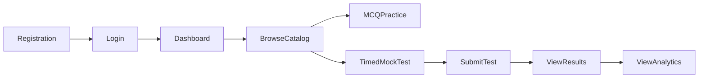

---

### 4.1 Student Registration

* **Purpose:** Create a verified student account and initialize default Free plan access.
* **Trigger:** Student fills out registration form and clicks "Create Account".
* **Preconditions:** Guest user is on registration page; email address is not already registered.
* **Step-by-Step Process:**
  1. Student enters full name, valid email, strong password, phone number (optional), and target exam track.
  2. Client submits registration payload to backend authentication endpoint.
  3. System validates payload syntax, email format, and password complexity.
  4. System checks database for existing email collisions (case-insensitive).
  5. System hashes password using PBKDF2/Argon2.
  6. System creates new `User` record (status: `ACTIVE`, role: `STUDENT`).
  7. System creates associated `UserProfile` record with target exam track preference.
  8. System binds user to default `FREE` `SubscriptionPlan` by creating an active `Subscription` record.
  9. System generates JWT access and refresh token pair.
  10. System enqueues welcome email job in Background Worker.
  11. System returns auth tokens and student profile DTO to client.
* **System Actions:** Validates input, hashes password, executes atomic database transaction (`User` + `UserProfile` + `Subscription`), enqueues welcome email, generates JWT.
* **Business Rules:**
  * Email must be unique across the platform.
  * Every registered student must immediately receive an active Free subscription.
  * Passwords must never be stored in plain text.
* **Expected Outcome:** User account created, Free subscription initialized, JWT session returned, welcome email queued.

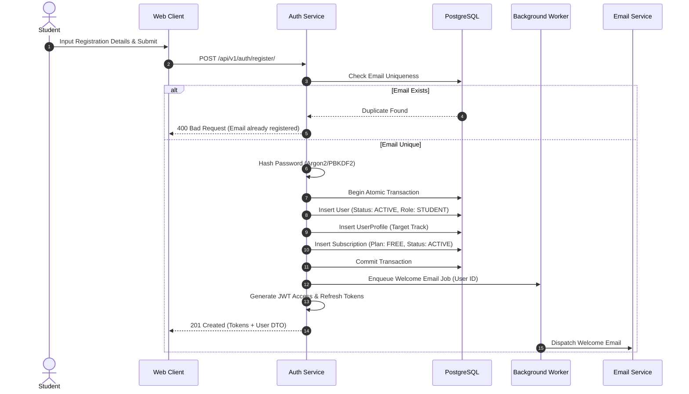

---

### 4.2 Email Verification (Account Activation)

* **Purpose:** Verify student email ownership to ensure deliverability of critical notifications.
* **Trigger:** Student clicks verification link in welcome email or requests resend.
* **Preconditions:** User account exists; verification token is valid and unexpired.
* **Step-by-Step Process:**
  1. System generates secure, signed verification token during registration or resend request.
  2. Verification link delivered to student email.
  3. Student clicks verification link containing token.
  4. Backend verifies token signature, expiration timestamp, and user ID.
  5. System updates `User` entity setting `email_verified = True`.
  6. System returns success response and redirects student to authenticated dashboard.
* **System Actions:** Decodes verification token, updates user status flag in DB.
* **Business Rules:**
  * Verification tokens expire after 24 hours.
  * Unverified accounts may log in but display a persistent verification banner.
* **Expected Outcome:** `User.email_verified` updated to `True`; student redirected to dashboard.

---

### 4.3 Student Login

* **Purpose:** Authenticate an existing student and establish an active session.
* **Trigger:** Student submits email and password on login form.
* **Preconditions:** User account exists in database.
* **Step-by-Step Process:**
  1. Student submits credentials (email and password).
  2. System fetches `User` record by email (case-insensitive).
  3. If user not found, system returns generic `401 Unauthorized` (prevents user enumeration).
  4. System verifies submitted password against stored password hash.
  5. System checks account operational status (`User.is_active`). If suspended, system returns `403 Forbidden` with suspension reason.
  6. System updates `last_login_at` timestamp.
  7. System generates new JWT access token and refresh token.
  8. System returns tokens, user profile, active subscription status, and entitlements to client.
* **System Actions:** Verifies password hash, checks account status, updates login timestamp, issues JWT.
* **Business Rules:**
  * Credentials must match exactly.
  * Suspended accounts cannot authenticate.
  * Failed login attempts increment rate-limiting counter.
* **Expected Outcome:** Authenticated JWT session established; user redirected to target dashboard.

---

### 4.4 Logout

* **Purpose:** Terminate active client session and invalidate refresh token.
* **Trigger:** Student clicks "Logout" button.
* **Preconditions:** Student is currently authenticated.
* **Step-by-Step Process:**
  1. Client sends request to logout endpoint containing refresh token.
  2. System adds refresh token to server-side token blacklist (or revokes refresh token in DB).
  3. Client clears JWT tokens from local browser storage.
  4. Client redirects user to public landing page.
* **System Actions:** Blacklists refresh token, logs security session termination.
* **Business Rules:** Blacklisted tokens cannot be used to obtain new access tokens.
* **Expected Outcome:** Session terminated securely on both server and client.

---

### 4.5 Password Reset

* **Purpose:** Allow a student to securely recover account access after forgetting password.
* **Trigger:** Student clicks "Forgot Password?" and submits email address.
* **Preconditions:** Valid email address submitted.
* **Step-by-Step Process:**
  1. Student inputs registered email address.
  2. System searches for user. If user exists, system generates cryptographically secure reset token.
  3. System enqueues password reset email containing link with token.
  4. System returns success message to client (regardless of email existence to prevent enumeration).
  5. Student opens email and clicks reset link.
  6. Student submits new password alongside reset token.
  7. System verifies token validity, expiration, and reuse status.
  8. System hashes new password, updates `User` credential record, and invalidates all existing refresh tokens.
  9. System sends confirmation notification email.
* **System Actions:** Generates reset token, enqueues email, updates password hash, revokes existing sessions.
* **Business Rules:** Reset tokens expire after 1 hour and are single-use only.
* **Expected Outcome:** Password updated; old sessions invalidated; student logs in with new password.

---

### 4.6 View Dashboard

* **Purpose:** Present personalized preparation overview, target exam track, recent test history, and progress widgets.
* **Trigger:** Student navigates to home dashboard route `/dashboard`.
* **Preconditions:** Student is authenticated.
* **Step-by-Step Process:**
  1. Client requests dashboard overview data with JWT authorization header.
  2. System resolves user identity and active subscription status.
  3. System queries:
     * User profile and target exam track info.
     * Recent attempt history (last 5 attempts with scores).
     * Aggregated performance stats (total tests taken, overall accuracy %, study streak).
     * Recommended practice topics and weak topic alerts.
     * Access level indicators (Free vs Premium banner).
  4. System constructs unified dashboard DTO and returns JSON to client.
  5. Client renders personalized dashboard UI.
* **System Actions:** Evaluates entitlements, queries attempt summaries and progress aggregates.
* **Business Rules:** Dashboard content reflects user's specific target exam track and active subscription entitlements.
* **Expected Outcome:** Complete personalized dashboard rendered in $< 200\text{ ms}$.

---

### 4.7 Browse Exam Tracks

* **Purpose:** Allow students to explore top-level exam categories (Army, Air Force, Navy, ASF, ISSB, Police, FPSC).
* **Trigger:** Student clicks "Exam Tracks" in navigation.
* **Preconditions:** None (accessible to guests and registered students).
* **Step-by-Step Process:**
  1. Client requests active exam tracks list.
  2. System queries `ExamTrack` entities where `is_active = True`, sorted by display order.
  3. System includes track titles, slugs, icons, exam counts, and target descriptions.
  4. Client displays grid of available exam tracks.
* **System Actions:** Fetches active taxonomy tracks.
* **Expected Outcome:** List of available exam tracks rendered with active status tags.

---

### 4.8 Browse Exams

* **Purpose:** View specific intake exams within a selected Exam Track (e.g., PMA Long Course under Pakistan Army).
* **Trigger:** Student selects a specific Exam Track card.
* **Preconditions:** Valid `ExamTrack` selected.
* **Step-by-Step Process:**
  1. Client sends request with `track_slug`.
  2. System verifies track existence and fetches child `Exam` entities.
  3. System returns list of exams, syllabus outlines, and subject counts.
  4. Client displays exams list under selected track.
* **Expected Outcome:** Filtered list of exams presented for student selection.

---

### 4.9 Browse Subjects

* **Purpose:** View academic subjects (Intelligence, Math, Physics, English) belonging to an Exam.
* **Trigger:** Student selects a specific Exam.
* **Step-by-Step Process:**
  1. System queries `Subject` entities associated with target `Exam`.
  2. Returns subject titles, topic counts, total question counts, and free/premium availability.
  3. Client displays subject cards with completion progress bars if authenticated.
* **Expected Outcome:** Subject hierarchy displayed with student progress overlays.

---

### 4.10 Browse Topics

* **Purpose:** Select specific syllabus concepts (e.g., Verbal Analogies) for focused MCQ practice.
* **Trigger:** Student opens a Subject detail view.
* **Step-by-Step Process:**
  1. System queries `Topic` entities under selected `Subject`.
  2. System joins `StudentProgress` records to display topic mastery %, attempted counts, and weak-topic badges.
  3. Client displays list of topics with "Practice Now" buttons.
* **Expected Outcome:** Granular topic list rendered with mastery indicators.

---

### 4.11 Practice MCQs

* **Purpose:** Enable untimed topic-wise or subject-wise practice with immediate feedback and explanations.
* **Trigger:** Student clicks "Practice Now" on a selected topic or custom filter.
* **Preconditions:** Student authenticated; topic exists.
* **Step-by-Step Process:**
  1. Student configures practice session parameters (Topic, Question Count [10/20/50], Difficulty level).
  2. System checks user subscription entitlements. If user is Free and topic is Premium-restricted, system prompts upgrade modal.
  3. System fetches matching published `Question` items and their `QuestionOption` records.
  4. System strips correct answer markers if client is in standard mode, OR includes correct option markers for practice mode depending on mode configuration (in instant practice mode, options include correct answer keys).
  5. Student views question stem, selects an option, and clicks "Check Answer".
  6. Client checks option correctness locally or sends atomic checking request.
  7. Client displays immediate visual feedback (Green for correct, Red for incorrect) and reveals `QuestionExplanation`.
  8. System records student practice response in background to update practice stats.
* **System Actions:** Fetches published questions, records practice attempt metrics in background.
* **Business Rules:** Free students have daily practice question limits (e.g., 30 MCQs/day); Premium students have unlimited practice.
* **Expected Outcome:** Interactive practice session executed with instant explanation delivery.

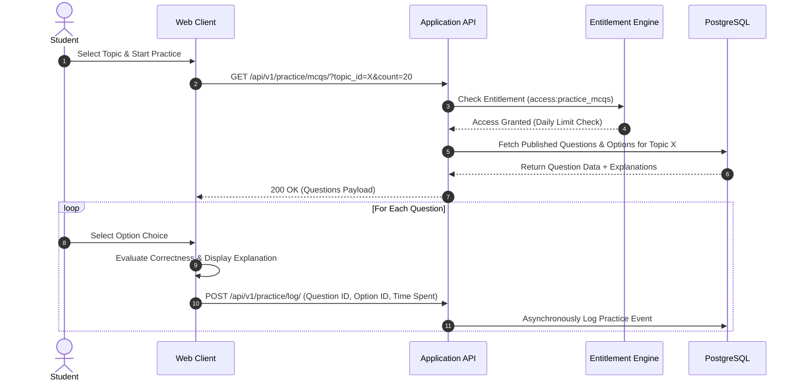

---

### 4.12 Bookmark Questions

* **Purpose:** Allow students to save difficult or important questions for future revision.
* **Trigger:** Student clicks bookmark star icon on a question item during practice or test review.
* **Preconditions:** Authenticated student; valid question ID.
* **Step-by-Step Process:**
  1. Student clicks bookmark toggle button.
  2. Client sends toggle request (`POST /api/v1/bookmarks/`).
  3. System checks if bookmark already exists for `(user_id, question_id)`:
     * If exists $\rightarrow$ delete record (unbookmark).
     * If not exists $\rightarrow$ insert new `Bookmark` record.
  4. System returns updated bookmark status boolean.
  5. Client updates UI icon state.
* **Expected Outcome:** Question saved to student's personal saved list.

---

### 4.13 View Notes

* **Purpose:** Provide structured revision notes and summary materials for subjects.
* **Trigger:** Student navigates to "Notes" section.
* **Preconditions:** Student authenticated.
* **Step-by-Step Process:**
  1. Client requests notes list filtered by Subject/Exam.
  2. System checks active entitlements (`access:pdf_notes`).
  3. If user is Free, system returns preview note snippets and marks premium notes locked.
  4. If user is Premium, system returns full notes content and downloadable asset URLs.
  5. Client renders notes reader view.
* **Expected Outcome:** Study notes delivered according to subscription entitlement.

---

### 4.14 Start Mock Test

* **Purpose:** Initialize a official timed exam simulation session.
* **Trigger:** Student clicks "Start Mock Test" on a specific test template.
* **Preconditions:** Authenticated student; test template is active; student satisfies tier entitlement.
* **Step-by-Step Process:**
  1. Student selects target `MockTest` (e.g., "PMA Long Course Full Mock #1").
  2. System verifies user entitlements (`access:premium_mock_tests` if test is Premium).
  3. System checks for existing `IN_PROGRESS` attempt for this student and test:
     * If active unexpired attempt exists $\rightarrow$ resume existing attempt.
     * If expired active attempt exists $\rightarrow$ force submit expired attempt and start new attempt.
  4. System initializes new `Attempt` record:
     * `started_at = NOW()`
     * `status = IN_PROGRESS`
     * `allotted_duration_seconds = MockTest.duration_minutes * 60`
  5. System dynamically selects questions tied to the `MockTest` via `MockTestQuestion`.
  6. System strips ALL correct answer indicators and explanation texts from the payload.
  7. System returns `Attempt` ID, end timestamp cutoff, and question items array to client.
  8. Client starts local countdown timer anchored to server end timestamp.
* **System Actions:** Verifies access, checks active attempts, creates `Attempt` row, strips answer keys, returns timed question set.
* **Business Rules:**
  * Correct answer keys must NEVER be transmitted to the client during an active test session.
  * Server time is the sole authority for session expiration.
* **Expected Outcome:** Timed session initialized; server-anchored timer running on client.

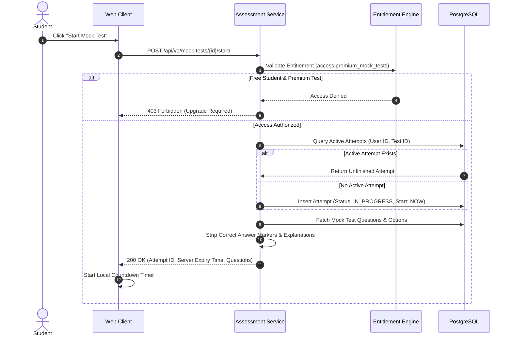

---

### 4.15 Submit Mock Test

* **Purpose:** Finalize a mock test attempt, score responses server-side, and record results.
* **Trigger:** Student clicks "Submit Test" OR client timer expires.
* **Preconditions:** `Attempt` exists with status `IN_PROGRESS`.
* **Step-by-Step Process:**
  1. Client sends POST request containing `Attempt` ID and array of selected answers `[{question_id, selected_option_id, time_spent_seconds}]`.
  2. System initiates atomic database transaction.
  3. System locks `Attempt` row (`SELECT ... FOR UPDATE`).
  4. System verifies attempt status is `IN_PROGRESS`. (If already `SUBMITTED`, return existing result idempotently).
  5. System calculates elapsed time (`NOW() - started_at`).
  6. System fetches actual correct answer keys and marking parameters (`positive_marks`, `negative_marks`) for all test questions.
  7. System evaluates each student response:
     * Selected correct option $\rightarrow$ add positive marks, mark answer `is_correct = True`.
     * Selected incorrect option $\rightarrow$ subtract negative marks, mark answer `is_correct = False`.
     * Skipped question $\rightarrow$ zero marks assigned.
  8. System bulk-inserts `AttemptAnswer` records.
  9. System updates `Attempt` status to `SUBMITTED` and sets `submitted_at = NOW()`.
  10. System creates immutable `AttemptResult` record storing total score, percentage, correct/wrong/skipped counts, pass/fail status.
  11. System commits transaction.
  12. System enqueues background worker job to aggregate `StudentProgress` and update weak-topic analytics.
  13. System returns scored result summary DTO to client.
* **System Actions:** Atomic row locking, server-side scoring calculation, bulk inserts, `AttemptResult` snapshot creation, background event dispatch.
* **Business Rules:**
  * Scoring logic runs 100% on server.
  * Negative marking is applied according to mock test configuration.
  * Once submitted, an attempt can never be altered or re-submitted.
* **Expected Outcome:** Test scored; `AttemptResult` persisted; student sees immediate score card.

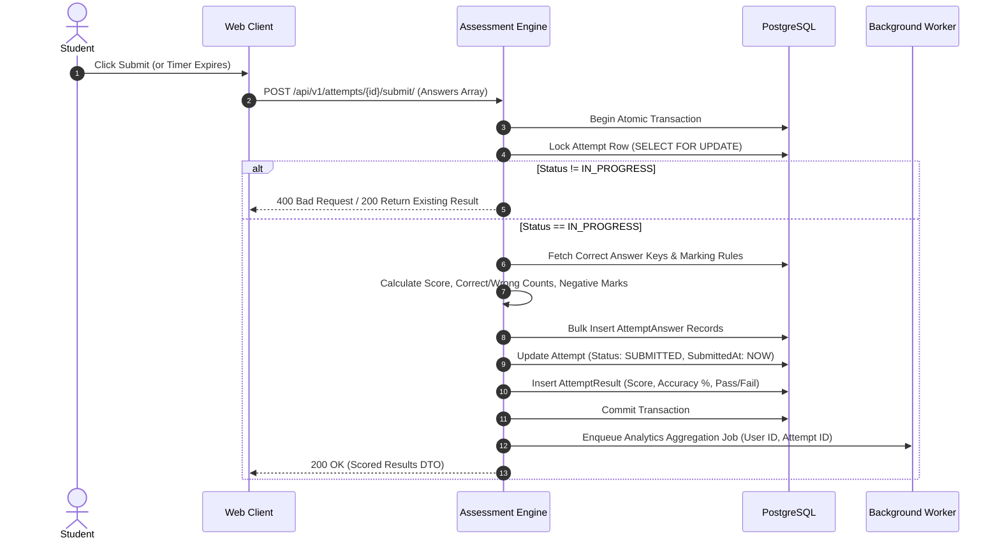

---

### 4.16 Review Results

* **Purpose:** Allow student to inspect individual questions, selected answers, correct answer keys, and explanations post-submission.
* **Trigger:** Student clicks "Review Detailed Answers" after submitting test or from attempt history.
* **Preconditions:** Attempt status is `SUBMITTED` or `EXPIRED`.
* **Step-by-Step Process:**
  1. Student requests attempt detailed review (`GET /api/v1/attempts/{id}/review/`).
  2. System verifies `Attempt` belongs to requesting student (or administrator).
  3. System checks attempt status is completed.
  4. System fetches questions, options, student's selected answers, correct answer markers, and `QuestionExplanation` content.
  5. System returns detailed review payload.
  6. Client renders question-by-question review interface with filter tabs (All, Correct, Incorrect, Skipped).
* **Expected Outcome:** Detailed answer review interface displayed with explanations and correctness badges.

---

### 4.17 View Performance Analytics

* **Purpose:** Display comprehensive visual analytics, accuracy trends, speed metrics, and weak-topic diagnostics.
* **Trigger:** Student opens "Analytics" tab.
* **Preconditions:** Student authenticated; Premium entitlement active for advanced analytics (Free students view basic summary).
* **Step-by-Step Process:**
  1. Student requests performance analytics data.
  2. System evaluates entitlements (`access:weak_topic_analytics`).
  3. System queries aggregated `StudentProgress` and `WeakTopic` tables.
  4. System computes:
     * Overall accuracy % across subjects.
     * Topic mastery distribution chart data.
     * Average time spent per question (speed analysis).
     * List of identified weak topics requiring immediate practice.
  5. System returns structured analytics DTO.
  6. Client renders charts, progress gauges, and weak-topic study recommendations.
* **Expected Outcome:** Diagnostic analytics charts rendered empowering targeted revision.

---

## 5. Premium Subscription Workflows

Monetization workflows manage commercial plans, Safepay checkout processing, webhook processing, subscription lifecycles, and entitlement assignments.

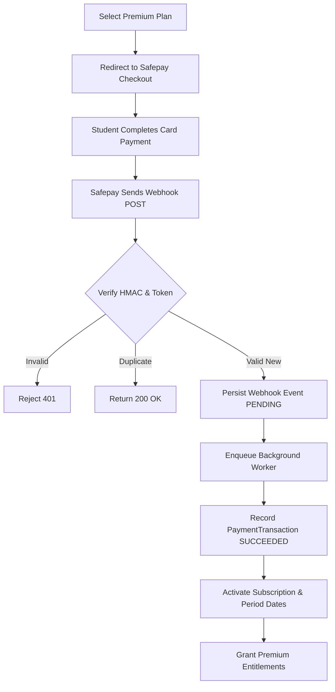

---

### 5.1 Purchase Subscription

* **Purpose:** Initiate checkout for the Premium subscription plan (Rs. 499 PKR/month).
* **Trigger:** Student clicks "Upgrade to Premium" on pricing page or feature lock modal.
* **Preconditions:** Authenticated student; currently on Free or expired plan.
* **Step-by-Step Process:**
  1. Student selects Premium plan (Rs. 499 PKR / month).
  2. Client sends checkout request (`POST /api/v1/subscriptions/checkout/`).
  3. System fetches active `SubscriptionPlan` configuration (verifying price Rs. 499 PKR).
  4. System calls Safepay Gateway API (via Safepay Provider Adapter) to initialize a checkout tracker session.
  5. Safepay returns checkout URL and tracker token.
  6. System creates pending `PaymentTransaction` record (`status = PENDING`).
  7. System returns checkout URL to client.
  8. Client redirects student browser to hosted Safepay Checkout page.
* **Business Rules:**
  * Plan price and currency (PKR) are fetched from database configuration, never accepted from client requests.
  * Direct payment initialization does not alter subscription state.
* **Expected Outcome:** Safepay hosted checkout page opened in student browser.

---

### 5.2 Safepay Checkout

* **Purpose:** Collect payment securely on Safepay hosted payment page.
* **Trigger:** Student redirected to Safepay payment gateway.
* **Process:**
  1. Student inputs debit/credit card details on PCI-compliant Safepay checkout page.
  2. Safepay processes payment with card issuing bank.
  3. Safepay redirects student browser back to Prepora return URL (`/checkout/success` or `/checkout/cancel`).
  4. Safepay asynchronously dispatches webhook payload to Prepora webhook endpoint.
* **Security Rule:** Prepora infrastructure never touches or stores raw credit card credentials.

---

### 5.3 Payment Verification & Webhook Ingestion

* **Purpose:** Verify authenticity of payment gateway webhook callbacks securely and idempotently.
* **Trigger:** Safepay HTTP POST webhook request received at `/api/v1/payments/webhooks/safepay/`.
* **Preconditions:** Webhook endpoint publicly accessible over HTTPS with TLS 1.2/1.3.
* **Step-by-Step Process:**
  1. Receiver endpoint extracts raw HTTP payload and `X-SFPY-SIGNATURE` header.
  2. System computes expected HMAC-SHA256 signature using stored Safepay Webhook Secret Key.
  3. System compares calculated signature with header signature.
     * **Mismatch:** System immediately rejects request with `401 Unauthorized`.
  4. System extracts Safepay `event_token` (Idempotency Key).
  5. System queries `WebhookEventLog` database table for `event_token`:
     * **Token Found (Duplicate):** System immediately responds with `200 OK` (Acknowledged) and skips processing.
  6. System inserts raw event into `WebhookEventLog` table (`status = PENDING`, payload version `2.0.0`).
  7. System returns `200 OK` HTTP acknowledgement to Safepay within $< 2\text{ seconds}$.
  8. System enqueues background worker job passing `event_token`.
* **System Actions:** HMAC verification, DB idempotency check, payload persistence, fast HTTP 200 acknowledgement, background task enqueuing.
* **Business Rules:**
  * Invalid HMAC signatures must be rejected.
  * Endpoint MUST acknowledge quickly with 200 OK before running business logic to prevent gateway timeout retries.
  * Processing MUST be idempotent based on `event_token`.
* **Expected Outcome:** Webhook safely persisted and acknowledged; async background job queued.

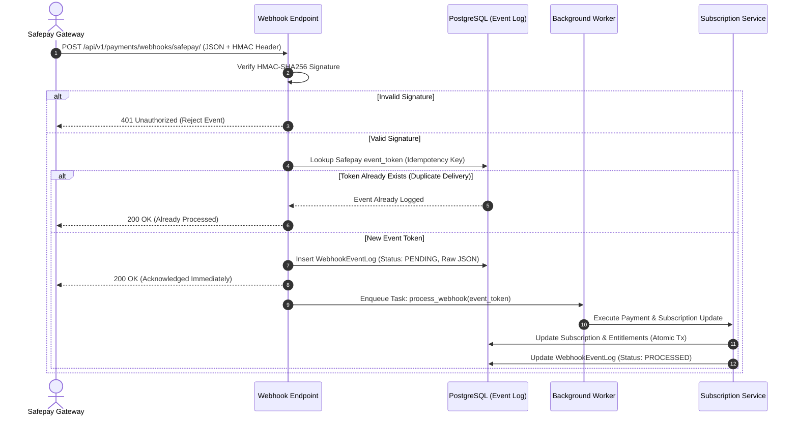

---

### 5.4 Webhook Processing & Subscription Activation

* **Purpose:** Execute async business logic for verified payment webhooks to activate user subscription.
* **Trigger:** Background Worker picks up `process_webhook` task.
* **Step-by-Step Process:**
  1. Worker fetches `WebhookEventLog` row by `event_token`.
  2. Worker checks event type (e.g., `payment.succeeded` or `subscription.payment.succeeded`).
  3. Worker extracts payment transaction tracker, customer email, amount, currency, and Safepay subscription IDs.
  4. Worker initiates atomic database transaction.
  5. Worker updates `PaymentTransaction` record (`status = SUCCEEDED`, `safepay_transaction_id`).
  6. Worker updates or creates student's `Subscription` record:
     * `status = ACTIVE`
     * `current_period_start = NOW()`
     * `current_period_end = NOW() + 30 Days`
     * `auto_renew = True`
     * `last_paid_at = NOW()`
  7. Worker evaluates `PlanEntitlement` mappings for `PREMIUM_MONTHLY` plan and updates active entitlement access rules.
  8. Worker updates `WebhookEventLog` record status to `PROCESSED`.
  9. Worker commits transaction.
  10. Worker enqueues payment confirmation email and in-app notification.
* **System Actions:** Updates payment ledger, transitions subscription to `ACTIVE`, grants entitlements, sends email receipt.
* **Business Rules:**
  * Successful payment extends subscription period by exactly 1 billing cycle.
  * Payment records and subscription records remain distinct entities.
* **Expected Outcome:** Subscription activated; student granted immediate access to Premium features.

---

### 5.5 Entitlement Assignment

* **Purpose:** Dynamically map subscription states to actionable feature authorizations.
* **Trigger:** Subscription state change (`ACTIVE` $\rightarrow$ grant; `EXPIRED` $\rightarrow$ revoke).
* **Process:**
  1. System checks `Subscription.status`.
  2. If `ACTIVE` or in grace period `PAST_DUE`, system resolves active entitlements:
     * `access:unlimited_mcqs`
     * `access:premium_mock_tests`
     * `access:weak_topic_analytics`
     * `access:pdf_notes`
  3. System updates authorization cache for student session.
* **Expected Outcome:** Feature gates across API and UI evaluate authorization to True.

---

### 5.6 Subscription Expiration

* **Purpose:** Revert premium student to Free plan tier when subscription period ends without renewal.
* **Trigger:** Background Cron Job runs daily or period end date passes.
* **Preconditions:** `Subscription.current_period_end < NOW()` AND `status == ACTIVE` AND `auto_renew == False` (or payment renewal failed past grace period).
* **Step-by-Step Process:**
  1. Scheduled worker queries expired subscriptions.
  2. For each expired subscription:
     * System initiates atomic transaction.
     * System updates `Subscription.status = EXPIRED`.
     * System revokes premium entitlements.
     * System falls user back to baseline `FREE` plan entitlements.
     * System commits transaction.
     * System enqueues subscription expired email notification inviting renewal.
* **Expected Outcome:** Premium entitlements revoked; user gracefully downgraded to Free plan without data loss.

---

### 5.7 Subscription Renewal (Auto-Recurring & Manual)

* **Purpose:** Support seamless monthly renewal of Premium plan access.
* **Renewal Models:**
  1. **Automatic Recurring Renewal:** Safepay handles monthly recurring card charge and sends `subscription.payment.succeeded` webhook, executing Section 5.4 to extend `current_period_end` by another 30 days.
  2. **Manual Renewal:** If auto-renew was canceled or card expired, student logs in, opens billing page, clicks "Renew Subscription", completes new Safepay checkout flow, and receives extended subscription period.
* **Business Rules:**
  * Manual renewal prior to expiration appends 30 days to existing `current_period_end`.
  * User can cancel future auto-renewal at any time; paid subscription remains `ACTIVE` until `current_period_end`.

---

### 5.8 Failed Payment & Past Due Grace Period

* **Purpose:** Manage failed recurring payments gracefully with a 7-day grace period before access revocation.
* **Trigger:** Safepay dispatches `subscription.payment.failed` webhook.
* **Step-by-Step Process:**
  1. Webhook processor receives payment failure event.
  2. System records `PaymentTransaction` with `status = FAILED` and records failure reason.
  3. System checks subscription state:
     * System transitions `Subscription.status` to `PAST_DUE`.
     * System sets `grace_period_end = NOW() + 7 Days`.
  4. During 7-day grace period:
     * Premium entitlements REMAIN ACTIVE so student study is uninterrupted.
     * Banner displayed on UI: *"Payment renewal failed. Please update payment method within X days."*
     * Automated retries occur via Safepay.
  5. If payment succeeds during grace period $\rightarrow$ status reverts to `ACTIVE`, grace period cleared.
  6. If grace period expires without successful payment $\rightarrow$ status set to `EXPIRED`, premium entitlements revoked.
* **Business Rules:**
  * Default grace period is 7 days.
  * Premium access is maintained during grace period to prioritize student experience.
* **Expected Outcome:** Grace period applied; automated notification sent; eventual recovery or expiration.

---

### 5.9 Refund Workflow (Manual Admin Review)

* **Purpose:** Process legitimate refund requests manually according to platform policy.
* **Trigger:** Student submits refund request within 7 days of billing due to technical access failure.
* **Preconditions:** Request within 7 days; payment verified; manual review by Administrator.
* **Step-by-Step Process:**
  1. Student requests refund via support channel.
  2. Platform Administrator opens Admin Refund Console and reviews transaction history and usage logs.
  3. Administrator verifies eligibility (e.g., payment deducted but technical error blocked access; duplicate payment).
  4. Administrator clicks "Approve Refund" on Admin Panel.
  5. System sends refund command to Safepay API (or admin processes refund in Safepay portal).
  6. System creates `PaymentTransaction` record (`status = REFUNDED`, `amount`).
  7. System sets `Subscription.status = CANCELED` and revokes premium entitlements.
  8. System logs administrative action in `AuditLog`.
  9. System sends refund confirmation email to student.
* **Expected Outcome:** Financial refund executed; subscription canceled; audit log recorded.

---

## 6. Assessment Workflows

Assessment workflows govern the operational lifecycle of practice sessions, timed mock tests, scoring algorithms, and progress aggregation.

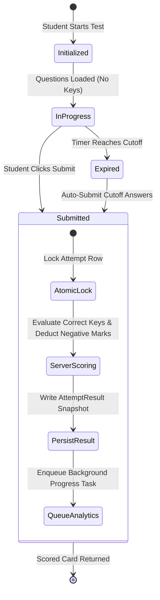

---

### 6.1 Practice Session Lifecycle

1. **Session Setup:** Student filters questions by Exam Track, Subject, Topic, and Quantity (e.g., 20 MCQs).
2. **Item Delivery:** Backend fetches questions matching criteria. Answer keys included in payload if instant practice mode is enabled.
3. **Execution:** Student solves questions sequentially or in random order, toggling immediate explanations.
4. **Completion:** Untimed session summary displayed showing correct/incorrect counts. Session metrics logged to `StudentProgress` in background.

---

### 6.2 Timed Mock Test Lifecycle

1. **Test Initialization:** System validates tier entitlement and creates `Attempt` (`status = IN_PROGRESS`).
2. **Session Assembly:** Mock test questions fetched; correct answers stripped; server expiration timestamp fixed (`started_at + duration`).
3. **Active Test Taking:** Student navigates question grid, selects options, flags items for review. Answers periodically auto-saved to client local storage.
4. **Submission Gate:** Test terminated via manual submission OR automatic timeout.
5. **Evaluation & Result:** Server scores attempt atomically, writes `AttemptResult`, queues analytics.

---

### 6.3 Auto-Submission on Timeout

* **Purpose:** Ensure tests are fairly finalized when time expires, preventing unauthorized extra time.
* **Trigger:** Server timestamp passes `started_at + duration_seconds + 30s grace`.
* **Process:**
  1. If student browser disconnects or fails to click submit before cutoff, background cleanup worker detects unsubmitted `IN_PROGRESS` attempts past cutoff time.
  2. Worker automatically invokes submission scoring engine using whatever partial answers were last recorded or transmitted.
  3. Worker sets `Attempt.status = EXPIRED` and generates `AttemptResult`.
* **Business Rule:** Student cannot submit answers after server expiration cutoff.

---

### 6.4 Score Calculation & Negative Marking Rules

Server scoring engine applies the following formula per attempt:

$$\text{Final Score} = \sum_{i \in \text{Correct}} P_i - \sum_{j \in \text{Wrong}} N_j$$

Where:
* $P_i =$ Positive mark weight for question $i$ (Default: $+1.0$).
* $N_j =$ Negative mark deduction for wrong distractor $j$ (Configurable per test: e.g., $0.25$ marks for wrong answer; $0.0$ for skipped).
* $\text{Accuracy } \% = \left( \frac{\text{Correct Count}}{\text{Total Answered}} \right) \times 100$.

All math is calculated in backend Python using double-precision decimals and persisted immutably in `AttemptResult`.

---

### 6.5 Result Generation & Progress Tracking

Upon test submission, system generates a complete result snapshot:
* Total Questions, Answered Count, Correct Count, Incorrect Count, Skipped Count.
* Final Score achieved vs Passing Score threshold $\rightarrow$ Pass/Fail Evaluation.
* Percentage score and percentile calculation against historical test takers.
* Topic-wise accuracy breakdown (e.g., Intelligence: 85%, Physics: 45%).
* Background worker updates aggregated `StudentProgress` table to instantly update student dashboard trends.

---

## 7. Content Management Workflows

Content management workflows govern how educational materials are authored, reviewed, approved, published, updated, and archived under strict governance.

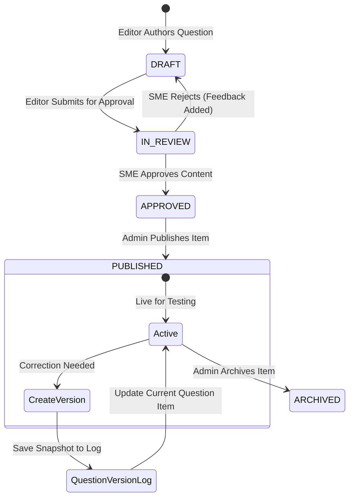

---

### 7.1 Content Creation (Taxonomy, Questions, Options, Explanations)

1. **Taxonomy Setup:** Administrator creates `ExamTrack`, `Exam`, `Subject`, and `Topic` records.
2. **Drafting:** Content Manager (Editor) creates new question:
   * Stem text & optional diagrams/formulas.
   * Options A, B, C, D (designating correct answer choice).
   * Detailed explanation text and pedagogical references.
   * Taxonomy tagging (Topic ID, Difficulty: Easy/Medium/Hard).
3. **Initial State:** Question saved with `status = DRAFT`. Creator ID recorded.

---

### 7.2 Editorial Approval Workflow (`DRAFT` $\rightarrow$ `PUBLISHED`)

1. **Submission:** Editor submits draft item $\rightarrow$ status changes to `IN_REVIEW`.
2. **SME Audit:** Subject Matter Expert reviews question stem, distractor quality, correct key accuracy, and explanation validity.
3. **Review Decision:**
   * **Rejection:** SME adds feedback notes $\rightarrow$ status reverts to `DRAFT` for Editor revision.
   * **Approval:** SME approves item $\rightarrow$ status changes to `APPROVED`. Reviewer ID and review timestamp recorded.
4. **Publishing:** Administrator selects `APPROVED` questions and executes publish command $\rightarrow$ status changes to `PUBLISHED`. Item becomes live in practice and test banks.
5. **Business Rule (Separation of Duties):** The editor who authored a question CANNOT be the sole reviewer who approves it (`creator_id != reviewer_id`).

---

### 7.3 Content Updates & Versioning Mechanics

* **Rule:** Published questions cannot be directly overwritten inline without preserving historical audit integrity.
* **Process:**
  1. When a `PUBLISHED` question requires modification (e.g., correcting a typo or updating an explanation):
  2. System creates a complete JSON snapshot of current stem, options, and explanation and appends it to `QuestionVersion` audit log table.
  3. System increments `Question.version_number` (e.g., 1.0 $\rightarrow$ 2.0).
  4. System applies updates to active `Question` record.
  5. Past student test attempts remain linked to the specific `QuestionVersion` active when the test was taken, ensuring historical student score reports are never altered by future edits.

---

## 8. Administration Workflows

Administrative workflows handle user governance, access delegation, reported content resolution, and security oversight.

```
+-----------------------------------------------------------------------------------+
|                            ADMINISTRATION WORKFLOWS                               |
+-----------------------------------------------------------------------------------+
| * User Moderation (Suspend / Reactivate account with reason logging)              |
| * Role & Permission Assignment (Assign Editor, SME, Admin roles)                  |
| * Reported Question Resolution (Student Report -> SME Review -> Resolution)       |
| * Platform Announcement Dispatch (Targeted system broadcast alerts)               |
| * Security Audit Logging (Immutable event logging for administrative actions)    |
+-----------------------------------------------------------------------------------+
```

---

### 8.1 User Management & Role Assignment

1. **Account Moderation:** Administrator searches user by email $\rightarrow$ views profile, activity log, and subscription history $\rightarrow$ toggles account state (`ACTIVE` vs `SUSPENDED`). Reason logged in `AuditLog`.
2. **Role Elevation:** Super Administrator modifies user role (e.g., promoting user from `STUDENT` to `CONTENT_EDITOR` or `SME`). Changes take effect on next JWT token issuance.

---

### 8.2 Reported Question Resolution

1. **Report Submission:** Student flags question during practice/review with category (Wrong Answer Key, Typo, Ambiguous, Outdated) and comment. `QuestionReport` created (`status = OPEN`).
2. **Support Triage:** Support Agent or Content Editor reviews `OPEN` reports queue.
3. **Investigation:** Operator inspects question. If valid issue found:
   * Operator initiates question edit workflow (Section 7.3).
   * Question fixed and version incremented.
   * `QuestionReport` updated to `RESOLVED` with resolution notes.
4. **Notification:** Student receives notification: *"Thank you! Question #1234 report was reviewed and resolved."*

---

### 8.3 System Audit Logging

* Every sensitive administrative action (user suspension, role modification, manual subscription grant, content deletion, refund approval) writes an immutable record to `AuditLog`:
  * `actor_id`, `action_code`, `target_entity_type`, `target_entity_id`, `ip_address`, `pre_change_state_json`, `post_change_state_json`, `timestamp`.

---

## 9. Analytics Workflows

Analytics workflows transform raw student test data into diagnostic insights and performance dashboards.

```
Attempt Submission Event
       |
       v
Background Task Worker Enqueued
       |
       v
+-----------------------------------------------------------------------+
|                       ANALYTICS AGGREGATION ENGINE                     |
+-----------------------------------------------------------------------+
| 1. Update StudentProgress (Total MCQs, Correct Count, Accuracy %)     |
| 2. Recalculate Topic Mastery Metrics                                  |
| 3. Evaluate Weak Topic Thresholds (Accuracy < 60% -> WeakTopic Entry) |
| 4. Update Target Exam Preparation Readiness Index                     |
| 5. Refresh Learner Dashboard Cache                                    |
+-----------------------------------------------------------------------+
```

---

### 9.1 Calculation & Aggregation Mechanics

1. **Trigger:** `Attempt` submission or practice batch logging triggers an async domain event `attempt.scored`.
2. **Worker Execution:** Background worker executes analytical aggregation:
   * Aggregates total questions attempted and correct count for the student per `Topic`.
   * Updates `StudentProgress.accuracy_percentage`.
   * Calculates speed metrics (average seconds spent per question).
3. **Weak Topic Identification:** If student's accuracy on a specific topic falls below benchmark threshold (e.g., $< 60\%$ across $\ge 15$ attempted questions), topic added to `WeakTopic` table.
4. **Dashboard Cache Refresh:** Pre-computed analytics summaries stored in `StudentProgress` table to enable instantaneous dashboard page loads without live multi-table SQL joins.

---

## 10. Notification Workflows

Notification workflows deliver timely transactional and study communications across channels.

| Trigger Event | Target Channel | Recipient | Content / Action |
| :--- | :--- | :--- | :--- |
| **User Registration** | Email | Student | Welcome email + account confirmation link |
| **Payment Succeeded** | Email + In-App | Student | Payment receipt invoice + Premium activation alert |
| **Payment Failed** | Email + In-App | Student | Payment failure notification + 7-day grace period warning |
| **Subscription Expiring** | Email + In-App | Student | 3-day expiration reminder + quick renewal link |
| **Password Reset Request**| Email | Student | Secure password reset link (expires 1 hour) |
| **Question Report Fixed** | In-App | Student | Resolution update thanking student for feedback |
| **System Announcement** | In-App Broadcast | All Users | Alert regarding new exam tracks or mock test releases |

---

## 11. Error & Exception Workflows

Error workflows detail system recovery mechanics for operational failures.

```
+-----------------------------------------------------------------------------------+
|                            ERROR RECOVERY MATRIX                                  |
+--------------------------+--------------------------------------------------------+
| FAILURE SCENARIO         | SYSTEM RECOVERY MECHANISM                              |
+--------------------------+--------------------------------------------------------+
| Invalid Login            | Rate-limit counter incremented; clear security warning |
| Network Disconnect Test  | Client auto-saves draft answers in browser IndexedDB;  |
|                          | syncs upon reconnect prior to server cutoff time.      |
| Test Expiration Cutoff   | Background cleanup worker auto-submits active attempt  |
|                          | at cutoff time; scores partial answers safely.         |
| Duplicate Webhook        | Idempotency check on event_token returns 200 OK without|
|                          | duplicate billing or double extension.                 |
| Payment Gateway Timeout  | Webhook endpoint persists event PENDING & responds 200;|
|                          | background worker retries logic with exponential backoff|
+--------------------------+--------------------------------------------------------+
```

---

### 11.1 Network Interruption During Mock Test

* **Scenario:** Student loses internet connection while taking a 90-minute mock test.
* **Recovery Mechanism:**
  1. Web client continuously caches selected answers in browser local storage (`IndexedDB`).
  2. Local countdown timer continues running based on initial server expiration cutoff timestamp.
  3. When network reconnects, client automatically transmits cached answer payload to server.
  4. Server verifies timestamp is within allowed cutoff window and processes submission cleanly.

### 11.2 Duplicate Webhook Handling

* **Scenario:** Safepay delivers the same payment confirmation webhook POST request 3 times due to network retries.
* **Recovery Mechanism:**
  1. Receiver checks `WebhookEventLog` for `event_token`.
  2. First request: Persisted as `PENDING`, worker queued, returns `200 OK`.
  3. Second & Third requests: System detects `event_token` already logged $\rightarrow$ immediately returns `200 OK` without re-running subscription activation or adding extra subscription days. Zero double-billing risk.

---

## 12. Workflow Dependencies

Workflows do not exist in isolation; they form an integrated system ecosystem.

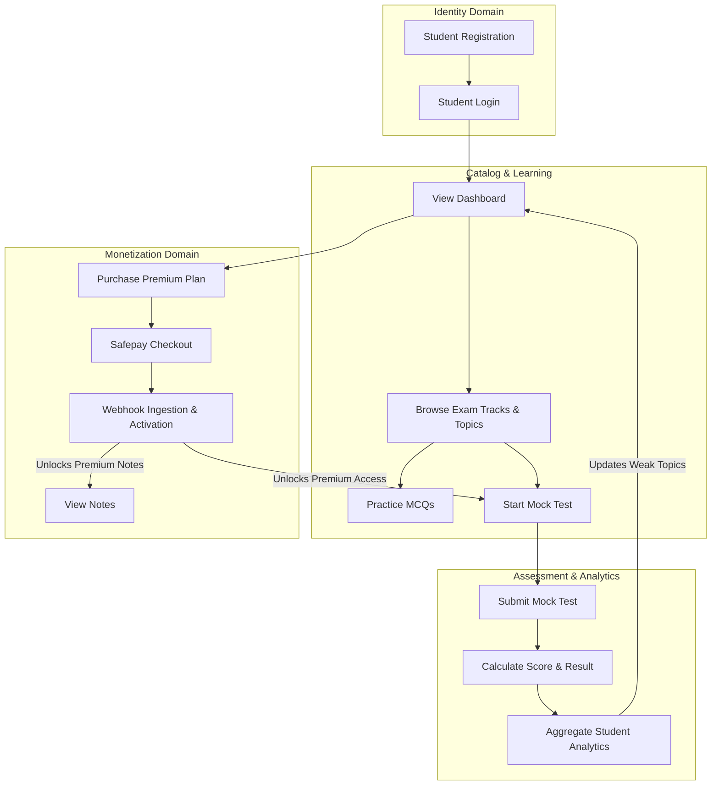

---

## 13. Business Rules Summary

All workflows in Prepora enforce the following core platform business rules:

```
+-----------------------------------------------------------------------------------+
|                             CORE BUSINESS RULES                                   |
+-----------------------------------------------------------------------------------+
| IDENTITY & ACCESS:                                                                |
| 1. Every user must have a unique email address across the platform.               |
| 2. Passwords must be hashed using PBKDF2 or Argon2 before database persistence.   |
| 3. Suspended user accounts are blocked from authentication and API access.       |
|                                                                                   |
| MONETIZATION & SUBSCRIPTIONS:                                                     |
| 4. Subscription payment status and entitlement authorization are distinct concepts.|
| 5. Payment events NEVER grant access directly without server-side verification.   |
| 6. Safepay webhooks MUST be HMAC verified and processed idempotently by event token.|
| 7. Failed subscription payments receive a 7-day grace period before access cutoff. |
|                                                                                   |
| CONTENT & GOVERNANCE:                                                             |
| 8. Every published question must undergo SME review (creator_id != reviewer_id).  |
| 9. Published questions are immutable; updates require creating a new version log. |
|                                                                                   |
| ASSESSMENT & TESTING:                                                             |
| 10. Correct answer keys MUST NEVER be sent to client during active mock tests.     |
| 11. Mock test duration and cutoffs are enforced strictly by server time.          |
| 12. Once submitted, a test attempt is finalized and can never be re-scored.       |
+-----------------------------------------------------------------------------------+
```

---

## 14. Workflow-to-Domain Mapping

The following matrix maps every business workflow to its primary and secondary Bounded Contexts:

| Business Workflow | Primary Domain | Secondary Domains Involved |
| :--- | :--- | :--- |
| **Student Registration** | Identity & Access | Subscription & Entitlements, Notifications |
| **Student Login / Auth** | Identity & Access | Admin & Audit |
| **Browse Exam Taxonomy** | Exam Taxonomy | Question Bank, Assessment |
| **Practice MCQs** | Question Bank | Assessment, Subscription & Entitlements, Analytics |
| **Start / Submit Mock Test** | Assessment & Execution | Question Bank, Subscription, Analytics |
| **View Analytics & Weak Topics**| Analytics & Progress | Exam Taxonomy, Assessment |
| **Purchase Subscription** | Payments & Gateway Ledger | Subscription & Entitlements, Identity |
| **Safepay Webhook Ingestion** | Payments & Gateway Ledger | Subscription & Entitlements, Admin & Audit |
| **Subscription Expiration** | Subscription & Entitlements | Notifications, Identity |
| **Content Review & Publishing** | Question Bank Governance | Exam Taxonomy, Admin & Audit |
| **Reported Question Resolution**| Question Bank Governance | Admin & Audit, Notifications |
| **User Account Moderation** | Administration & Audit | Identity & Access, Notifications |

---

## 15. Future Workflow Expansion

The workflow architecture of Prepora is engineered to support future P1/P2 product expansions without requiring architectural redesign.

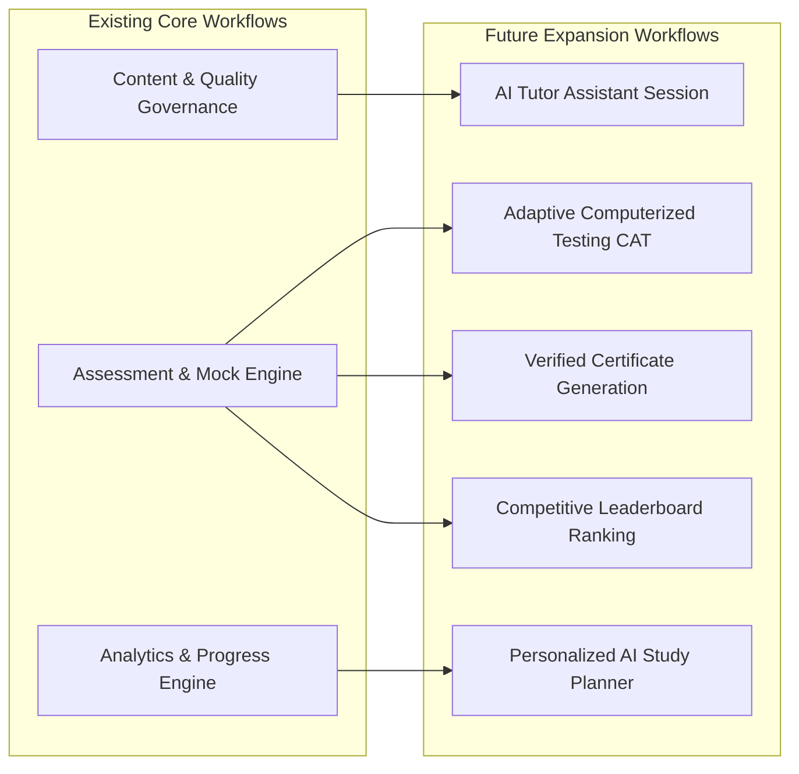

### 15.1 Future Module Integration Overview

1. **AI Tutor Assistant Sessions:** Interactive AI study assistant explaining complex physics/math questions. Integrated by consuming `Question` and `QuestionExplanation` entities within a new AI Chat service boundary.
2. **Adaptive Computerized Testing (CAT):** Dynamic test execution where next item difficulty adjusts based on previous answer correctness. Builds directly on top of the existing `Assessment Engine` and item difficulty tags.
3. **Personalized AI Study Planner:** Automated study scheduling generating daily target practice sets based on `WeakTopic` calculations.
4. **Verified Certificate Generation:** Automatically issuing verifiable PDF certificates upon achieving $\ge 80\%$ score on major full-length mock exams.
5. **Competitive Leaderboards & Ranking:** Aggregating student mock test scores into regional and track-wise rank lists. Data collection hooks are already present in `AttemptResult`.

### 15.2 Extensibility Assurance
Because Prepora decouples user identity, content taxonomy, assessment execution, monetization ledgers, and analytics processing into distinct bounded contexts, new future workflows can be added as modular services listening to existing domain events without modifying established database tables or breaking current user workflows.

---
