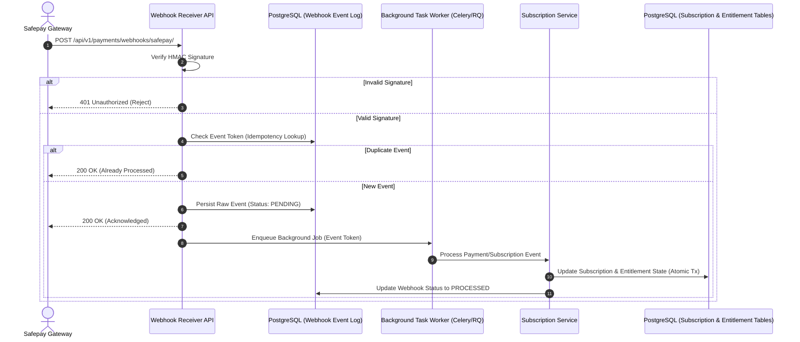
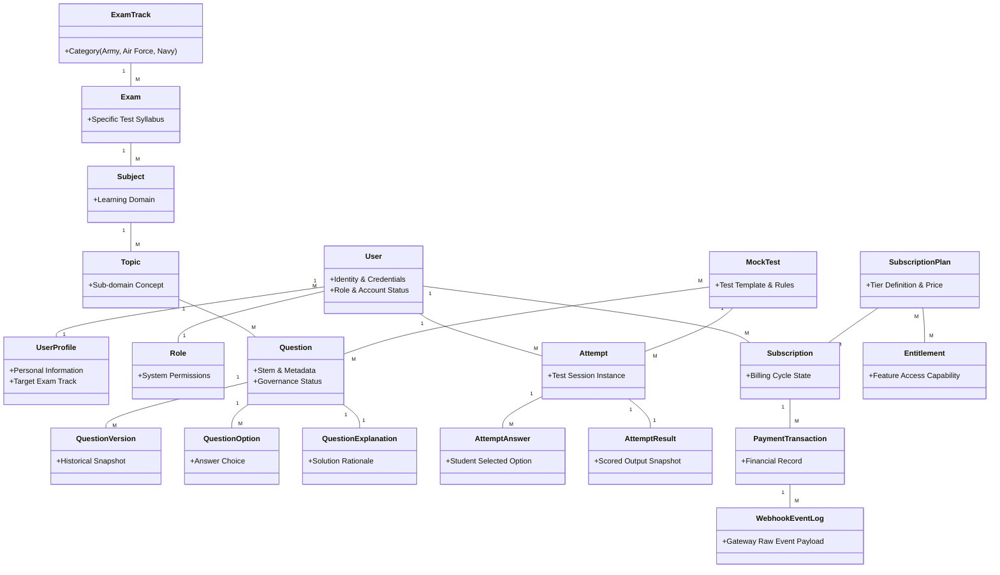
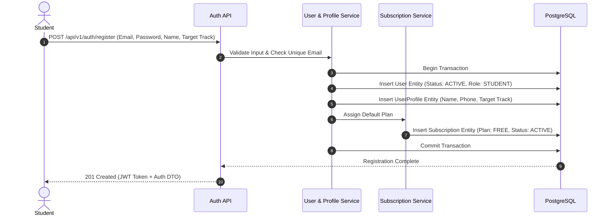
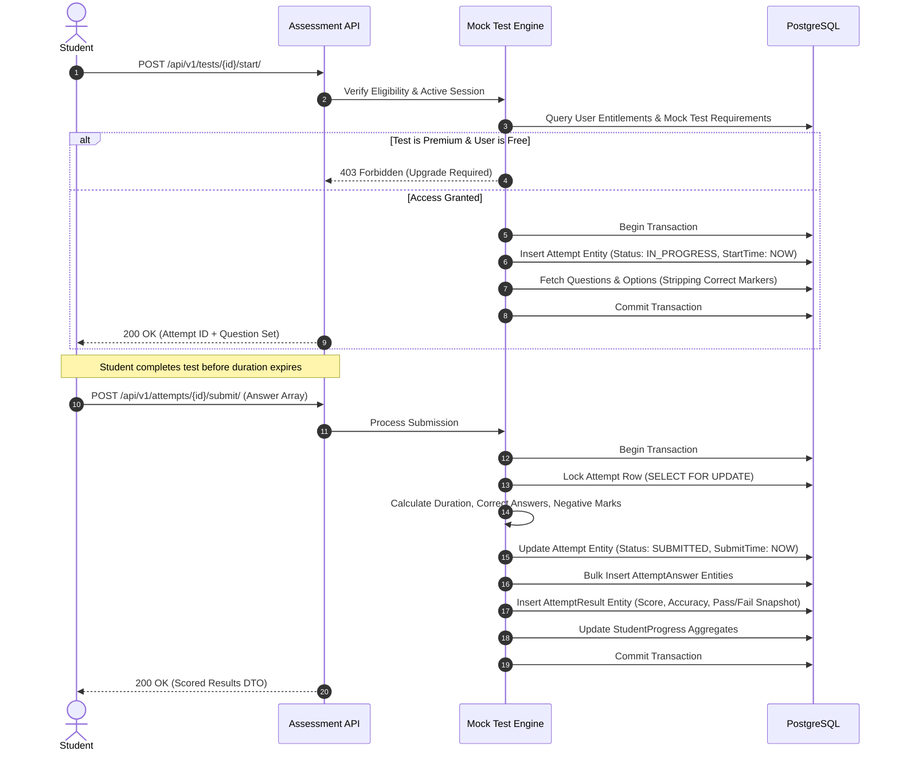
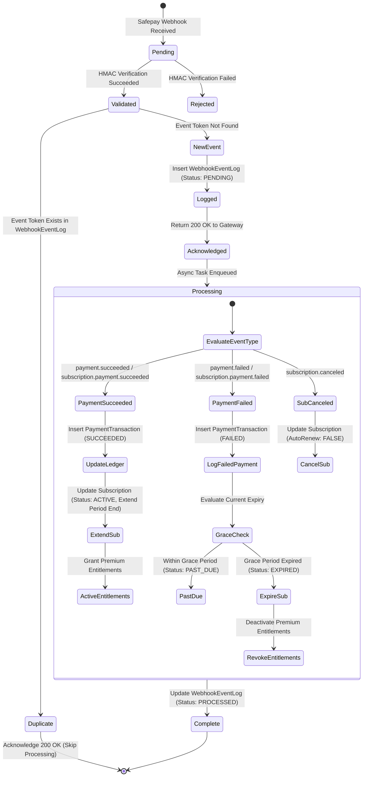
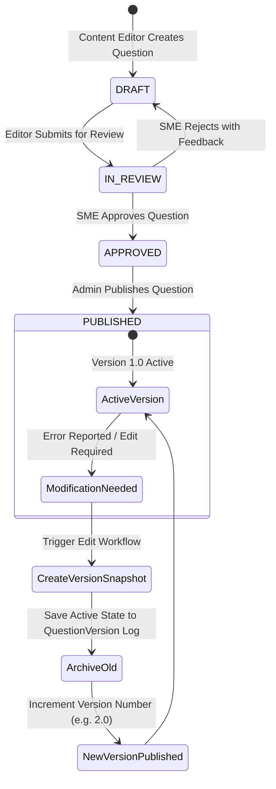
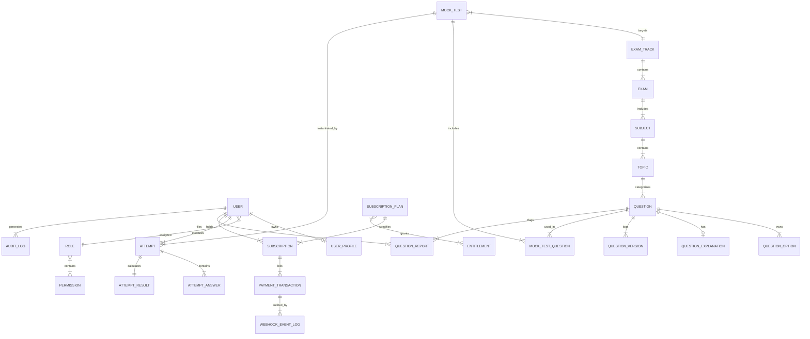

# Prepora Database Architecture Plan

> **Document Status:** Active Architectural Blueprint  
> **Target System:** Prepora SaaS Backend (Django REST Framework + PostgreSQL)  
> **Author:** Senior Software Architect & Database Engineer  
> **Related Documentation:** [Product Plan & SRS](file:///d:/Prepora/docs/PROJECT_PLAN.md), [Backend Architecture](file:///d:/Prepora/docs/BACKEND_ARCHITECTURE.md), [API Design](file:///d:/Prepora/docs/API_DESIGN.md)

---

## 1. Purpose

### 1.1 Document Objective
This document defines the architectural philosophy, business domain modeling, workflow mechanics, and design strategy for the **Prepora** database. It serves as the single source of truth for all persistent data architecture decisions prior to physical database schema generation (SQL DDL or Django ORM models).

### 1.2 Why Database Planning Precedes Implementation
In production SaaS applications—especially those handling high-volume online assessments, subscription billing, and strict content governance—rushing directly into SQL table creation or Django model drafting is a primary root cause of technical debt. 

Database planning is conducted prior to coding to achieve five critical outcomes:

1. **Alignment with Business Rules:** Ensuring that complex domain mechanics (such as entitlement-based feature access, multi-stage content review, and idempotent payment webhooks) are supported by relational structures rather than fragile application workarounds.
2. **Prevention of Structural Refactoring:** Schema modifications on live databases containing millions of user attempt logs or subscription ledger rows are high-risk, expensive, and introduce downtime risks.
3. **Data Integrity Enforcement:** Guaranteeing that rules (e.g., "A published question cannot be altered without creating a new version", "A payment cannot activate entitlements without server-side verification") are enforced at the persistence layer.
4. **Performance & Scalability Planning:** Designing indexing, normalization, and aggregation strategies ahead of time to support heavy concurrent testing traffic during peak Pakistan Armed Forces exam preparation seasons.
5. **Onboarding & Maintainability:** Providing backend engineers with clear rationale for *why* entity relationships and boundaries exist, reducing accidental architectural drift.

### 1.3 Relationship to Product Plan & SRS
This plan directly translates the functional and non-functional requirements established in [PROJECT_PLAN.md](file:///d:/Prepora/docs/PROJECT_PLAN.md) into persistent data structures:

* **Product SRS Alignment:** Implements the domain hierarchy (`Exam Track -> Exam -> Subject -> Topic -> Question`), the subscription/entitlement decoupling (`User -> Subscription -> Entitlements -> Feature Access`), content quality governance (`Draft -> In Review -> Approved -> Published`), and idempotent payment verification.
* **Scope Boundary Enforcement:** Explicitly structures core P0 entity domains (Identity, Content, Assessment, Monetization, Progress) while defining clean extension slots for P1/P2 features (Certificates, Leaderboards, AI Recommendations) without requiring breaking schema alterations.

---

## 2. Database Philosophy

Prepora's persistence layer is engineered under a strict set of architectural principles designed to guarantee data trustworthiness, high performance, and long-term maintainability.

```
+-----------------------------------------------------------------------+
|                         APPLICATION BACKEND                           |
|  (Business Logic, Entitlement Evaluation, Scoring, State Machines)    |
+-----------------------------------------------------------------------+
                                   |
                  Explicit API / ORM Boundary Layer
                                   |
+-----------------------------------------------------------------------+
|                         POSTGRESQL DATABASE                           |
|  (Single Source of Truth, ACID Integrity, Relational Constraints)     |
+-----------------------------------------------------------------------+
```

### 2.1 Database as the Single Source of Truth
The database is the ultimate authority for system state. Application servers are stateless worker nodes that process logic, but persistent domain state (user access levels, exam responses, monetary ledger events, question revision history) resides strictly within the database. Transient in-memory caches (such as Redis) may be used for speed, but state can always be fully reconstituted from PostgreSQL.

### 2.2 Separation of Concerns: Backend Logic vs. Persistence
A foundational policy of Prepora is that **business logic belongs in the backend application layer (Django Python services), not in database triggers or stored procedures**.

* **Why Avoid Stored Procedures & Triggers:** Stored procedures hinder unit testing, obscure business logic across multiple technology stacks, complicate version control/CI-CD pipelines, and make database migrations difficult to audit.
* **Database Responsibility:** The database enforces structural integrity (Foreign Keys, NOT NULL, UNIQUE constraints, CHECK rules, transactional ACID boundaries).
* **Backend Responsibility:** Application service layers enforce domain workflows (scoring calculations, entitlement authorization rules, payment status transitions, notification triggers).

### 2.3 Relational Normalization & Integrity
Prepora prioritizes a highly normalized schema (3NF) for all transactional and content domains:
* Eliminates update, insertion, and deletion anomalies.
* Prevents data duplication (e.g., user profiles or pricing tiers stored in multiple places).
* Guarantees that references (e.g., question option references in student attempt logs) remain strictly consistent across millions of records.

*Note on Controlled Denormalization:* Denormalization is permitted **only** in designated read-heavy snapshot entities (e.g., caching total score and accuracy percentage inside an `AttemptResult` record) to eliminate computationally expensive multi-table JOINs during dashboard rendering.

### 2.4 Selection Rationale: Why PostgreSQL?
PostgreSQL was selected as the enterprise database engine for Prepora based on technical requirements:

1. **Transactional Integrity & ACID Compliance:** Guarantees strict transactional isolation during concurrent mock test submissions and payment webhook processing.
2. **Rich Data Type Support:** Native support for `UUID` primary keys, high-precision `NUMERIC` for monetary values, `TIMESTAMPTZ` for timezones, and `JSONB` for provider payloads.
3. **Advanced Indexing:** Capabilities including B-tree, Partial Indexes (e.g., indexing only active subscriptions), and GIN indexes for JSONB metadata.
4. **JSONB Flexibility:** Allows structured relational schema for core entities while storing unpredictable, third-party provider payloads (e.g., Safepay webhook metadata) cleanly in semi-structured fields without schema pollution.
5. **Ecosystem & Django Compatibility:** Flawless integration with Django ORM, supporting transactional DDL migrations, connection pooling (PgBouncer), and read-replica scaling.

---

## 3. SaaS Data Flow Overview

Data in Prepora flows through a multi-tiered architecture with clearly defined domain responsibilities at every boundary.

### 3.1 End-to-End Request Data Flow

```mermaid
graph TD
    Client[Student / Web Client] -->|1. HTTPS Request / JSON| API Gateway / Nginx
    API Gateway / Nginx -->|2. Route to Application| Django Middleware
    
    subgraph Backend Application Layer
        Django Middleware -->|3. Authentication & JWT Validation| REST View Controller
        REST View Controller -->|4. Delegate Business Operations| Domain Service Layer
        Domain Service Layer -->|5. Entitlement & Rule Checks| Domain Service Layer
    end
    
    Domain Service Layer -->|6. SQL Query via ORM / Transaction| PostgreSQL DB
    PostgreSQL DB -->|7. Verified ACID Data / Result Set| Domain Service Layer
    
    subgraph Backend Response Formatting
        Domain Service Layer -->|8. Construct Domain DTO| REST View Controller
        REST View Controller -->|9. Serialize JSON Response| Django Middleware
    end
    
    Django Middleware -->|10. HTTP Response 200/4xx/5xx| Client
```

### 3.2 Tier Responsibility Breakdown

| Architecture Tier | Primary Responsibility | Data Handling Governance |
| :--- | :--- | :--- |
| **Frontend Client** | User interaction, UI state rendering, input validation | Accepts user input; never trusts local client calculations for scores, access rules, or prices. |
| **API Boundary** | Request routing, JWT validation, payload parsing, rate limiting | Rejects malformed requests; converts HTTP payloads into internal DTOs. |
| **Backend Middleware** | Context setup, CORS, tenant/user authentication, request logging | Attaches verified user context to execution thread. |
| **Domain Services** | Business logic, state transition rules, entitlement checks, scoring algorithms | Enforces workflow rules; manages atomic database transactions. |
| **PostgreSQL Database** | Persistent storage, relational integrity, row-level locking, ACID safety | Executes queries, enforces foreign keys and constraints; returns persistent truth. |

### 3.3 Asynchronous Webhook & Event Flow
For asynchronous operations (e.g., Safepay payment webhooks), the data flow is designed for zero event loss and idempotent execution:



---

## 4. Business Domain Analysis

Prepora's data model is organized into ten distinct business domains. Isolating these domains prevents tight coupling and ensures clear ownership of data entities.

```mermaid
graph BS
    subgraph Core Identity & Access
        AuthDomain[Authentication & User Management]
    end
    
    subgraph Content & Assessment Engine
        TaxonomyDomain[Exam Taxonomy & Hierarchy]
        QBankDomain[Question Bank & Quality Governance]
        MockDomain[Mock Test & Practice Engine]
    end
    
    subgraph Monetization & Subscriptions
        SubDomain[Subscription & Entitlements]
        PayDomain[Payments & Gateway Ledger]
    end
    
    subgraph Analytics & Engagement
        AnalyticsDomain[Analytics & Learner Progress]
        NotifDomain[Notifications & Communications]
    end
    
    subgraph Governance & Administration
        AdminDomain[Admin Operations & Audit Logging]
        ReportDomain[Reporting & Platform Metrics]
    end

    AuthDomain --> TaxonomyDomain
    AuthDomain --> SubDomain
    SubDomain --> PayDomain
    TaxonomyDomain --> QBankDomain
    QBankDomain --> MockDomain
    MockDomain --> AnalyticsDomain
    SubDomain --> MockDomain
```

### 4.1 Authentication & User Management Domain
* **Purpose:** Manages identity, credentials, user profiles, and Role-Based Access Control (RBAC).
* **Responsibilities:** Secure credential storage, role assignment (Student, Editor, SME, Admin, Superadmin), profile metadata, session security.
* **Why It Exists:** All platform interactions require authenticated identity and strict authorization.
* **Future Dependents:** Social login integrations, multi-device session management, security audit systems.

### 4.2 Exam Taxonomy & Hierarchy Domain
* **Purpose:** Represents the domain structure of Pakistan Armed Forces and competitive exams.
* **Responsibilities:** Maintaining the hierarchy: `Exam Track -> Exam -> Subject -> Topic`.
* **Why It Exists:** Content must be strictly cataloged so students prepare for their specific test syllabus (e.g., PMA Long Course vs. Initial Air Force Test).
* **Future Dependents:** Adaptive learning paths, syllabus versioning, partner academy content packs.

### 4.3 Question Bank & Quality Governance Domain
* **Purpose:** Stores questions, options, explanations, references, and review states.
* **Responsibilities:** Content drafting, editorial review lifecycle (`DRAFT -> IN_REVIEW -> APPROVED -> PUBLISHED`), version history, question report tracking.
* **Why It Exists:** Question quality and accuracy are Prepora's core value proposition; bad content destroys student trust.
* **Future Dependents:** AI question generator evaluation, automated error detection, question item difficulty recalibration.

### 4.4 Mock Test & Practice Engine Domain
* **Purpose:** Configures and executes practice sessions and timed mock exam simulations.
* **Responsibilities:** Test templates, time limits, question selection rules, test attempts, student responses, scoring calculations.
* **Why It Exists:** Delivers the primary learning interaction for students simulating real exam pressure.
* **Future Dependents:** Adaptive computerized testing (CAT), speed-scoring metrics, anti-cheat monitoring.

### 4.5 Analytics & Learner Progress Domain
* **Purpose:** Measures student performance, track accuracy trends, and identifies weak topics.
* **Responsibilities:** Historical performance aggregation, topic mastery calculations, time-per-question analysis, score snapshots.
* **Why It Exists:** Provides students with actionable feedback on where to focus study efforts.
* **Future Dependents:** AI recommendation engine, predictive exam readiness scoring, personalized study schedulers.

### 4.6 Subscription & Entitlements Domain
* **Purpose:** Manages subscription plans, billing periods, entitlement policies, and access authorization.
* **Responsibilities:** Subscription states (`PENDING, ACTIVE, PAST_DUE, CANCELED, EXPIRED, PAUSED`), entitlement mappings, renewal dates, grace period policies.
* **Why It Exists:** Enforces Prepora's monetization rules cleanly without hardcoding `is_premium` flags on user accounts.
* **Future Dependents:** Tiered plan upgrades, enterprise academy licenses, discount coupon systems.

### 4.7 Payments & Gateway Ledger Domain
* **Purpose:** Records financial transactions, checkout sessions, and payment provider webhook logs.
* **Responsibilities:** Transaction ledger, gateway response logging, Safepay metadata preservation, HMAC verification logs, refund records.
* **Why It Exists:** Maintains an immutable financial audit trail separate from subscription state.
* **Future Dependents:** Multi-gateway processing (JazzCash, EasyPaisa), automated refund processing, revenue accounting.

### 4.8 Notifications & Communications Domain
* **Purpose:** Handles targeted messaging, system updates, and study reminders.
* **Responsibilities:** Notification logs, delivery channels (In-App, Email, SMS), read statuses, broadcast announcements.
* **Why It Exists:** Engages students and alerts them to subscription renewals or test updates.
* **Future Dependents:** Push notifications (Web/Mobile), automated study habit alerts.

### 4.9 Administration & Audit Operations Domain
* **Purpose:** Tracks administrative modifications, user suspensions, and system audit logs.
* **Responsibilities:** System action logging, role change history, manual subscription overrides, content deletion logs.
* **Why It Exists:** Guarantees platform security, compliance, and internal operational oversight.
* **Future Dependents:** Advanced security event monitoring (SIEM), administrative compliance exports.

### 4.10 Reporting & Platform Metrics Domain
* **Purpose:** Aggregates macro-level platform performance for administrators.
* **Responsibilities:** Daily active user counts, revenue metrics, popular exam tracks, content reporting statistics.
* **Why It Exists:** Empowers business leadership to make data-driven decisions.
* **Future Dependents:** Executive analytics dashboards, automated financial reporting exports.

---

## 5. Domain Modeling

Below is the identification of business entities across domains. In accordance with database planning principles, entity responsibilities and ownership are defined prior to field or column specifications.



### 5.1 Identity & Access Domain Entities

#### User Entity
* **Why It Exists:** Represents a unique legal or physical actor within the platform.
* **Business Responsibility:** Owns authentication credentials, account status (Active, Suspended), and primary role bindings.
* **Information Owned:** Primary email, hashed password, account status flags, timestamp metadata.
* **Dependents:** UserProfile, Attempt, Subscription, AuditLog, PaymentTransaction.

#### UserProfile Entity
* **Why It Exists:** Stores optional or biographical details separate from core authentication credentials.
* **Business Responsibility:** Manages student demography, targeted exam track preferences, phone numbers, and profile avatars.
* **Information Owned:** Full name, phone number, target exam selection, city/region.
* **Dependents:** None (dependent on User).

#### Role Entity
* **Why It Exists:** Encapsulates permissions into reusable roles (`Student`, `Content Editor`, `SME`, `Support Agent`, `Admin`, `Superadmin`).
* **Business Responsibility:** Defines RBAC scope across the platform.
* **Information Owned:** Role key, description, permission set bindings.
* **Dependents:** User.

#### Permission Entity
* **Why It Exists:** Defines granular capabilities within the system (e.g., `content.publish`, `users.suspend`, `finance.refund`).
* **Business Responsibility:** Atomic authorization unit.
* **Information Owned:** Permission codename, target domain, action type.
* **Dependents:** Role.

---

### 5.2 Exam Taxonomy Domain Entities

#### ExamTrack Entity
* **Why It Exists:** Represents top-level military/competitive branches (e.g., Pakistan Army, PAF, PN, FPSC, Police).
* **Business Responsibility:** High-level grouping for all exams and preparation materials.
* **Information Owned:** Track name, slug, icon asset reference, status.
* **Dependents:** Exam, MockTest, StudentProgress.

#### Exam Entity
* **Why It Exists:** Represents a specific test intake or selection course (e.g., PMA Long Course, GDP Air Force, Navy Cadet).
* **Business Responsibility:** Groups subjects and syllabi for an explicit target test.
* **Information Owned:** Exam title, slug, track binding, description.
* **Dependents:** Subject, MockTest.

#### Subject Entity
* **Why It Exists:** Defines major academic/testing domains (e.g., Intelligence Tests, English, Mathematics, Physics, General Knowledge).
* **Business Responsibility:** Organizes topics and questions by field of study.
* **Information Owned:** Subject title, slug, sort order.
* **Dependents:** Topic, Question, PDFNote.

#### Topic Entity
* **Why It Exists:** Provides fine-grained concept categorization within a subject (e.g., Verbal Intelligence -> Analogies; Physics -> Thermodynamics).
* **Business Responsibility:** Enables weak-topic analysis and granular MCQ filtering.
* **Information Owned:** Topic title, slug, subject binding, sort order.
* **Dependents:** Question, WeakTopic, StudentProgress.

---

### 5.3 Question Bank Domain Entities

#### Question Entity
* **Why It Exists:** Represents an assessment item stem and metadata.
* **Business Responsibility:** Serves as the core item container; tracks current publication status and taxonomy tagging.
* **Information Owned:** Question stem, difficulty level, taxonomy links (Topic, ExamTrack), publication status (`DRAFT`, `IN_REVIEW`, `APPROVED`, `PUBLISHED`, `ARCHIVED`), active version reference.
* **Dependents:** QuestionOption, QuestionExplanation, QuestionVersion, QuestionReport, AttemptAnswer.

#### QuestionOption Entity
* **Why It Exists:** Stores choices/distractors for a specific question.
* **Business Responsibility:** Maintains answer choices, labels (A, B, C, D), and correctness status.
* **Information Owned:** Option label, text, media reference, correctness boolean indicator, display order.
* **Dependents:** AttemptAnswer.

#### QuestionExplanation Entity
* **Why It Exists:** Provides pedagogical rationale for why a correct answer is right and why distractors are wrong.
* **Business Responsibility:** Delivers learning value to students during review mode.
* **Information Owned:** Text explanation, reference source quote, media attachments.
* **Dependents:** None (belongs to Question).

#### QuestionVersion Entity
* **Why It Exists:** Preserves complete snapshot history when published questions are modified.
* **Business Responsibility:** Ensures historical test attempts reference the exact question stem/options present when the student answered it.
* **Information Owned:** Full JSON snapshot of stem, options, and explanation at version timestamp; version number; modifier ID.
* **Dependents:** AttemptAnswer (for audit tracing).

#### QuestionSource Entity
* **Why It Exists:** Documents authoritative sources behind questions (e.g., Past Papers 2022, Official Syllabus, Standard Textbook).
* **Business Responsibility:** Supports question quality governance and editorial verification.
* **Information Owned:** Source name, publication year, authority reference.
* **Dependents:** Question.

---

### 5.4 Mock Test Domain Entities

#### MockTest Entity
* **Why It Exists:** Represents a structured test template or exam simulation.
* **Business Responsibility:** Configures test duration, passing criteria, question count, and access tier (Free vs Premium).
* **Information Owned:** Test title, exam track binding, duration (minutes), total mark weight, passing percentage, premium requirement flag, status.
* **Dependents:** MockTestQuestion, Attempt.

#### MockTestQuestion Entity
* **Why It Exists:** Associative entity connecting questions to mock tests with specific ordering and mark weights.
* **Business Responsibility:** Maintains test composition and sequence.
* **Information Owned:** Mock test binding, question binding, question order index, positive mark weight, negative mark weight.
* **Dependents:** None.

---

### 5.5 Assessment Execution Domain Entities

#### Attempt Entity
* **Why It Exists:** Represents a student's active or completed test-taking session instance.
* **Business Responsibility:** Tracks session time, client metadata, progress state (`IN_PROGRESS`, `SUBMITTED`, `EXPIRED, CANCELED`), and completion timestamps.
* **Information Owned:** Student ID, mock test ID, start time, submission time, total duration, attempt status, client IP / device info snapshot.
* **Dependents:** AttemptAnswer, AttemptResult.

#### AttemptAnswer Entity
* **Why It Exists:** Records a student's specific selection for a single question within an attempt.
* **Business Responsibility:** Captures student choice, time spent on item, and marking status.
* **Information Owned:** Attempt ID, question ID, selected option ID, time spent (seconds), score assigned, correctness flag.
* **Dependents:** None.

#### AttemptResult Entity
* **Why It Exists:** Stores calculated scoring metrics for a completed attempt.
* **Business Responsibility:** Maintains immutable snapshot of score, accuracy, rank, and summary stats.
* **Information Owned:** Total questions, answered count, correct count, wrong count, skipped count, final score, accuracy percentage, pass/fail state.
* **Dependents:** Certificate (future).

---

### 5.6 Monetization Domain Entities

#### SubscriptionPlan Entity
* **Why It Exists:** Defines commercial subscription offerings (e.g., Free Plan, Premium Monthly Plan).
* **Business Responsibility:** Manages plan pricing, currency, billing cycles, and feature capability templates.
* **Information Owned:** Plan name, plan code (`FREE`, `PREMIUM_MONTHLY`), price amount, currency (`PKR`), billing interval, active flag.
* **Dependents:** Subscription, PlanEntitlement.

#### Entitlement Entity
* **Why It Exists:** Represents a specific capability or feature boundary within the application.
* **Business Responsibility:** Serves as the atom of access authorization (e.g., `access:premium_mock_tests`, `access:pdf_notes`, `access:advanced_analytics`).
* **Information Owned:** Entitlement code, human name, description.
* **Dependents:** PlanEntitlement, UserEntitlementCache.

#### PlanEntitlement Entity
* **Why It Exists:** Associative entity mapping feature entitlements to subscription plans.
* **Business Responsibility:** Controls which entitlements are granted by a plan.
* **Information Owned:** Subscription plan ID, entitlement ID.
* **Dependents:** None.

#### Subscription Entity
* **Why It Exists:** Tracks a student's active or past billing contract.
* **Business Responsibility:** Enforces subscription status state machine (`PENDING`, `ACTIVE`, `PAST_DUE`, `CANCELED`, `EXPIRED`, `PAUSED`), period start/end dates, auto-renew flag, and Safepay subscription reference tokens.
* **Information Owned:** Student ID, plan ID, normalized status, period start date, period end date, auto-renew flag, cancellation timestamp, provider subscription reference.
* **Dependents:** PaymentTransaction.

---

### 5.7 Payment Gateway Ledger Domain Entities

#### PaymentTransaction Entity
* **Why It Exists:** Stores financial records of checkout attempts and recurring billing payments.
* **Business Responsibility:** Maintains transaction ledger, payment status (`PENDING`, `SUCCEEDED`, `FAILED`, `CANCELED`, `REFUNDED`), amount, currency, and Safepay transaction reference IDs.
* **Information Owned:** Student ID, subscription ID, amount, currency, payment status, Safepay tracker ID, Safepay transaction ID, failure reason, payment timestamp.
* **Dependents:** WebhookEventLog.

#### WebhookEventLog Entity
* **Why It Exists:** Audit log of all raw HTTP webhook events received from external payment providers (Safepay).
* **Business Responsibility:** Guarantees idempotency and provides raw payload audit records for billing dispute resolution.
* **Information Owned:** Provider (`SAFEPAY`), event token (Idempotency key), event type (e.g., `subscription.payment.succeeded`), payload version, raw JSON payload, HMAC verification status, processing status (`PENDING`, `PROCESSED`, `FAILED`, `IGNORED`), processing error log.
* **Dependents:** None.

---

### 5.8 Governance & Administration Entities

#### QuestionReport Entity
* **Why It Exists:** Allows students to report potential issues in published questions.
* **Business Responsibility:** Tracks student feedback on content quality (e.g., wrong key, typo, ambiguous stem) and reviewer resolution workflows.
* **Information Owned:** Reporter user ID, question ID, report category, student comment, review status (`OPEN`, `UNDER_REVIEW`, `RESOLVED`, `REJECTED`), reviewer user ID, resolution notes.
* **Dependents:** None.

#### AuditLog Entity
* **Why It Exists:** Records critical system actions for security, compliance, and administrative oversight.
* **Business Responsibility:** Immutably records administrative overrides, user role modifications, manual subscription grants, and content publishing events.
* **Information Owned:** Actor user ID, action type, target entity type, target entity ID, IP address, timestamp, pre-change state JSON, post-change state JSON.
* **Dependents:** None.

---

## 6. Workflow Analysis

This section analyzes the end-to-end data modifications, entity state transitions, and business rules enforced during key platform operations.

### 6.1 Student Registration Workflow



* **Participating Entities:** `User`, `UserProfile`, `Role`, `SubscriptionPlan`, `Subscription`.
* **Entities Created:** `User`, `UserProfile`, `Subscription` (Free Tier).
* **Entities Updated:** None.
* **Business Rules Enforced:**
  1. Email must be unique across the platform (case-insensitive check).
  2. Passwords must be hashed using PBKDF2/Argon2 before DB persistence.
  3. Every new student is automatically bound to the `FREE` plan subscription with active status.
  4. Operation must be executed within an atomic database transaction.

---

### 6.2 Timed Mock Test Attempt & Scoring Workflow



* **Participating Entities:** `User`, `Entitlement`, `MockTest`, `Attempt`, `AttemptAnswer`, `AttemptResult`, `Question`, `QuestionOption`, `StudentProgress`.
* **Entities Created:** `Attempt`, `AttemptAnswer` (Bulk), `AttemptResult`.
* **Entities Updated:** `Attempt` (Status change), `StudentProgress` (Aggregated statistics update).
* **Business Rules Enforced:**
  1. Access to premium mock tests requires active entitlement check.
  2. Test timing is calculated on the server using `now() - started_at`, regardless of client browser local time.
  3. Correct answer indicators must NEVER be sent to the client during an active `IN_PROGRESS` attempt.
  4. Scoring logic (positive marks + negative marking deduction) runs entirely inside the backend application within a single database transaction.
  5. Late submissions past the duration window plus grace period are marked `EXPIRED` and scored only up to the cutoff.

---

### 6.3 Safepay Webhook Ingestion & Subscription Renewal Workflow



* **Participating Entities:** `WebhookEventLog`, `PaymentTransaction`, `Subscription`, `SubscriptionPlan`, `Entitlement`, `User`.
* **Entities Created:** `WebhookEventLog`, `PaymentTransaction`.
* **Entities Updated:** `Subscription` (Status, Period End Date, Auto-Renew Flag), `WebhookEventLog` (Processing Status).
* **Business Rules Enforced:**
  1. **HMAC Signature Check:** Webhooks with invalid HMAC signatures must be rejected immediately without writing to state tables.
  2. **Idempotency Guarantee:** The Safepay event token is checked against `WebhookEventLog`. If already present, return HTTP 200 immediately without executing business logic.
  3. **Fast Acknowledgements:** Webhook endpoint returns HTTP 200 as soon as the event is persisted to `WebhookEventLog`, delegating status transitions to async execution workers.
  4. **Decoupled Billing & Access:** Payment records populate `PaymentTransaction`. Entitlement changes only occur via verified `Subscription` status rules.
  5. **Grace Period Rule:** A failed subscription payment sets status to `PAST_DUE`. Premium entitlements remain active for a 7-day grace period. If unrecovered after 7 days, status becomes `EXPIRED` and entitlements are deactivated.

---

### 6.4 Question Editorial Governance & Versioning Workflow



* **Participating Entities:** `Question`, `QuestionOption`, `QuestionExplanation`, `QuestionVersion`, `QuestionReport`, `User` (Editor/SME/Admin), `AuditLog`.
* **Entities Created:** `Question`, `QuestionOption`, `QuestionExplanation`, `QuestionVersion` (on update), `AuditLog`.
* **Entities Updated:** `Question` (Status, Active Version Number), `QuestionReport` (Resolution Status).
* **Business Rules Enforced:**
  1. **Separation of Duties:** The editor who creates a question cannot be the sole approver for publication (`creator_id != reviewer_id`).
  2. **Immutability of Published Content:** Once a question is `PUBLISHED`, direct inline edits to text or correct answers are prohibited.
  3. **Version Snapshots:** Any modification to a published question automatically writes the pre-edit state to `QuestionVersion` and increments the version counter.
  4. **Historical Attempt Preservation:** Student attempts retain a link to the specific `QuestionVersion` active at the time of the test, ensuring historical accuracy reports never alter past scores.

---

## 7. Relationship Planning

Prepora relies on standard relational structures to ensure zero data redundancy and maximum query efficiency.

```
ONE-TO-ONE (1:1)
[ User ] <-----------------------------------------> [ UserProfile ]
[ Attempt ] <-------------------------------------> [ AttemptResult ]

ONE-TO-MANY (1:N)
[ Subject ] <--- 1 : N ---> [ Topic ]
[ Topic ]   <--- 1 : N ---> [ Question ]
[ Question] <--- 1 : N ---> [ QuestionOption ]
[ User ]    <--- 1 : N ---> [ Attempt ]
[ User ]    <--- 1 : N ---> [ Subscription ]
[ Subscription ] <--- 1 : N ---> [ PaymentTransaction ]

MANY-TO-MANY (N:M) via Junction Entities
[ MockTest ]      <--- N : M ---> [ Question ]     via [ MockTestQuestion ]
[ SubscriptionPlan ] <--- N : M ---> [ Entitlement ]  via [ PlanEntitlement ]
```

### 7.1 One-to-One (1:1) Relationships
Used when attributes belong to the same logical concept but are separated for performance, security, or clean domain boundaries:
* **`User` <-> `UserProfile`:** Separates high-frequency authentication fields (`email`, `password_hash`, `role`) from biographical/metadata fields (`full_name`, `phone`, `city`).
* **`Attempt` <-> `AttemptResult`:** Separates session execution parameters (`start_time`, `ip_address`, `status`) from finalized scoring outputs (`score`, `percentage`, `summary_json`).

### 7.2 One-to-Many (1:N) Relationships
The primary building block of Prepora's relational taxonomy and event logging:
* **`ExamTrack` -> `Exam` -> `Subject` -> `Topic` -> `Question`:** Hierarchical content breakdown.
* **`Question` -> `QuestionOption`:** A single question stem owns multiple answer choices.
* **`User` -> `Attempt`:** A student conducts multiple test attempts over time.
* **`User` -> `Subscription`:** A student holds a history of subscription cycles.
* **`Subscription` -> `PaymentTransaction`:** A subscription cycle may have multiple billing attempts or recurring payment records.

### 7.3 Many-to-Many (N:M) Relationships & Junction Tables
Direct N:M relationships are converted into explicit associative junction entities containing contextual metadata:

| Left Entity | Right Entity | Junction Entity | Additional Metadata Stored in Junction |
| :--- | :--- | :--- | :--- |
| **`MockTest`** | **`Question`** | **`MockTestQuestion`** | `question_order`, `positive_marks`, `negative_marks` |
| **`SubscriptionPlan`** | **`Entitlement`** | **`PlanEntitlement`** | `granted_at`, `override_rules` |
| **`Role`** | **`Permission`** | **`RolePermission`** | `assigned_by`, `assigned_at` |

---

## 8. Normalization Strategy

Prepora follows a rigorous normalization process to eliminate anomalies, supplemented by documented, controlled denormalization for read performance.

### 8.1 Normalization Forms Compliance

#### First Normal Form (1NF)
* Every table field contains atomic, single-valued entries.
* No repeating groups or comma-separated strings inside relational columns (e.g., distractors are stored as individual rows in `QuestionOption`, not an array string in `Question`).

#### Second Normal Form (2NF)
* All non-key attributes are fully functionally dependent on the primary key.
* In composite junction tables like `MockTestQuestion`, attributes like `question_order` depend on the combination of `(mock_test_id, question_id)`.

#### Third Normal Form (3NF)
* No non-key attribute depends transitively on another non-key attribute.
* User roles are stored via `role_id` referencing a `Role` entity, rather than embedding permission arrays or role titles inside the `User` table.

---

### 8.2 Practical Normalization Decisions for Prepora

1. **Separation of Question Content & Revisions:** Question stems, options, and explanations are normalized into distinct tables. Revisions are pushed to a `QuestionVersion` ledger so main tables reflect current truth without bloating primary query paths.
2. **Entitlement Rule Decoupling:** Subscription plans do not store hardcoded feature flags (e.g., `can_view_pdf = True`). Instead, plans link to atomic `Entitlement` entities via `PlanEntitlement`. Access checking evaluates whether a user's active subscription resolves to the required entitlement code.

---

### 8.3 Controlled Denormalization Cases
To maintain high responsiveness during concurrent test submissions and high-traffic analytics viewing, limited denormalization is explicitly designed into the schema:

```
[ Primary Transactional Tables ]                  [ Read-Optimized Snapshots ]
- Attempt (Session logs)              ====>       - AttemptResult (Calculated Score)
- AttemptAnswer (Individual choices)  ====>       - StudentProgress (Aggregated Accuracy)
                                      ====>       - Subscription (Price Amount Snapshot)
```

1. **`AttemptResult` Aggregates:** Total correct count, wrong count, score, and accuracy percentage are calculated upon test submission and written into `AttemptResult`. Re-calculating test scores dynamically across thousands of `AttemptAnswer` rows on every dashboard view is prohibited.
2. **`StudentProgress` Summary Cache:** Cumulative accuracy and total tests attempted per topic are maintained in a background-updated aggregate table (`StudentProgress`) to allow instant load of progress dashboards.
3. **Monetary Price Snapshotting:** When a user subscribes, the paid plan amount and currency are snapshotted directly into the `Subscription` and `PaymentTransaction` entities. This ensures that future administrative changes to standard `SubscriptionPlan` prices do not retroactively distort historical financial accounting or subscription renewal contracts.

---

## 9. Database Design Principles

All entities within Prepora must conform to strict persistence standards.

### 9.1 Single Responsibility Principle per Table
Each table must represent exactly one domain entity or associative mapping. Mixing concerns—such as embedding payment gateway responses inside the core user table—is prohibited.

### 9.2 Primary Key Strategy: Standardized UUIDv4
All primary keys across Prepora tables utilize **Universally Unique Identifiers (UUIDv4)**.

* **Rationale for UUIDs:**
  1. Prevents sequential ID enumeration attacks (e.g., an attacker crawling `/api/v1/tests/1`, `/api/v1/tests/2`).
  2. Enables secure client-side creation of temporary identifiers before synchronization.
  3. Simplifies distributed database splitting, sharding, and multi-region replication without ID collision risks.

### 9.3 Mandatory Referential Integrity
Foreign key constraints are enforced at the database layer for all relationships. Application-only foreign key logical conventions are rejected.

* **Cascade & Delete Rules:**
  * **`RESTRICT` / `PROTECT` (Default):** Prevents deletion of core taxonomy or content entities if referenced by active transactional records (e.g., a `Question` cannot be deleted if referenced in student `AttemptAnswer` rows).
  * **`CASCADE`:** Used strictly for tightly bound child entities (e.g., deleting a draft `Question` cascades to its `QuestionOption` rows).
  * **`SET NULL`:** Used for non-critical audit bindings (e.g., if an admin account is removed, historical `AuditLog` actor references are set to NULL while preserving the log entry).

### 9.4 Soft Delete Pattern
Data representing user activity, published content, or financial records must never be hard-deleted via standard SQL `DELETE`.

* Entities incorporate a `deleted_at` nullable timestamp column.
* Soft-deleted rows are excluded from standard application queries via default ORM managers (`WHERE deleted_at IS NULL`).
* Retains complete auditability and data recovery capabilities in compliance with educational persistence standards.

### 9.5 Standardized Timestamps
Every table must include standard timestamp tracking columns using PostgreSQL `TIMESTAMPTZ` (Timestamp with Time Zone):
* `created_at`: Set automatically on row insertion (UTC).
* `updated_at`: Updated automatically via ORM hooks or database triggers on row modification (UTC).

### 9.6 Design for Future Expansion
Entities are structured with extensible taxonomy references and reserved `JSONB` metadata fields. This allows adding third-party provider tracking, client device diagnostics, or dynamic feature flags without altering core schema definitions.

---

## 10. Future Database Modules

The database architecture is designed to accommodate planned future modules (P1/P2 priorities) without requiring breaking schema redesigns.

```
                                +-----------------------------------+
                                |   CORE FOUNDATION (Current Plan)  |
                                |   User, Content, Test, Billing    |
                                +-----------------------------------+
                                                  |
           +--------------------------------------+--------------------------------------+
           |                                      |                                      |
           v                                      v                                      v
+-----------------------+              +-----------------------+              +-----------------------+
|  Engagement Modules   |              |  Academic Credentials |              |    AI & Personalization|
| - Bookmarks / Saved   |              | - Certificates        |              | - AI Tutor History    |
| - Study Schedulers    |              | - Leaderboards        |              | - Adaptive Engine     |
| - Discussion Forums   |              | - Badges / Streaks    |              | - Recommendations     |
+-----------------------+              +-----------------------+              +-----------------------+
```

### 10.1 Bookmarks & Revisit Lists
* **Purpose:** Allows students to save challenging questions, notes, or mock tests for later revision.
* **Extension Strategy:** A polymorphic associative entity (`Bookmark`) binding `User` to entity types (`QUESTION`, `NOTE`, `MOCK_TEST`) using explicit target UUIDs.

### 10.2 Study Plans & Schedulers
* **Purpose:** Provides custom study calendars leading up to specific military exam dates.
* **Extension Strategy:** Binds to existing `ExamTrack` and `Topic` entities, linking student tasks to scheduled daily target goals.

### 10.3 Leaderboards & Gamification
* **Purpose:** Computes rank positions and competitive percentile scoring across exam tracks.
* **Extension Strategy:** Isolated read-heavy snapshot entities (`LeaderboardSnapshot`) generated via scheduled background workers, preventing performance impact on primary assessment tables.

### 10.4 Course Completion Certificates
* **Purpose:** Issues verifiable digital certificates for students completing full mock preparation series.
* **Extension Strategy:** Binds `User` and `AttemptResult` to a `Certificate` verification ledger containing unique verification hashes and PDF asset references.

### 10.5 Discussion Forums & Peer Support
* **Purpose:** Enables moderated student Q&A under subjects or exam tracks.
* **Extension Strategy:** Independent messaging entities (`ForumThread`, `ForumPost`) referencing core `User` and `Subject` keys.

### 10.6 AI Tutor & Adaptive Learning Engine
* **Purpose:** Integrates LLM assistance for interactive question explanations and personalized study path generation.
* **Extension Strategy:** Stores conversation history in an isolated `AITutorSession` entity while feeding performance data from existing `AttemptResult` and `StudentProgress` records into recommendation algorithms.

---

## 11. ERD Planning

The Entity Relationship Diagram (ERD) visually maps all persistent domain boundaries. ERD planning precedes actual DDL scripting to ensure all cardinality rules and join paths are structurally sound.

### 11.1 Conceptual ERD Topology



### 11.2 Entity Clustering Summary
* **Identity Cluster:** `USER`, `USER_PROFILE`, `ROLE`, `PERMISSION`.
* **Taxonomy Cluster:** `EXAM_TRACK`, `EXAM`, `SUBJECT`, `TOPIC`.
* **Question Bank Cluster:** `QUESTION`, `QUESTION_OPTION`, `QUESTION_EXPLANATION`, `QUESTION_VERSION`, `QUESTION_SOURCE`.
* **Assessment Cluster:** `MOCK_TEST`, `MOCK_TEST_QUESTION`, `ATTEMPT`, `ATTEMPT_ANSWER`, `ATTEMPT_RESULT`.
* **Monetization Cluster:** `SUBSCRIPTION_PLAN`, `ENTITLEMENT`, `PLAN_ENTITLEMENT`, `SUBSCRIPTION`, `PAYMENT_TRANSACTION`, `WEBHOOK_EVENT_LOG`.
* **Governance Cluster:** `QUESTION_REPORT`, `AUDIT_LOG`, `STUDENT_PROGRESS`.

---

## 12. Table Design Planning

When translating this plan into actual physical table definitions in the next project phase, every table specification must follow a standardized engineering template.

### 12.1 Required Table Specification Schema
In the subsequent phase, each table will be defined using the following structured breakdown:

1. **Table Name:** Physical SQL table name (using snake_case).
2. **Entity Purpose:** Concise statement of business ownership.
3. **Attribute List:** Column names, PostgreSQL data types (`UUID`, `VARCHAR`, `TEXT`, `INTEGER`, `NUMERIC`, `BOOLEAN`, `TIMESTAMPTZ`, `JSONB`), NULLability, and Default values.
4. **Primary Key:** Explicit primary key column designation.
5. **Foreign Keys:** Target entity references, ON DELETE policies (`RESTRICT`, `CASCADE`, `SET NULL`).
6. **Constraints:** `UNIQUE` keys, `CHECK` constraints (e.g., `score >= 0`, `status IN (...)`).
7. **Indexes:** B-tree, Partial, GIN, and Composite index specifications.
8. **Operational Notes:** Security, partitioning, or caching requirements.

---

## 13. Implementation Roadmap

Database implementation must strictly follow a dependency-ordered sequence. Attempting to build transactional or assessment tables before foundation taxonomy tables exist creates invalid foreign key references and forces rework.

```mermaid
gantt
    title Database Implementation Roadmap
    dateFormat  X
    axisFormat %d
    
    section Phase 1: Identity & RBAC
    Identity & Access Tables      :active, p1, 0, 1
    
    section Phase 2: Taxonomy & Content
    Exam Taxonomy Hierarchy       :p2, after p1, 1d
    Question Bank & Governance    :p3, after p2, 1d
    
    section Phase 3: Assessment Engine
    Mock Test Templates           :p4, after p3, 1d
    Test Execution & Attempt Logs :p5, after p4, 1d
    
    section Phase 4: Monetization
    Subscription & Entitlements   :p6, after p1, 1d
    Payment Ledger & Webhook Logs :p7, after p6, 1d
    
    section Phase 5: Analytics & Admin
    Progress Aggregates & Audit   :p8, after p5, 1d
```



### 13.1 Phase Breakdown & Justification

#### Phase 1: Identity & RBAC Foundation
* **Entities:** `User`, `UserProfile`, `Role`, `Permission`, `RolePermission`.
* **Justification:** All system actions, content creation, and subscription bindings require an authenticated user identity.

#### Phase 2: Taxonomy & Question Bank
* **Entities:** `ExamTrack`, `Exam`, `Subject`, `Topic`, `QuestionSource`, `Question`, `QuestionOption`, `QuestionExplanation`, `QuestionVersion`.
* **Justification:** Academic taxonomy must exist before questions can be cataloged; questions must exist before mock tests can be assembled.

#### Phase 3: Assessment & Execution Engine
* **Entities:** `MockTest`, `MockTestQuestion`, `Attempt`, `AttemptAnswer`, `AttemptResult`.
* **Justification:** Built upon the question bank to enable student test-taking and automated scoring.

#### Phase 4: Monetization & Payment Ledger
* **Entities:** `SubscriptionPlan`, `Entitlement`, `PlanEntitlement`, `Subscription`, `PaymentTransaction`, `WebhookEventLog`.
* **Justification:** Integrates monetization rules and Safepay webhook handling, binding feature entitlement controls to test access.

#### Phase 5: Analytics, Governance & Audit
* **Entities:** `StudentProgress`, `WeakTopic`, `QuestionReport`, `AuditLog`.
* **Justification:** Captures aggregate insights, user feedback, and security logging across active transactional data.

---

## 14. Best Practices & Engineering Standards

Prepora enforces strict engineering conventions across schema naming, migrations, security, and operations.

### 14.1 Naming Conventions
* **Table Names:** Plural snake_case (e.g., `users`, `mock_tests`, `question_options`, `payment_transactions`).
* **Column Names:** Singular snake_case (e.g., `email`, `first_name`, `created_at`).
* **Primary Keys:** Standardized as `id` across all tables (UUID type).
* **Foreign Keys:** Named using target singular entity name plus `_id` suffix (e.g., `user_id`, `question_id`, `mock_test_id`).
* **Boolean Columns:** Prefixed with `is_` or `has_` (e.g., `is_active`, `is_correct`, `has_passed`).
* **Timestamp Columns:** Suffixed with `_at` (e.g., `created_at`, `updated_at`, `submitted_at`, `deleted_at`).

### 14.2 UUID vs. Serial Integer Rationale
All primary keys use **UUIDv4**.
* Integer IDs are prohibited for public-facing domain entities to prevent enumeration attacks.
* Internal high-frequency sequence indexing uses PostgreSQL native UUID generation algorithms (`gen_random_uuid()`).

### 14.3 Deletion & Integrity Governance
* **Default Foreign Key Rule:** `ON DELETE RESTRICT` is mandatory for core business data to prevent accidental cascade deletion of student records or question banks.
* **Soft Deletes:** Applied to user accounts, questions, notes, and subscription records via `deleted_at` fields.

### 14.4 Audit Logging & Webhook Idempotency
* All administrative configuration changes and role updates write immutable logs to `AuditLog`.
* Third-party payment webhooks must check `WebhookEventLog` for event token uniqueness prior to executing state transitions.

### 14.5 Schema Migration Strategy
* **Django ORM Migrations:** All schema alterations are managed strictly via version-controlled Django migration files (`python manage.py makemigrations`). Direct manual SQL alterations on production databases are strictly forbidden.
* **Zero-Downtime Migration Policy:** Adding non-nullable columns requires a multi-step deployment:
  1. Add column as nullable.
  2. Deploy backend code that populates the column.
  3. Backfill existing rows via background script.
  4. Apply constraint setting column to `NOT NULL`.

### 14.6 Backup, Disaster Recovery & High Availability
* **Point-in-Time Recovery (PITR):** Write-Ahead Logging (WAL) archiving enabled with 30-day retention to allow restoration to any exact millisecond.
* **Daily Automated Snapshots:** Encrypted backups generated daily and stored in geographically redundant object storage.
* **High Availability (HA):** Primary database with automatic failover to a hot standby read-replica in a separate availability zone.

---

## 15. Conclusion & Next Steps

This database architecture plan provides a complete conceptual and architectural foundation for Prepora. By establishing clear business domain boundaries, entity workflows, normalization strategies, and design principles, the project is fully prepared for physical schema definition.

### Recommended Next Phase
1. **Physical Schema Definition:** Convert entity specifications into explicit PostgreSQL SQL DDL scripts and Django ORM models with full field data types, constraints, and indexes.
2. **Database Seed Strategy:** Define initial data fixtures for roles, permissions, exam tracks, initial subjects, and baseline subscription plans.
