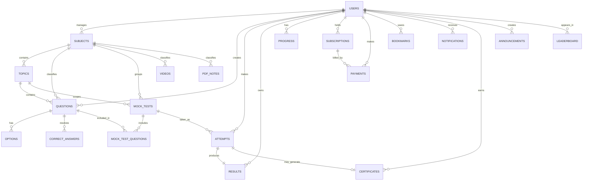

# Database Plan for Prepora

## 1. Overview

The database should support the full product lifecycle of Prepora: user identity, content taxonomy, assessment delivery, attempt scoring, progress tracking, ranking, notifications, subscriptions, payments, certificates, and admin operations.

The design should be relational, normalized where it matters, and flexible where the product needs growth. PostgreSQL is the right choice because it supports strong constraints, JSONB flexibility, and scalable querying.

## 2. Core Design Principles

- Use UUIDs as primary keys for easier distributed compatibility.
- Add created_at and updated_at timestamps to all major tables.
- Use soft-delete patterns where content and user records may need auditability.
- Use JSONB for flexible metadata such as device info, target rules, and payment payloads.
- Keep frequently queried relationships indexed.
- Separate transactional data from derived reporting data where appropriate.

## 3. Core Tables

### Users

- Purpose: store user identity and account state
- Columns: id, email, password_hash, full_name, phone, avatar_url, role_code, status, last_login_at, created_at, updated_at, deleted_at
- Primary Key: id
- Foreign Keys: none
- Relationships: one user has many attempts, subscriptions, payments, bookmarks, notifications, certificates, progress rows, announcements, and created content
- Indexes: unique email, role, status, created_at
- Constraints: email unique, status restricted to valid states

### Subjects

- Purpose: represent major learning domains such as Army, Air Force, and Police preparation tracks
- Columns: id, name, slug, description, sort_order, status, created_at, updated_at
- Primary Key: id
- Foreign Keys: none
- Relationships: one subject has many topics, questions, mock tests, videos, and notes
- Indexes: unique slug, status, sort_order
- Constraints: slug unique, sort_order positive

### Topics

- Purpose: group content into smaller study units within a subject
- Columns: id, subject_id, name, slug, description, sort_order, status, created_at, updated_at
- Primary Key: id
- Foreign Keys: subject_id -> Subjects.id
- Relationships: one topic belongs to one subject and has many questions, videos, notes, and mock tests
- Indexes: unique(subject_id, slug), subject_id, status
- Constraints: slug unique within subject

## 4. Assessment Tables

### Questions

- Purpose: store the question stem, difficulty, and editorial metadata
- Columns: id, subject_id, topic_id, created_by_user_id, exam_track, question_type, difficulty_level, stem, explanation, language_code, status, version_no, published_at, created_at, updated_at, deleted_at
- Primary Key: id
- Foreign Keys: subject_id -> Subjects.id, topic_id -> Topics.id, created_by_user_id -> Users.id
- Relationships: one question has many options and many correct answer mappings; it can be used in many mock tests
- Indexes: subject_id, topic_id, exam_track, difficulty_level, status, created_at
- Constraints: question_type and status restricted to valid values; difficulty_level between 1 and 5

### Options

- Purpose: store each possible answer option for a question
- Columns: id, question_id, option_label, option_text, option_order, media_key, is_active, created_at, updated_at
- Primary Key: id
- Foreign Keys: question_id -> Questions.id
- Relationships: one question has many options
- Indexes: question_id, unique(question_id, option_order)
- Constraints: option_order positive; option order unique per question

### Correct Answers

- Purpose: define which option or options are correct for a question
- Columns: id, question_id, option_id, is_primary, rationale, created_at, updated_at
- Primary Key: id
- Foreign Keys: question_id -> Questions.id, option_id -> Options.id
- Relationships: one question has one or many correct answer mappings depending on question type
- Indexes: question_id, option_id
- Constraints: option must belong to the same question

### Mock Tests

- Purpose: define test templates, time limits, and question scope
- Columns: id, subject_id, topic_id, created_by_user_id, exam_track, title, description, test_mode, duration_minutes, question_count, negative_marking, passing_score, status, published_at, created_at, updated_at
- Primary Key: id
- Foreign Keys: subject_id -> Subjects.id, topic_id -> Topics.id, created_by_user_id -> Users.id
- Relationships: one mock test has many mock test questions and many attempts
- Indexes: subject_id, topic_id, exam_track, status, created_at
- Constraints: question_count and duration positive; status and test_mode restricted to valid values

### Mock Test Questions

- Purpose: join mock tests to the specific question set and order
- Columns: id, mock_test_id, question_id, question_order, marks, negative_marks, is_optional, created_at
- Primary Key: id
- Foreign Keys: mock_test_id -> Mock Tests.id, question_id -> Questions.id
- Relationships: a mock test has many questions; a question can appear in many mock tests
- Indexes: unique(mock_test_id, question_order), unique(mock_test_id, question_id)
- Constraints: question order positive; no duplicate question within the same test

### Attempts

- Purpose: represent a user’s attempt to take a mock test
- Columns: id, user_id, mock_test_id, attempt_number, status, started_at, submitted_at, duration_seconds, client_timezone, device_info, ip_address, created_at, updated_at
- Primary Key: id
- Foreign Keys: user_id -> Users.id, mock_test_id -> Mock Tests.id
- Relationships: one user has many attempts; one mock test has many attempts; one attempt has one result
- Indexes: unique(user_id, mock_test_id, attempt_number), user_id, mock_test_id, status
- Constraints: attempt_number positive; submitted_at cannot be earlier than started_at

### Results

- Purpose: store scoring and derived metrics for an attempt
- Columns: id, attempt_id, user_id, mock_test_id, total_questions, answered_count, correct_count, wrong_count, skipped_count, score, percentage, accuracy, time_taken_seconds, rank_position, summary_json, calculated_at, updated_at
- Primary Key: id
- Foreign Keys: attempt_id -> Attempts.id, user_id -> Users.id, mock_test_id -> Mock Tests.id
- Relationships: one attempt has one result
- Indexes: unique(attempt_id), user_id, mock_test_id, calculated_at
- Constraints: counts non-negative; percentage and accuracy between 0 and 100

### Progress

- Purpose: track a user’s progress over time by subject, topic, test, or track
- Columns: id, user_id, scope_type, scope_id, total_attempts, questions_answered, correct_count, wrong_count, accuracy, average_score, mastery_level, last_attempt_at, updated_at
- Primary Key: id
- Foreign Keys: user_id -> Users.id
- Relationships: one user has many progress rows
- Indexes: unique(user_id, scope_type, scope_id), user_id, scope_type, last_attempt_at
- Constraints: counts non-negative; accuracy between 0 and 100

## 5. Content and Engagement Tables

### Videos

- Purpose: store lecture content metadata
- Columns: id, subject_id, topic_id, created_by_user_id, exam_track, title, description, provider, video_key, thumbnail_key, duration_seconds, transcript, status, published_at, created_at, updated_at
- Primary Key: id
- Foreign Keys: subject_id -> Subjects.id, topic_id -> Topics.id, created_by_user_id -> Users.id
- Relationships: associated with a subject and optionally a topic
- Indexes: subject_id, topic_id, exam_track, status, published_at
- Constraints: duration_seconds positive

### PDF Notes

- Purpose: store notes and reading resources
- Columns: id, subject_id, topic_id, created_by_user_id, exam_track, title, summary, file_key, page_count, language_code, status, published_at, created_at, updated_at
- Primary Key: id
- Foreign Keys: subject_id -> Subjects.id, topic_id -> Topics.id, created_by_user_id -> Users.id
- Relationships: associated with a subject and optionally a topic
- Indexes: subject_id, topic_id, exam_track, status, published_at
- Constraints: page_count positive

### Announcements

- Purpose: broadcast platform updates to users or segments
- Columns: id, created_by_user_id, audience_type, target_rules, title, body, priority, status, publish_at, expires_at, created_at, updated_at
- Primary Key: id
- Foreign Keys: created_by_user_id -> Users.id
- Relationships: one admin creates many announcements
- Indexes: status, publish_at, audience_type
- Constraints: priority within defined range

### Bookmarks

- Purpose: let users save questions, tests, videos, notes, or topics for later
- Columns: id, user_id, item_type, item_id, note, created_at
- Primary Key: id
- Foreign Keys: user_id -> Users.id
- Relationships: one user has many bookmarks to multiple entity types
- Indexes: unique(user_id, item_type, item_id), user_id, item_type
- Constraints: item_type restricted to approved values

### Notifications

- Purpose: deliver in-app or outbound notifications
- Columns: id, user_id, notification_type, channel, title, body, related_type, related_id, is_read, read_at, scheduled_at, sent_at, created_at
- Primary Key: id
- Foreign Keys: user_id -> Users.id
- Relationships: one user has many notifications
- Indexes: user_id, is_read, created_at, scheduled_at
- Constraints: channel restricted to supported values

### Leaderboard

- Purpose: store ranking snapshots for a scope and time period
- Columns: id, user_id, scope_type, scope_id, period_type, period_start, period_end, rank_position, score, accuracy, attempt_count, generated_at, snapshot_version
- Primary Key: id
- Foreign Keys: user_id -> Users.id
- Relationships: one user can appear in many leaderboard snapshots
- Indexes: unique(scope_type, scope_id, period_type, period_start, period_end, user_id), user_id, generated_at
- Constraints: rank_position and attempt_count non-negative; accuracy between 0 and 100

## 6. Monetization and Credential Tables

### Subscriptions

- Purpose: track billing entitlements and subscription lifecycle
- Columns: id, user_id, plan_code, billing_cycle, status, starts_at, ends_at, auto_renew, amount_snapshot, currency, provider, provider_subscription_ref, cancelled_at, metadata, created_at, updated_at
- Primary Key: id
- Foreign Keys: user_id -> Users.id
- Relationships: one user has many subscriptions; one subscription has many payments
- Indexes: user_id, status, ends_at, unique(provider_subscription_ref)
- Constraints: amount non-negative; currency validated; status restricted to supported values

### Payments

- Purpose: store payment transactions and gateway response data
- Columns: id, user_id, subscription_id, amount, currency, provider, provider_payment_ref, payment_method, status, paid_at, failure_reason, raw_payload, created_at, updated_at
- Primary Key: id
- Foreign Keys: user_id -> Users.id, subscription_id -> Subscriptions.id
- Relationships: one subscription has many payments
- Indexes: unique(provider_payment_ref), user_id, subscription_id, status
- Constraints: amount non-negative; status restricted to supported states

### Certificates

- Purpose: store issued student certificates and verification metadata
- Columns: id, user_id, attempt_id, certificate_number, certificate_type, issued_at, expires_at, score_snapshot, file_key, status, metadata, created_at, updated_at
- Primary Key: id
- Foreign Keys: user_id -> Users.id, attempt_id -> Attempts.id
- Relationships: one user can earn many certificates; one attempt can generate one certificate
- Indexes: unique(certificate_number), unique(attempt_id), user_id, issued_at
- Constraints: score_snapshot between 0 and 100

## 7. ERD Overview

## 8. Scalability Considerations

The design is scalable because:

- transactional tables and analytics tables are separated logically
- the most important lookup patterns are indexed
- content tables are normalized enough for integrity but flexible enough for growth
- large fact tables such as attempts, results, notifications, and leaderboard rows can later be partitioned or moved into specialized stores if needed
- JSONB supports flexible metadata without overcomplicating the core relational model

## 9. Recommended Next Step

The next step should be to convert this plan into actual PostgreSQL schema definitions and migration files, but this document is intentionally design-only and does not include SQL yet.
