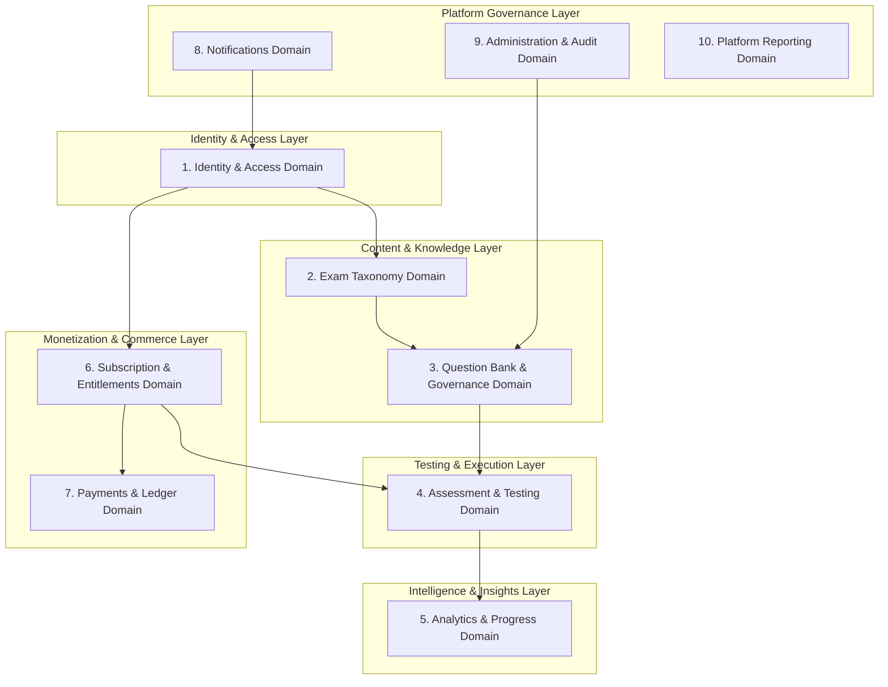
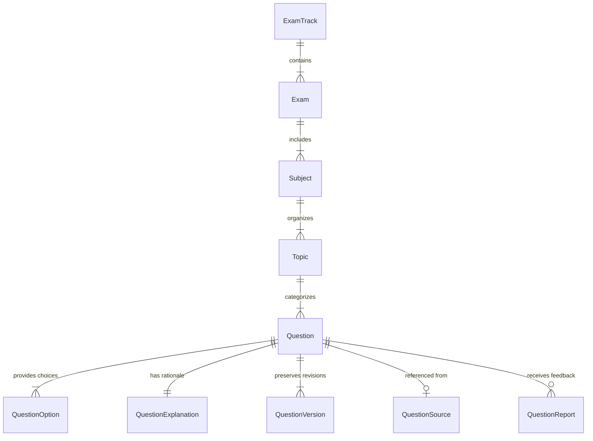
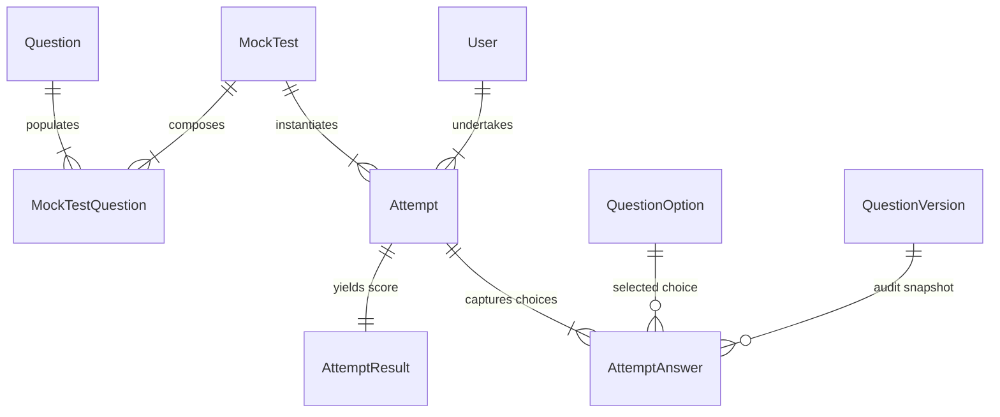
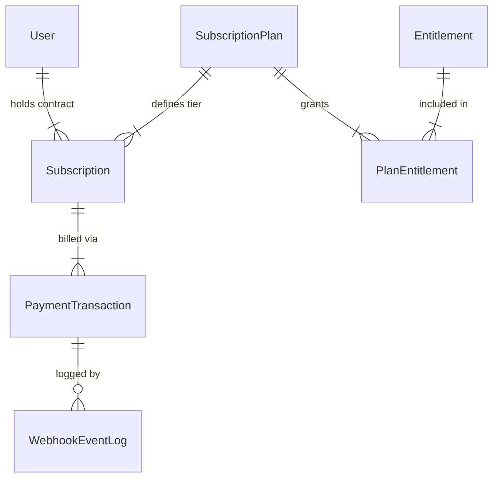
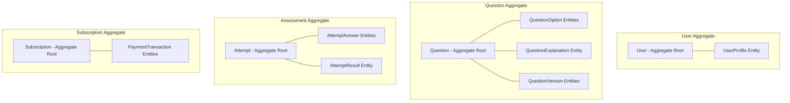
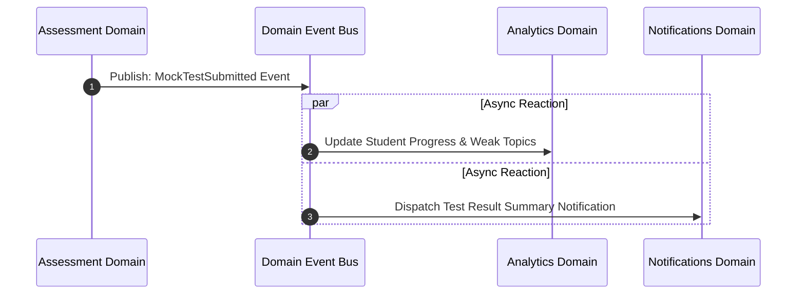

# Prepora Domain Model Specification

> **Document Status:** Active Architectural Domain Blueprint  
> **Target Platform:** Prepora SaaS Platform (Pakistan Armed Forces & Competitive Examination Preparation)  
> **Author:** Lead Software Architect  
> **Related Documentation:** [Product Plan & SRS](file:///d:/Prepora/docs/PROJECT_PLAN.md), [Database Architecture Plan](file:///d:/Prepora/docs/DATABASE_PLAN.md), [Backend Architecture](file:///d:/Prepora/docs/BACKEND_ARCHITECTURE.md)

---

## 1. Purpose

### 1.1 What is Domain Modeling?
Domain Modeling is the architectural practice of identifying, defining, and structuring the essential real-world business concepts, entities, rules, relationships, and events within a specific problem space. It focuses purely on **what the business does, what concepts exist, how business data behaves, and what rules govern business operations**, independent of underlying technical implementations such as database schemas, ORM models, frameworks, storage engines, or network protocols.

In Domain-Driven Design (DDD), the domain model forms the **Ubiquitous Language**—a shared, unambiguous vocabulary used equally by product leadership, subject matter experts (SMEs), business analysts, and backend software engineers.

```
+-----------------------------------------------------------------------------------+
|                                 BUSINESS DOMAIN                                   |
|   (Concepts, Ubiquitous Language, Business Rules, Workflows, Domain Events)       |
+-----------------------------------------------------------------------------------+
                                          |
                                          v
+-----------------------------------------------------------------------------------+
|                              DOMAIN MODELING LAYER                                |
|   (Bounded Contexts, Entities, Value Objects, Aggregates, Relationships)         |
+-----------------------------------------------------------------------------------+
                                          |
                      Translates Business Truth Into Technical Specs
                                          v
+------------------------------------+          +-----------------------------------+
|      DATABASE ARCHITECTURE         |          |          API & APP LOGIC          |
| (Relational Schema, ERD, Postgres) |          | (Django Services, Business Flow)  |
+------------------------------------+          +-----------------------------------+
```

### 1.2 Why Domain Modeling Precedes Database Design
In production software architecture—particularly for high-concurrency SaaS applications handling online assessments, subscription lifecycles, content governance, and payment ledgers—jumping directly into SQL tables or ORM models is a major source of architectural debt. 

Domain Modeling is executed before physical database design for four strategic reasons:

1. **Decoupling Business Truth from Storage Mechanics:** Technical implementation details (such as primary key data types, foreign key indices, ORM field attributes, or JSON caching) must serve the business domain, not dictate it. Modeling the domain first prevents business logic from being distorted by database constraints.
2. **Preventing Premature Optimization and Schema Instability:** Databases designed without a conceptual domain model frequently suffer from missing abstractions, ambiguous data ownership, circular dependencies, and frequent breaking migrations when unmodeled business edge cases surface.
3. **Establishing Clear Bounded Contexts:** Defining domain boundaries early ensures that distinct business capabilities (such as Identity, Question Governance, Mock Testing, and Subscription Entitlements) remain loosely coupled and highly cohesive, preventing monolithic data tangles.
4. **Ensuring Correct Entitlement & Lifecycle Rules:** Complex domain policies—such as decoupling payment events from feature entitlements, or preserving historical question revisions for past test attempts—must be explicitly modeled conceptually before writing persistence code.

### 1.3 Relationship to Product Plan, SRS, and Database Plan
This document acts as the conceptual bridge between product requirements and technical storage execution:

* **Relationship to Product Plan & SRS ([PROJECT_PLAN.md](file:///d:/Prepora/docs/PROJECT_PLAN.md)):** The SRS defines *what* the system must do from a functional and product perspective (e.g., student testing, content review workflows, Safepay billing). The Domain Model converts those functional requirements into explicit conceptual entities, bounded contexts, business rules, and aggregate consistency boundaries.
* **Relationship to Database Architecture Plan ([DATABASE_PLAN.md](file:///d:/Prepora/docs/DATABASE_PLAN.md)):** The Database Plan defines *how* the domain model is physically stored using PostgreSQL tables, indexes, normalized relations, and foreign keys. The Domain Model serves as the direct logical blueprint for the ER Diagram and physical database design.

### 1.4 Why Understanding the Business is More Important Than Creating Tables
Tables are transient persistence mechanisms; business domain rules are enduring truths. A database table can be refactored, split, or migrated from PostgreSQL to another store, but the core business logic of an armed forces entry test—such as negative marking rules, multi-stage editorial sign-off, or subscription entitlement authorization—remains constant.

Architects who build database tables without deep domain comprehension create systems that fail when real-world business complexity hits. By prioritizing domain understanding, Prepora ensures that its underlying software architecture reflects the true nature of Pakistani competitive examination preparation.

---

## 2. Understanding the Business Domain

### 2.1 The Problem Prepora Solves
Candidates preparing for Pakistan Armed Forces entry tests (such as PMA Long Course, PAF Initial Tests, Navy Cadet, ISSB, and ASF) as well as competitive government exams (such as CSS, FPSC, NTS, and Police entry) face distinct preparation challenges:

* **Fragmented and Outdated Material:** Preparation resources are scattered across outdated physical booklets, unverified social media groups, and low-quality PDFs with inaccurate answer keys.
* **Lack of Timed Exam Simulation:** Candidates fail not due to lack of knowledge, but due to inability to solve MCQs under strict exam room time constraints and negative marking pressure.
* **No Diagnostic Analytics:** Traditional study methods do not provide visibility into specific topic weaknesses (e.g., Verbal Analogies vs. Spatial Reasoning in Intelligence tests).
* **Unclear Monetization & Access:** Existing local tools lack transparent subscription systems, leaving students uncertain about content access and billing.

Prepora solves these problems by providing a production-grade digital learning platform with structured exam taxonomies, verified question banks, strict editorial governance, timed mock test simulations, instant scoring analytics, and transparent subscription access.

### 2.2 User Classes & Stakeholders
The Prepora domain serves eight distinct user classes across two operational sides (Learners and Platform Operators):

```
+-----------------------------------------------------------------------------------+
|                                 PREPORA USERS                                     |
+-----------------------------------------+-----------------------------------------+
|             LEARNER SIDE                |           OPERATOR SIDE                 |
+-----------------------------------------+-----------------------------------------+
| * Guest Visitor                         | * Content Editor                        |
| * Registered Student                    | * Subject Matter Expert (SME)           |
| * Premium Student                       | * Support Agent                         |
|                                         | * Platform Administrator                |
|                                         | * Super Administrator                   |
+-----------------------------------------+-----------------------------------------+
```

1. **Guest Visitor:** Unauthenticated learner exploring public marketing pages, viewing exam track catalogs, and previewing sample question sets.
2. **Registered Student:** Authenticated learner on the Free plan, accessing baseline practice sets, public mock tests, basic performance history, and limited study notes.
3. **Premium Student:** Authenticated learner with an active paid subscription, holding entitlements to unlimited practice MCQs, timed premium mock exams, weak-topic analytics, and premium notes.
4. **Content Editor:** Operational user responsible for drafting questions, authoring explanations, tagging taxonomy, and submitting items for editorial review.
5. **Subject Matter Expert (SME):** Educational authority responsible for reviewing draft content, verifying question correctness, validating answer keys, checking reference sources, and approving items for publication.
6. **Support Agent:** Operations team member responsible for resolving student account inquiries, reviewing user-submitted question reports, and assisting with subscription access issues.
7. **Platform Administrator:** Administrative user overseeing user management, content catalog publishing, platform analytics, subscription overrides, and operational audit logs.
8. **Super Administrator:** System authority managing global security policies, administrative role assignments, integration configurations, and critical platform controls.

### 2.3 Core Business Processes
The platform operates through six primary business workflows:

1. **Identity & Profile Lifecycle:** User registration, credential authentication, role assignment, target exam track selection, and profile updates.
2. **Content Quality Governance:** Content drafting by Editors, formal review and validation by SMEs, administrative approval, versioned publication, and question error reporting.
3. **Assessment Execution & Scoring:** Test session initialization, dynamic question assembly based on exam rules, client response tracking, server-side timed submission, negative marking calculation, and performance snapshot generation.
4. **Learner Analytics & Weak Area Diagnosis:** Real-time aggregation of accuracy metrics, time-per-question analysis, topic mastery evaluation, and weak-topic identification.
5. **Subscription & Entitlement Lifecycle:** Subscription plan selection, gateway payment checkout, asynchronous payment webhook ingestion, subscription state transitions, entitlement evaluation, and feature authorization.
6. **Platform Administration & Security Auditing:** System action tracking, administrative overrides, content report resolution, and operational metric reporting.

### 2.4 Data That Must Be Remembered
To fulfill its business mission, Prepora must persistently remember:

* **Identity Truth:** Who the user is, their credentials, assigned roles, and target exam track.
* **Taxonomy Structure:** The official hierarchy of exam paths, subjects, and specific syllabus topics.
* **Content Authority & Provenance:** Questions, option choices, pedagogical explanations, authoritative reference sources, editorial approval states, and revision histories.
* **Assessment Records:** Every mock test attempt, exact student answers selected, time spent per question, final scores, accuracy percentages, and performance snapshots.
* **Commercial Ledger & Access:** Subscription plans, user billing contracts, period dates, Safepay gateway transactions, webhook event audit logs, and active feature entitlement mappings.
* **Governance History:** Student question reports, administrative audit logs, and content review actions.

---

## 3. Business Domains (Bounded Contexts)

Prepora is partitioned into ten distinct Bounded Contexts. Each domain owns its specific business concepts, rules, entities, and responsibilities, interacting with other domains strictly through well-defined domain interfaces and events.



### 3.1 Identity & Access Domain
* **Purpose:** Serves as the authoritative domain for user identity, authentication, credential validation, user profile preferences, and Role-Based Access Control (RBAC).
* **Responsibilities:** Manages unique user identity, credential hashing standards, account operational status (Active, Suspended), demography, target exam preferences, role bindings, and granular permission definitions.
* **Why It Exists:** Ensures that every interaction on the platform is attributed to a verified identity with clear authorization boundaries.
* **Future Scalability Considerations:** Extensible to support social OAuth identity providers, multi-factor authentication (MFA), and single sign-on (SSO) for educational institutions.
* **Interacting Domains:** Interacts with Subscription & Entitlements (for access control), Assessment (for linking attempts), Admin & Audit (for action tracking), and Notifications (for recipient routing).

### 3.2 Exam Taxonomy Domain
* **Purpose:** Models the structural hierarchy of Pakistan Armed Forces and competitive examinations.
* **Responsibilities:** Defines and maintains the domain structure: `Exam Track -> Exam -> Subject -> Topic`.
* **Why It Exists:** Armed forces preparation requires strict categorization matching official syllabi (e.g., PMA Long Course vs. PAF Initial Test vs. Navy Cadet).
* **Future Scalability Considerations:** Capable of expanding to include new government examination bodies (e.g., CSS, provincial PSCs, NTS) or modular syllabus revisions without restructuring existing taxonomy data.
* **Interacting Domains:** Interacts with Question Bank (for tagging questions), Assessment (for constructing mock test templates), and Analytics (for grouping progress by syllabus area).

### 3.3 Question Bank & Quality Governance Domain
* **Purpose:** Authoritative repository for educational content, question stems, distractors, explanations, source references, editorial approval workflows, and version control.
* **Responsibilities:** Enforces content review states (`DRAFT -> IN_REVIEW -> APPROVED -> PUBLISHED -> ARCHIVED`), separation of creator/reviewer duties, immutable versioning of published items, and handling user-submitted question reports.
* **Why It Exists:** Content accuracy and trust are Prepora's core value propositions. Flawed questions or wrong answer keys ruin student trust and exam outcomes.
* **Future Scalability Considerations:** Built to support AI-assisted content drafting with mandatory SME review gates, rich media attachments, and automated item difficulty analysis.
* **Interacting Domains:** Interacts with Exam Taxonomy (for content placement), Assessment (for feeding questions into tests), Admin & Audit (for logging editorial actions), and Notifications (for reporting review decisions).

### 3.4 Assessment & Testing Domain
* **Purpose:** Manages test configuration templates, timed exam execution, student session state, response collection, server-side scoring, and attempt completion.
* **Responsibilities:** Defines Mock Test parameters (duration, question counts, negative marking weights, access tier), tracks live test attempt sessions, records item answers, enforces time cutoffs, and calculates final scored results.
* **Why It Exists:** Delivers the primary learning interaction for students simulating real exam conditions.
* **Future Scalability Considerations:** Engineered to support adaptive testing (Computerized Adaptive Testing - CAT), dynamic question selection algorithms, and anti-cheat session monitoring.
* **Interacting Domains:** Interacts with Question Bank (for loading test items), Subscription & Entitlements (for verifying test tier access eligibility), Analytics (for sending scored performance data), and Identity (for student attribution).

### 3.5 Analytics & Progress Domain
* **Purpose:** Transforms raw attempt results into actionable performance diagnostics, progress tracking, accuracy metrics, and weak-topic identification.
* **Responsibilities:** Calculates cumulative student accuracy, tracks time spent per question, monitors topic mastery levels, identifies weak subject areas, and provides progress trends over time.
* **Why It Exists:** Empowers students to focus their limited study time on high-impact weak topics rather than re-practicing known concepts.
* **Future Scalability Considerations:** Designed to integrate with future AI recommendation engines and predictive exam readiness algorithms.
* **Interacting Domains:** Interacts with Assessment (for receiving raw attempt data), Exam Taxonomy (for mapping weak areas to syllabus topics), and Identity (for serving personalized learner dashboards).

### 3.6 Subscription & Entitlements Domain
* **Purpose:** Manages commercial subscription plans, user subscription lifecycles, billing period states, entitlement definitions, and feature access decisions.
* **Responsibilities:** Maintains normalized subscription states (`PENDING, ACTIVE, PAST_DUE, CANCELED, EXPIRED, PAUSED`), maps subscription plans to specific feature capabilities (entitlements), enforces past-due grace periods, and handles subscription lifecycle transitions.
* **Why It Exists:** Decouples payment processing from feature authorization, ensuring subscription policy changes do not require code changes.
* **Future Scalability Considerations:** Extensible to support tiered subscription plans, promotional trial periods, institution/academy group plans, and regional pricing tiers.
* **Interacting Domains:** Interacts with Identity (for user binding), Payments & Ledger (for listening to transaction events), Assessment (for authorizing test access), and Analytics (for authorizing advanced dashboard access).

### 3.7 Payments & Gateway Ledger Domain
* **Purpose:** Records financial checkout transactions, maintains an immutable ledger of gateway events, processes payment webhooks, and logs provider interactions.
* **Responsibilities:** Manages payment status states (`PENDING, SUCCEEDED, FAILED, CANCELED, REFUNDED`), verifies payment gateway HMAC signatures, enforces idempotent webhook event logging (using event tokens), and retains raw provider JSON payloads for audit purposes.
* **Why It Exists:** Maintains financial accounting integrity and prevents duplicate processing of payment events.
* **Future Scalability Considerations:** Isolated behind a provider-agnostic adapter pattern to allow future integrations with local Pakistani payment gateways (JazzCash, EasyPaisa, Nayapay, Bank Transfers) alongside Safepay.
* **Interacting Domains:** Interacts with Subscription & Entitlements (triggering subscription state changes upon verified payment events) and Admin & Audit (for financial reconciliation).

### 3.8 Notifications Domain
* **Purpose:** Manages user communications, system announcements, study reminders, and operational alerts across delivery channels.
* **Responsibilities:** Queueing notifications, managing delivery preferences, tracking delivery status, and delivering targeted messages (e.g., subscription renewal reminders, question report resolutions).
* **Why It Exists:** Drives learner engagement and keeps users informed about critical account and content updates.
* **Future Scalability Considerations:** Expandable from web in-app notifications to multi-channel delivery including Push notifications, Email, and SMS alerts.
* **Interacting Domains:** Interacts with Identity (for user context), Subscription (for billing alerts), and Question Bank (for content report updates).

### 3.9 Administration & Audit Domain
* **Purpose:** Provides governance oversight, administrative override capabilities, system audit logging, and platform security management.
* **Responsibilities:** Recording immutable audit logs for sensitive operations (role changes, manual subscription grants, content deletions), tracking administrative user actions, and managing platform security controls.
* **Why It Exists:** Ensures compliance, operational security, accountability, and traceability across all platform operations.
* **Future Scalability Considerations:** Support for automated security incident detection, exportable audit compliance logs, and role-based administrative scoping.
* **Interacting Domains:** Interacts with all system domains to observe and log critical business events.

### 3.10 Platform Reporting Domain
* **Purpose:** Aggregates macro-level operational, financial, and pedagogical analytics for platform business leadership.
* **Responsibilities:** Compiling aggregate metrics on active users, exam track popularity, revenue trends, question performance metrics, and content error rates.
* **Why It Exists:** Provides leadership with empirical data to guide marketing, content development, and strategic decisions.
* **Future Scalability Considerations:** Capable of feeding business intelligence tools, executive dashboards, and automated reporting exports.
* **Interacting Domains:** Reads aggregated data from Analytics, Payments, Subscription, and Question Bank domains.

---

## 4. Domain Entities

Domain entities are business objects defined by their distinct identity, business continuity, and state lifecycle over time. Below is every core business entity within Prepora, detailed conceptually without database column definitions.

### 4.1 Identity & Access Domain Entities

#### 1. User
* **Why It Exists:** Represents a unique legal or physical actor interacting with the platform.
* **Business Meaning:** The primary account entity that identifies an individual learner, editor, SME, support staff, or administrator.
* **Responsibilities:** Holds identity credentials, manages account lifecycle status (Active, Suspended, Deactivated), and serves as the anchor for all platform activities.
* **Information Owned:** Primary email identity, secure credential hash, account operational state, account creation and last activity timestamps, assigned system roles.
* **Business Processes Used In:** Registration, Login, Authentication, Profile Management, Authorization.
* **Domains Depending Upon It:** All domains (User is the primary actor anchor).

#### 2. User Profile
* **Why It Exists:** Separates personal and demographic attributes from core authentication identity.
* **Business Meaning:** The biographical and educational profile of a student or operator.
* **Responsibilities:** Stores learner preferences, target exam track choices, contact information, and avatar references.
* **Information Owned:** Full display name, phone number, city/region, target exam track reference, preparation goal metrics, profile picture asset link.
* **Business Processes Used In:** Profile Onboarding, Learner Dashboard Personalization, Support Verification.
* **Domains Depending Upon It:** Identity, Analytics, Notifications.

#### 3. Role
* **Why It Exists:** Encapsulates sets of permissions into reusable organizational roles.
* **Business Meaning:** Defines a user's operational capacity (e.g., Student, Content Editor, SME, Support Agent, Platform Admin, Super Admin).
* **Responsibilities:** Groups permissions and binds them to users to enforce Role-Based Access Control (RBAC).
* **Information Owned:** Role identifier key, human-readable name, functional description, assigned permissions.
* **Business Processes Used In:** Authorization, Administrative Role Assignment, Feature Gating.
* **Domains Depending Upon It:** Identity, Admin & Audit.

#### 4. Permission
* **Why It Exists:** Represents an atomic authorization capability within the system.
* **Business Meaning:** A explicit grant allowing a specific business action (e.g., `content.publish`, `users.suspend`, `finance.override`).
* **Responsibilities:** Defines the boundary of permitted operational behavior.
* **Information Owned:** Permission code, target domain, action type, descriptive purpose.
* **Business Processes Used In:** Access Control Evaluation, Middleware Authorization.
* **Domains Depending Upon It:** Identity.

---

### 4.2 Exam Taxonomy Domain Entities

#### 5. Exam Track
* **Why It Exists:** Represents top-level military branches or national examination categories.
* **Business Meaning:** The highest level of syllabus organization (e.g., Pakistan Army, Air Force, Navy, ASF, Police, FPSC).
* **Responsibilities:** Groups related exams, subjects, and study tracks under a clear organizational brand.
* **Information Owned:** Track title, URL slug, description, visual icon asset link, display priority order, operational status (Active/Inactive).
* **Business Processes Used In:** Learner Onboarding, Exam Catalog Browsing, Content Categorization.
* **Domains Depending Upon It:** Taxonomy, Question Bank, Assessment, Analytics.

#### 6. Exam
* **Why It Exists:** Represents a specific entry test intake or competitive examination course.
* **Business Meaning:** A concrete target exam (e.g., PMA Long Course, GDP Air Force, Navy Civilian Cadet, FPSC General Recruitment).
* **Responsibilities:** Connects an Exam Track to a specific collection of subjects and syllabus requirements.
* **Information Owned:** Exam title, URL slug, parent track association, examination overview notes, target audience description.
* **Business Processes Used In:** Exam Selection, Mock Test Configuration, Study Path Navigation.
* **Domains Depending Upon It:** Taxonomy, Question Bank, Assessment.

#### 7. Subject
* **Why It Exists:** Represents a major academic or testing discipline.
* **Business Meaning:** A core subject field evaluated in tests (e.g., Intelligence Tests, Mathematics, Physics, English, General Knowledge, Islamic Studies).
* **Responsibilities:** Groups related syllabus topics under a unified academic discipline.
* **Information Owned:** Subject title, URL slug, academic summary, display sort index, status flag.
* **Business Processes Used In:** Syllabus Browsing, Practice Mode Filtering, Analytics Breakdown.
* **Domains Depending Upon It:** Taxonomy, Question Bank, Assessment, Analytics.

#### 8. Topic
* **Why It Exists:** Provides fine-grained concept categorization within a subject.
* **Business Meaning:** A specific syllabus concept or question type (e.g., Verbal Analogies, Non-Verbal Matrix Pattern, Newton's Laws of Motion, English Sentence Correction).
* **Responsibilities:** Enables granular question filtering and pin-point weak area diagnosis.
* **Information Owned:** Topic title, URL slug, parent subject association, concept summary, display order.
* **Business Processes Used In:** Topic-wise Practice, Weak Topic Diagnostics, Question Tagging.
* **Domains Depending Upon It:** Taxonomy, Question Bank, Analytics.

---

### 4.3 Question Bank Domain Entities

#### 9. Question
* **Why It Exists:** Represents an assessment item stem and its governance lifecycle.
* **Business Meaning:** The core multiple-choice question problem statement and its metadata.
* **Responsibilities:** Maintains the current active problem statement, difficulty level, taxonomy tagging, active version link, and approval lifecycle state.
* **Information Owned:** Problem stem text, rich text/image asset links, difficulty designation (Easy, Medium, Hard), taxonomy links (Topic, Exam Track), publication state (`DRAFT, IN_REVIEW, APPROVED, PUBLISHED, ARCHIVED`), active version reference, creator attribution, reviewer attribution.
* **Business Processes Used In:** Practice Mode, Mock Test Execution, Content Review, Question Reporting.
* **Domains Depending Upon It:** Question Bank, Assessment, Analytics, Admin & Audit.

#### 10. Question Option
* **Why It Exists:** Represents an individual answer choice or distractor for a question.
* **Business Meaning:** One of the selectable choices (e.g., Option A, B, C, D) presented to a student.
* **Responsibilities:** Maintains choice text, ordering, visual assets, and correctness indication.
* **Information Owned:** Choice label, choice text/image, correctness flag (True/False), display position index, distractor explanation hint.
* **Business Processes Used In:** Test Rendering, Answer Verification, Distractor Analysis.
* **Domains Depending Upon It:** Question Bank, Assessment.

#### 11. Question Explanation
* **Why It Exists:** Provides pedagogical justification for the correct answer.
* **Business Meaning:** The detailed solution guide explaining *why* the correct answer is right and why distractors are wrong.
* **Responsibilities:** Delivers learning value to students during post-test answer review.
* **Information Owned:** Comprehensive explanation text, formula/diagram asset references, key concept takeaway notes.
* **Business Processes Used In:** Practice Review, Post-Test Explanation Mode.
* **Domains Depending Upon It:** Question Bank, Assessment.

#### 12. Question Source
* **Why It Exists:** Documents authoritative sources behind question content.
* **Business Meaning:** The proven academic or historical source of a question (e.g., Past Papers 2023, Official PAF Syllabus, Standard Physics Textbook).
* **Responsibilities:** Ensures content credibility, auditability, and SME verification.
* **Information Owned:** Source publication name, year, volume/page reference, verified authority badge.
* **Business Processes Used In:** Editorial Content Review, Quality Auditing.
* **Domains Depending Upon It:** Question Bank.

#### 13. Question Version
* **Why It Exists:** Preserves immutable historical snapshots of published questions when modifications occur.
* **Business Meaning:** An immutable revision record preserving the exact state of a question at a point in time.
* **Responsibilities:** Guarantees that historical student attempts reference the exact question stem and choices present when the test was taken.
* **Information Owned:** Complete snapshot JSON (stem, options, explanation), version number, change rationale note, modifier user reference, timestamp.
* **Business Processes Used In:** Content Editing, Historical Attempt Auditing, Re-scoring Audits.
* **Domains Depending Upon It:** Question Bank, Assessment.

#### 14. Question Report
* **Why It Exists:** Captures student feedback regarding suspected content errors.
* **Business Meaning:** A formal report flagging a question for issues such as wrong key, bad explanation, typo, or outdated facts.
* **Responsibilities:** Manages report resolution workflows between students and support/editorial teams.
* **Information Owned:** Reporter student reference, question reference, report category, student comment text, resolution state (`OPEN, UNDER_REVIEW, RESOLVED, REJECTED`), reviewer notes, resolution timestamp.
* **Business Processes Used In:** Question Reporting, Editorial Quality Review, Support Ticketing.
* **Domains Depending Upon It:** Question Bank, Admin & Audit, Notifications.

---

### 4.4 Assessment & Execution Domain Entities

#### 15. Mock Test
* **Why It Exists:** Defines structured test configuration templates and exam simulations.
* **Business Meaning:** A timed examination template structured according to official test patterns.
* **Responsibilities:** Configures test parameters including time limits, passing scores, question counts, and tier restrictions.
* **Information Owned:** Test title, exam track link, total duration (minutes), total mark weight, passing percentage threshold, negative marking factor, tier access requirement (Free vs Premium), operational status.
* **Business Processes Used In:** Test Catalog Display, Test Initialization, Entitlement Access Gating.
* **Domains Depending Upon It:** Assessment, Subscription & Entitlements, Analytics.

#### 16. Mock Test Question
* **Why It Exists:** Connects questions to mock test templates with specific ordering and mark rules.
* **Business Meaning:** An associative entity defining a question's inclusion and weight within a specific test.
* **Responsibilities:** Controls question sequencing and specific scoring weights for a test template.
* **Information Owned:** Mock test reference, question reference, sequence position index, custom positive marks, custom negative deduction weight.
* **Business Processes Used In:** Dynamic Test Assembly, Scoring Engine Execution.
* **Domains Depending Upon It:** Assessment.

#### 17. Attempt
* **Why It Exists:** Represents an active or completed student test session instance.
* **Business Meaning:** A single execution of a mock test or practice set by a student.
* **Responsibilities:** Tracks session timing, current progress, submission state, and client metadata.
* **Information Owned:** Student reference, mock test reference, start timestamp, submission timestamp, allotted duration, attempt status (`IN_PROGRESS, SUBMITTED, EXPIRED, CANCELED`), client session metadata snapshot.
* **Business Processes Used In:** Test Execution, Auto-Submission Engine, Attempt History.
* **Domains Depending Upon It:** Assessment, Analytics, Identity.

#### 18. Attempt Answer
* **Why It Exists:** Records a student's specific selection for an individual question within an attempt.
* **Business Meaning:** The student's recorded answer choice for a single question item.
* **Responsibilities:** Captures selected option, time spent answering, and assigned marks.
* **Information Owned:** Attempt reference, question reference, selected option reference, question version reference used, time spent (seconds), score awarded, correctness state.
* **Business Processes Used In:** Test Submission Processing, Detailed Answer Review, Item Analysis.
* **Domains Depending Upon It:** Assessment, Analytics, Question Bank.

#### 19. Attempt Result
* **Why It Exists:** Stores calculated scoring outputs and performance summaries for a finished attempt.
* **Business Meaning:** The immutable final report card of a test attempt.
* **Responsibilities:** Provides instant performance feedback to the student and feeds analytics aggregates.
* **Information Owned:** Attempt reference, total questions count, answered count, correct count, wrong count, skipped count, final score achieved, accuracy percentage, pass/fail evaluation, scoring timestamp.
* **Business Processes Used In:** Result Display, Certificate Generation (Future), Progress Aggregation.
* **Domains Depending Upon It:** Assessment, Analytics.

---

### 4.5 Subscription & Monetization Domain Entities

#### 20. Subscription Plan
* **Why It Exists:** Defines commercial subscription offerings available to students.
* **Business Meaning:** A packaged product tier (e.g., Free Plan, Premium Monthly Plan).
* **Responsibilities:** Configures pricing, currency, billing intervals, and associated feature capabilities.
* **Information Owned:** Plan title, plan code (`FREE`, `PREMIUM_MONTHLY`), monetary price amount, currency (`PKR`), billing interval (Monthly), active status flag.
* **Business Processes Used In:** Commercial Pricing Display, Checkout Session Creation, Plan Upgrades.
* **Domains Depending Upon It:** Subscription & Entitlements, Payments & Ledger.

#### 21. Entitlement
* **Why It Exists:** Represents an atomic feature capability or access right within the application.
* **Business Meaning:** The fundamental unit of feature authorization (e.g., `access:unlimited_mcqs`, `access:premium_mock_tests`, `access:weak_topic_analytics`, `access:pdf_notes`).
* **Responsibilities:** Serves as the key evaluated by access control gates across the application.
* **Information Owned:** Entitlement code key, descriptive name, functional domain scope.
* **Business Processes Used In:** Feature Authorization, Access Control Middleware, Plan Capability Mapping.
* **Domains Depending Upon It:** Subscription & Entitlements, Assessment, Analytics.

#### 22. Plan Entitlement
* **Why It Exists:** Maps feature entitlements to subscription plans.
* **Business Meaning:** The associative binding defining which capabilities are included in a plan.
* **Responsibilities:** Controls plan capability sets cleanly without hardcoded logic.
* **Information Owned:** Subscription plan reference, entitlement reference, capability grant timestamp.
* **Business Processes Used In:** Entitlement Resolution, Plan Access Evaluation.
* **Domains Depending Upon It:** Subscription & Entitlements.

#### 23. Subscription
* **Why It Exists:** Tracks a student's active or historical billing contract and access window.
* **Business Meaning:** The agreement granting a student access to platform features over a specified period.
* **Responsibilities:** Enforces subscription state transitions (`PENDING, ACTIVE, PAST_DUE, CANCELED, EXPIRED, PAUSED`), tracks period start/end dates, manages auto-renew preferences, and handles past-due grace periods.
* **Information Owned:** Student user reference, subscription plan reference, normalized status, current period start date, current period end date, auto-renew preference flag, cancellation timestamp, payment provider subscription token reference.
* **Business Processes Used In:** Subscription Lifecycle Management, Webhook Processing, Entitlement Resolution.
* **Domains Depending Upon It:** Subscription & Entitlements, Payments & Ledger, Assessment, Identity.

---

### 4.6 Payments & Ledger Domain Entities

#### 24. Payment Transaction
* **Why It Exists:** Maintains an immutable financial ledger of all checkout attempts and renewal payments.
* **Business Meaning:** A monetary transaction record with an external payment gateway.
* **Responsibilities:** Stores transaction status (`PENDING, SUCCEEDED, FAILED, CANCELED, REFUNDED`), amount, currency, and gateway transaction identifiers.
* **Information Owned:** Student user reference, subscription reference, monetary amount, currency (`PKR`), transaction status, gateway tracker ID, gateway transaction ID, failure reason note, transaction timestamp.
* **Business Processes Used In:** Checkout Ingestion, Payment Webhook Processing, Financial Audit, Refund Processing.
* **Domains Depending Upon It:** Payments & Ledger, Subscription & Entitlements, Admin & Audit.

#### 25. Webhook Event Log
* **Why It Exists:** Provides an audit log of raw HTTP events received from payment providers (Safepay).
* **Business Meaning:** An immutable audit record guaranteeing idempotent event processing and dispute resolution.
* **Responsibilities:** Stores raw provider event payloads, verifies HMAC signatures, and tracks asynchronous processing status.
* **Information Owned:** Payment provider name (`SAFEPAY`), provider event token (Idempotency Key), event type code, payload schema version, raw JSON payload text, HMAC signature verification status, processing status (`PENDING, PROCESSED, FAILED, IGNORED`), processing error log, received timestamp.
* **Business Processes Used In:** Webhook Ingestion, Idempotency Checking, Asynchronous Worker Processing.
* **Domains Depending Upon It:** Payments & Ledger, Admin & Audit.

---

### 4.7 Governance, Analytics & Notification Entities

#### 26. Student Progress
* **Why It Exists:** Aggregates macro performance metrics per student and topic over time.
* **Business Meaning:** A summarized performance index reflecting a student's learning growth.
* **Responsibilities:** Maintains cumulative attempt counts, correct answer totals, accuracy percentages, and average time per question.
* **Information Owned:** Student reference, topic reference, total questions attempted, total correct answers, aggregated accuracy percentage, average time per question (seconds), last activity timestamp.
* **Business Processes Used In:** Learner Dashboard Rendering, Progress Trend Analysis.
* **Domains Depending Upon It:** Analytics, Assessment.

#### 27. Weak Topic
* **Why It Exists:** Pinpoints specific syllabus areas where a student's performance falls below target benchmarks.
* **Business Meaning:** An identified academic weak spot requiring targeted revision.
* **Responsibilities:** Highlights topics with low accuracy rates to recommend focused study actions.
* **Information Owned:** Student reference, topic reference, calculated mastery score, accuracy deficit percentage, recommended practice count, identification timestamp.
* **Business Processes Used In:** Weak Area Recommendation Engine, Targeted Practice Assembly.
* **Domains Depending Upon It:** Analytics, Assessment, Notifications.

#### 28. Notification
* **Why It Exists:** Represents a message or alert routed to a user.
* **Business Meaning:** An in-app or system message alerting a user to an event.
* **Responsibilities:** Tracks message content, target recipient, delivery channel, and read state.
* **Information Owned:** Recipient user reference, notification title, message body text, delivery channel (In-App, Email, SMS), read status boolean, action link URL, created timestamp.
* **Business Processes Used In:** User Communication, Alert Dispatching.
* **Domains Depending Upon It:** Notifications, Identity.

#### 29. Audit Log
* **Why It Exists:** Immutably records security-sensitive and operational actions across the platform.
* **Business Meaning:** The official security log tracking administrative and operational compliance.
* **Responsibilities:** Records actor identity, action type, target entity, pre-change state, post-change state, and IP context.
* **Information Owned:** Actor user reference, action codename, target entity type, target entity ID, IP address context, pre-action state JSON snapshot, post-action state JSON snapshot, event timestamp.
* **Business Processes Used In:** Security Auditing, Administrative Oversight, Compliance Verification.
* **Domains Depending Upon It:** Admin & Audit.

---

## 5. Entity Classification

To enforce domain organization, entities are categorized into their primary Bounded Contexts. Below is the mapping matrix explaining why each entity belongs in its designated domain:

```
+-----------------------------------------------------------------------------------+
|                            ENTITY CLASSIFICATION MATRIX                           |
+--------------------------+--------------------------------------------------------+
| BOUNDED CONTEXT          | CLASSIFIED ENTITIES                                    |
+--------------------------+--------------------------------------------------------+
| Identity & Access        | User, User Profile, Role, Permission                   |
| Exam Taxonomy            | Exam Track, Exam, Subject, Topic                       |
| Question Bank Governance | Question, Question Option, Question Explanation,       |
|                          | Question Source, Question Version, Question Report     |
| Assessment & Execution   | Mock Test, Mock Test Question, Attempt, Attempt Answer,|
|                          | Attempt Result                                         |
| Subscription Monetization| Subscription Plan, Entitlement, Plan Entitlement,      |
|                          | Subscription                                           |
| Payments & Gateway Ledger| Payment Transaction, Webhook Event Log                 |
| Analytics & Progress     | Student Progress, Weak Topic                           |
| Notifications            | Notification                                           |
| Governance & Audit       | Audit Log                                              |
+--------------------------+--------------------------------------------------------+
```

### 5.1 Rationale for Entity Groupings

1. **Identity & Access Domain (`User`, `User Profile`, `Role`, `Permission`):** Grouped together because they govern *who* the actor is and *what* operational capabilities they hold. Separating profile details from user credentials prevents security tangles while preserving auth cohesion.
2. **Exam Taxonomy Domain (`Exam Track`, `Exam`, `Subject`, `Topic`):** Grouped because they form the static structural hierarchy of Pakistan's educational test patterns. They have zero dependencies on student attempts or payment records.
3. **Question Bank Domain (`Question`, `Question Option`, `Question Explanation`, `Question Source`, `Question Version`, `Question Report`):** Grouped because they constitute the intellectual property, content quality, pedagogical rationale, and editorial governance lifecycle of the platform.
4. **Assessment Domain (`Mock Test`, `Mock Test Question`, `Attempt`, `Attempt Answer`, `Attempt Result`):** Grouped because they represent the real-time execution engine of test-taking, session management, response gathering, and scoring calculations.
5. **Subscription Domain (`Subscription Plan`, `Entitlement`, `Plan Entitlement`, `Subscription`):** Grouped because they encapsulate commercial business rules, access capabilities, billing contracts, and grace period policies independent of raw payment events.
6. **Payments Domain (`Payment Transaction`, `Webhook Event Log`):** Grouped because they form the immutable monetary accounting ledger and raw third-party gateway communication records.
7. **Analytics Domain (`Student Progress`, `Weak Topic`):** Grouped because they derive analytical intelligence from raw assessment attempts to provide diagnostic learner feedback.

---

## 6. Business Relationships

This section defines conceptual business relationships between entities. Relationships are modeled strictly conceptually without foreign key syntax or storage specifications.

### 6.1 Core Conceptual Relationship Diagrams

#### Exam Taxonomy & Content Governance Hierarchy


#### Learner Assessment & Scoring Mechanics


#### Monetization, Subscriptions & Payments


### 6.2 Narrative Relationship Explanations

1. **One User holds many Subscriptions:** A student creates a historical sequence of subscription periods over time (e.g., initial Free subscription, followed by upgraded Monthly Premium subscriptions).
2. **One Subscription Plan grants many Entitlements (via Plan Entitlement):** A commercial plan (e.g., Premium Monthly) includes multiple capability entitlements (e.g., unlimited MCQs, timed mock exams, weak topic analytics).
3. **One Subscription generates many Payment Transactions:** A subscription contract may accumulate multiple monetary transaction attempts (e.g., initial payment, monthly automated renewals, retried payments).
4. **One Payment Transaction logs zero or many Webhook Event Logs:** A payment gateway transaction may generate multiple raw asynchronous webhook events (e.g., `payment.succeeded`, `subscription.payment.succeeded`) captured in the event log.
5. **One Exam Track contains many Exams:** An overarching branch (e.g., Pakistan Army) contains multiple distinct target exams (e.g., PMA Long Course, Technical Cadet Scheme).
6. **One Subject contains many Topics:** An academic field (e.g., Intelligence Tests) contains specific concept topics (e.g., Verbal Series, Non-Verbal Patterns).
7. **One Topic contains many Questions:** A specific concept topic groups numerous practice and exam questions.
8. **One Question contains many Question Options:** A multiple-choice item owns a set of answer options (typically 4 choices: A, B, C, D).
9. **One Question owns exactly one Question Explanation:** Each question is paired with a single pedagogical solution rationale.
10. **One Question generates many Question Versions:** Modifying a published question records multiple historical version snapshots over time.
11. **One Mock Test composes many Questions (via Mock Test Question):** A mock exam template combines multiple curated questions with explicit sequence ordering and mark weights.
12. **One User undertakes many Attempts:** A student conducts multiple test execution sessions over their preparation journey.
13. **One Attempt produces many Attempt Answers:** A test session records individual student responses across all questions in the test.
14. **One Attempt yields exactly one Attempt Result:** Finalizing a test session calculates a single immutable scoring report card.

---

## 7. Business Rules

Business rules dictate the mandatory constraints, operational logic, and state transitions of the domain. Every rule is justified by clear business rationale.

```
+-----------------------------------------------------------------------------------+
|                             CORE BUSINESS RULES SUMMARY                           |
+-----------------------------------------------------------------------------------+
| BR-01: Content Integrity       | Questions cannot exist without a Topic.          |
| BR-02: Review Duty Separation  | Creator cannot be sole approver for publishing.  |
| BR-03: Published Immutability  | Edits to published questions force new version.  |
| BR-04: Test Session Ownership  | An Attempt belongs to exactly one User.          |
| BR-05: Entitlement Access      | Only Active Subscriptions grant Premium access.   |
| BR-06: Payment Decoupling      | Payments NEVER grant access directly.            |
| BR-07: Safe Content Archival   | Questions are archived, never hard deleted.       |
| BR-08: Submission Immutability | Attempt answers cannot change post-submission.    |
| BR-09: Grace Period Policy     | Failed renewal enters 7-day PAST_DUE grace.       |
| BR-10: Idempotent Billing      | Duplicate webhook event tokens must be skipped.  |
+-----------------------------------------------------------------------------------+
```

### 7.1 Content & Governance Rules

#### BR-01: Taxonomy Mandatory Hierarchy
* **Rule:** A Question cannot exist in isolation; it MUST be bound to at least one active Topic within the Exam Taxonomy.
* **Reasoning:** Uncategorized questions cannot be discovered during topic-wise practice, indexed in syllabi, or tracked in weak-topic analytics.

#### BR-02: Separation of Editorial Duties
* **Rule:** The Content Editor who creates or edits a question CANNOT be the sole approver who publishes that question (`creator_id != reviewer_id`).
* **Reasoning:** Prevents unverified content, typos, or wrong answer keys from entering live student tests without independent SME validation.

#### BR-03: Immutability of Published Content & Forced Versioning
* **Rule:** Once a Question is transitioned to `PUBLISHED` state, inline edits to its stem, options, or correct key are PROHIBITED. Any modification MUST write the previous state to a `QuestionVersion` record and increment the version counter.
* **Reasoning:** Protects historical test integrity. If a student took a test yesterday, their historical score report must reflect the exact question text as it existed yesterday, not today's edit.

#### BR-04: Non-Destructive Archival Policy
* **Rule:** Published questions containing flaws that cannot be version-corrected MUST be transitioned to `ARCHIVED` status. Hard deletion of questions from the domain is strictly forbidden.
* **Reasoning:** Retains data integrity across historical test attempts and audit logs.

---

### 7.2 Assessment & Scoring Rules

#### BR-05: Single User Session Ownership
* **Rule:** An Attempt belongs to exactly one User and one Mock Test configuration. Attempt sessions cannot be shared, transferred, or resumed by another user.
* **Reasoning:** Guarantees absolute individual accountability and accuracy for learner performance records.

#### BR-06: Timed Session Expiration Cutoff
* **Rule:** Test duration is enforced using server-side timestamps (`submission_time <= start_time + duration + grace_window`). If a submission arrives past the cutoff, the engine marks the attempt `EXPIRED` and scores only answers received prior to the limit.
* **Reasoning:** Prevents client-side clock tampering and enforces authentic exam room time pressure.

#### BR-07: Post-Submission Immutability of Answers
* **Rule:** Once an Attempt is transitioned to `SUBMITTED` or `EXPIRED` status, Attempt Answers become permanently read-only and CANNOT be modified or appended.
* **Reasoning:** Ensures score calculation inputs remain immutable and tamper-proof.

#### BR-08: Blind Options During In-Progress Attempts
* **Rule:** During an `IN_PROGRESS` attempt session, correct answer indicators and explanations MUST NEVER be exposed to the client.
* **Reasoning:** Prevents browser-side cheating and inspection of live test answers.

---

### 7.3 Monetization & Entitlement Rules

#### BR-09: Decoupling Payments from Feature Access
* **Rule:** A successful Payment Transaction NEVER grants feature access directly. Feature access is granted ONLY when an active Subscription resolves to valid Entitlements.
* **Reasoning:** Isolates gateway monetary processing from feature authorization, supporting subscription renewals, grace periods, administrative overrides, and multi-gateway billing without code changes.

#### BR-10: Active Subscription Entitlement Requirement
* **Rule:** Premium features (e.g., unlimited MCQs, timed mock exams, weak topic analytics) require an active Subscription with status `ACTIVE` (or `PAST_DUE` within grace period).
* **Reasoning:** Enforces Prepora's commercial monetization model consistently across all client interfaces.

#### BR-11: 7-Day Past Due Grace Period Policy
* **Rule:** When an automated recurring renewal payment fails, the Subscription status transitions to `PAST_DUE`. Premium entitlements remain ACTIVE for a 7-day grace period. If unrecovered after 7 days, status transitions to `EXPIRED` and entitlements are revoked.
* **Reasoning:** Prevents abrupt loss of access for students during temporary payment gateway glitches while giving time for payment recovery.

#### BR-12: Webhook Idempotency & HMAC Validation
* **Rule:** Payment webhook event payloads MUST be HMAC signature-verified before acceptance. Valid webhooks MUST check the provider event token; if the token exists in `WebhookEventLog`, the payload MUST be acknowledged without re-executing subscription state logic.
* **Reasoning:** Prevents duplicate subscription period extensions and unauthorized access grants from duplicate network deliveries.

---

## 8. Aggregate Boundaries

In Domain-Driven Design, an **Aggregate** is a cluster of associated domain objects treated as a single unit for data changes. Every Aggregate has a single **Aggregate Root** through which all external interactions must pass, ensuring transactional consistency boundaries.



### 8.1 User Aggregate
* **Aggregate Root:** `User`
* **Internal Entities:** `UserProfile`
* **Consistency Boundary:** Modifying identity status or profile details must pass through the `User` aggregate root. Changes to credentials or account state atomically update profile visibility and session validity.
* **Why It Exists:** Guarantees that a user's operational status (e.g., Suspended) instantly invalidates profile interactions without orphan records.

### 8.2 Question Aggregate
* **Aggregate Root:** `Question`
* **Internal Entities:** `QuestionOption`, `QuestionExplanation`, `QuestionVersion`
* **Consistency Boundary:** Options and explanations cannot exist or undergo modification outside their parent `Question` root. Publishing or versioning a question atomically commits stem text, options, and explanation as a single cohesive unit.
* **Why It Exists:** Prevents incomplete questions (e.g., stem published without options, or options updated without creating a version snapshot) from corrupting the question bank.

### 8.3 Assessment Aggregate
* **Aggregate Root:** `Attempt`
* **Internal Entities:** `AttemptAnswer`, `AttemptResult`
* **Consistency Boundary:** Answers selected during a test session belong exclusively to that `Attempt`. Submitting a test atomically locks the `Attempt`, records all `AttemptAnswer` items, and computes the `AttemptResult` within a single consistency boundary.
* **Why It Exists:** Prevents partial test submissions where answers are saved but scores fail to calculate.

### 8.4 Subscription Aggregate
* **Aggregate Root:** `Subscription`
* **Internal Entities:** `PaymentTransaction`
* **Consistency Boundary:** Monetary transactions associated with billing cycles must be evaluated through the `Subscription` aggregate root. A payment success event atomically updates subscription period dates and status.
* **Why It Exists:** Guarantees that financial ledger records remain in sync with subscription access dates.

---

## 9. Value Objects

A **Value Object** is an immutable domain object defined entirely by its attributes rather than a persistent conceptual identity. Two Value Objects with identical attributes are considered completely equal.

```
+-----------------------------------------------------------------------------------+
|                                VALUE OBJECTS IN PREPORA                           |
+--------------------------+--------------------------------------------------------+
| VALUE OBJECT             | CONCEPTUAL COMPOSITION & EQUALITY RULES                |
+--------------------------+--------------------------------------------------------+
| EmailAddress             | Case-insensitive validated string (e.g. user@domain.com)|
| Money                    | Pair of (Amount Decimal, Currency Code e.g. 499 PKR)   |
| Score                    | Aggregate of (Positive Marks, Negative Marks, Total)   |
| AccuracyPercentage       | Decimal percentage bounded between 0.00% and 100.00%  |
| DifficultyLevel          | Enumerated domain value (EASY, MEDIUM, HARD)           |
| QuestionStatus           | State enum (DRAFT, IN_REVIEW, APPROVED, PUBLISHED)     |
| AttemptStatus            | State enum (IN_PROGRESS, SUBMITTED, EXPIRED, CANCELED) |
| SubscriptionStatus       | State enum (PENDING, ACTIVE, PAST_DUE, EXPIRED)        |
| EventToken               | Immutable unique gateway payload signature token string|
+--------------------------+--------------------------------------------------------+
```

### 9.1 Value Object Definitions & Rationale

1. **EmailAddress:** Encapsulates email formatting validation and case-insensitive equality comparison (`student@domain.com` equals `STUDENT@domain.com`). Represents a pure value without standalone entity identity.
2. **Money:** Combines a numeric decimal value with an explicit ISO currency code (e.g., `499.00 PKR`). Prevents raw number operations across different currencies without explicit conversion.
3. **Score:** Combines total points achieved, positive marks earned, and negative marking deductions. Evaluated as an immutable mathematical value resulting from an attempt scoring calculation.
4. **AccuracyPercentage:** Represents calculated accuracy bounded between `0.00%` and `100.00%`. Encapsulates division-by-zero protection logic when zero questions are answered.
5. **DifficultyLevel:** Bounded domain enumeration (`EASY`, `MEDIUM`, `HARD`) representing pedagogical item difficulty.
6. **QuestionStatus:** Immutable state enumeration (`DRAFT`, `IN_REVIEW`, `APPROVED`, `PUBLISHED`, `ARCHIVED`) governing content lifecycle transitions.
7. **AttemptStatus:** State enumeration (`IN_PROGRESS`, `SUBMITTED`, `EXPIRED`, `CANCELED`) defining test execution session states.
8. **SubscriptionStatus:** State enumeration (`PENDING`, `ACTIVE`, `PAST_DUE`, `CANCELED`, `EXPIRED`, `PAUSED`) governing subscription access windows.
9. **EventToken:** Unique alphanumeric string token generated by payment gateways representing an event's cryptographic signature for idempotency matching.

---

## 10. Domain Events

A **Domain Event** is an immutable record of something significant that has occurred within the business domain. Domain events enable loose coupling between domains by allowing subscriber contexts to react to state changes asynchronously.



### 10.1 Key Domain Events Breakdown

| Domain Event | Triggering Action | Affected Entities | Reacting Domains & Actions |
| :--- | :--- | :--- | :--- |
| **`UserRegistered`** | Student completes account registration. | `User`, `UserProfile` | **Subscription Domain:** Assigns default `FREE` subscription.<br>**Notifications Domain:** Sends welcome message. |
| **`QuestionCreated`** | Content Editor submits draft item. | `Question`, `QuestionOption` | **Admin & Audit Domain:** Logs content creation action. |
| **`QuestionApproved`** | SME validates draft content. | `Question` | **Notifications Domain:** Alerts Editor of approval. |
| **`QuestionPublished`** | Admin publishes approved item. | `Question`, `QuestionVersion` | **Question Bank:** Locks stem; generates Version 1.0 snapshot. |
| **`QuestionReported`** | Student flags question issue. | `QuestionReport`, `Question` | **Notifications Domain:** Alerts Support/Editorial team.<br>**Admin & Audit Domain:** Logs report entry. |
| **`MockTestStarted`** | Student starts test session. | `Attempt` | **Assessment Domain:** Starts server duration timer. |
| **`MockTestSubmitted`** | Student or timer submits test. | `Attempt`, `AttemptAnswer`, `AttemptResult` | **Analytics Domain:** Recalculates user progress & weak topics.<br>**Notifications Domain:** Dispatches score alert. |
| **`PaymentSucceeded`** | Safepay webhook verifies paid transaction. | `PaymentTransaction`, `WebhookEventLog` | **Subscription Domain:** Transitions Subscription status to `ACTIVE`; extends period end date.<br>**Notifications Domain:** Dispatches billing receipt. |
| **`PaymentFailed`** | Safepay webhook reports failed renewal. | `PaymentTransaction`, `WebhookEventLog` | **Subscription Domain:** Transitions Subscription status to `PAST_DUE`; initiates 7-day grace period.<br>**Notifications Domain:** Dispatches payment recovery alert. |
| **`SubscriptionExpired`** | Past-due grace period ends without payment recovery. | `Subscription` | **Subscription Domain:** Transitions status to `EXPIRED`; revokes Premium Entitlements.<br>**Notifications Domain:** Dispatches subscription expiry alert. |

---

## 11. Future Domain Expansion

The Prepora domain model is deliberately engineered to remain extensible without requiring structural redesign when phase two and phase three business capabilities are introduced.

```
+-----------------------------------------------------------------------------------+
|                             FUTURE DOMAIN EXPANSION ROADMAP                       |
+-----------------------------------------------------------------------------------+
| PHASE 2: ADAPTIVE LEARNING & ENGAGEMENT                                           |
| * Adaptive Testing Domain (Computerized Adaptive Testing - CAT algorithms)        |
| * AI Study Tutor Domain (Personalized study plan generators)                      |
| * Gamification & Achievements Domain (Badges, streaks, milestone rewards)         |
|                                                                                   |
| PHASE 3: COMMUNITY & ENTERPRISE                                                   |
| * Institutional Multi-Tenancy Domain (Academies, coaching centers, group portal)  |
| * Peer Discussion & Study Group Domain (Moderated student Q&A forums)            |
| * Certificate & Credentialing Domain (Verifiable completion certificates)        |
+-----------------------------------------------------------------------------------+
```

### 11.1 Anticipated Future Domains

1. **Adaptive Testing Domain (CAT):** Introducing item response theory (IRT) to dynamically adjust question difficulty during test sessions based on real-time student response accuracy.
   * *Extensibility Provision:* The `Attempt` and `MockTestQuestion` entity models already separate static test templates from dynamic attempt session instances.
2. **AI Study Tutor & Recommendation Engine:** Automated generation of personalized study schedules and targeted review queues driven by weak-topic diagnostics.
   * *Extensibility Provision:* The `WeakTopic` and `StudentProgress` entities cleanly expose standard diagnostic data feeds for AI model consumption.
3. **Gamification, Achievements & Leaderboards:** Student motivation tools including daily study streaks, subject mastery badges, and competitive exam rankings.
   * *Extensibility Provision:* Event-driven domain architecture (`MockTestSubmitted`, `QuestionAnswered`) allows gamification listeners to process points without touching core scoring logic.
4. **Institutional Multi-Tenancy:** Academy and coaching center portals allowing instructors to create custom mock tests and track student batch analytics.
   * *Extensibility Provision:* Identity and Taxonomy domains support institutional scoping attributes without altering core entity ownership.
5. **Certificates & Verified Credentials:** Automated issuance of cryptographically verifiable certificates upon passing full-length mock exam series.
   * *Extensibility Provision:* `AttemptResult` entities maintain immutable snapshot scores required for certificate validation.

---

## 12. Architectural Principles

The Prepora domain model is governed by eight foundational architectural principles. These principles ensure long-term code quality, security, maintainability, and domain integrity.

### 12.1 Separation of Concerns (SoC)
Each domain owns its specific responsibilities and data models. The Assessment Domain handles test session timing and scoring, but delegates feature access evaluation to the Subscription & Entitlements Domain and diagnostic reporting to the Analytics Domain.

### 12.2 Single Responsibility Principle (SRP)
Every business entity and aggregate root represents exactly one concept. The `User` entity handles identity; `UserProfile` handles biographical data; `Subscription` handles access contracts; `PaymentTransaction` handles monetary ledger records.

### 12.3 High Cohesion & Low Coupling
Entities within a bounded context exhibit high functional cohesion, working together on shared domain goals. Inter-domain coupling is kept strictly low, communicating via domain events (`PaymentSucceeded`, `MockTestSubmitted`) or explicit domain interfaces rather than direct data mutation.

### 12.4 Domain-Driven Organization
Software architecture is structured around core business domains rather than technical frameworks or database tables. Terminology used in code mirrors the Ubiquitous Language established by subject matter experts and product leadership.

### 12.5 Business-First Design
Technical choices (such as choosing PostgreSQL, JSONB fields, or Celery workers) are made strictly to serve business requirements. Schema designs must accommodate real-world exam policies, negative marking, and editorial governance rather than forcing business rules into rigid technical shortcuts.

### 12.6 Decoupled Monetization Architecture
Monetization follows a strict four-tier decoupled evaluation model:  
`User -> Subscription -> Entitlements -> Feature Access`  
Access is never controlled by hardcoded `is_premium` user flags. This decoupling allows Prepora to introduce new plans, adjust feature bundles, or override individual entitlements without modifying core application code.

### 12.7 Immutable Versioning & Auditability
Critical domain data—including published questions, student attempt scores, financial transactions, and administrative overrides—is preserved immutably. Content edits generate explicit version snapshots, and payment events produce immutable ledger logs to guarantee 100% historical auditability.

### 12.8 Future Extensibility
The domain model establishes clean extension points for future P1/P2 features (such as AI recommendations, adaptive testing, and multi-tenancy) ensuring the platform scales gracefully without requiring breaking schema refactors.

---
