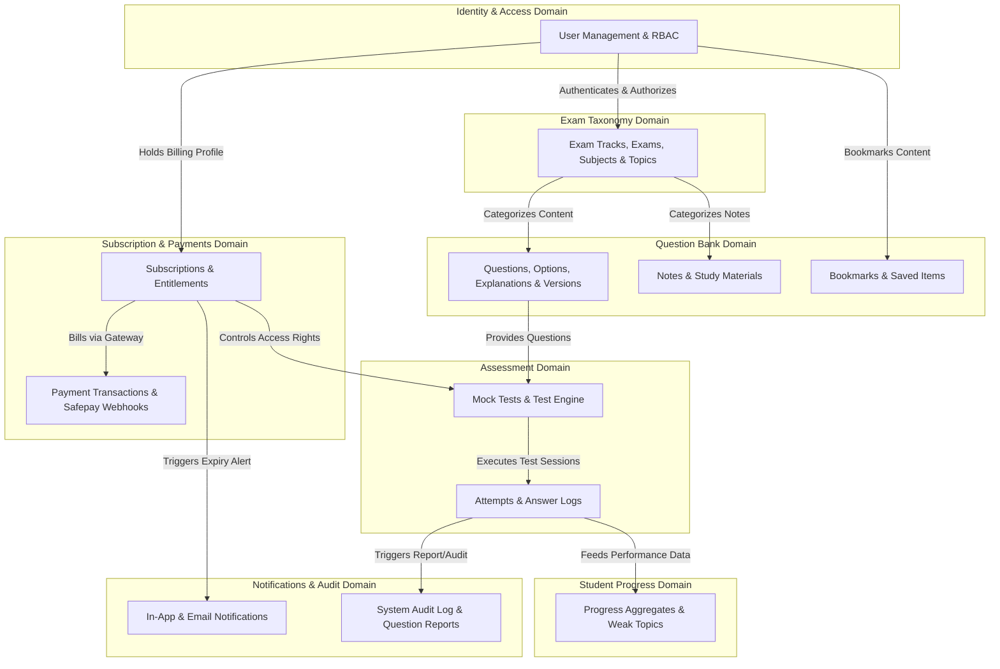

# Prepora Entity Relationship Diagram

> **Document Status:** Complete Entity Relationship Blueprint  
> **Target Database Engine:** PostgreSQL 15+ / Django 4.2+ ORM  
> **Author:** Senior Database Architect & PostgreSQL Data Modeler  
> **Single Source of Truth:** [PROJECT_PLAN.md](file:///d:/Prepora/docs/PROJECT_PLAN.md), [DATABASE_PLAN.md](file:///d:/Prepora/docs/DATABASE_PLAN.md), [DOMAIN_MODEL.md](file:///d:/Prepora/docs/DOMAIN_MODEL.md), [BUSINESS_WORKFLOWS.md](file:///d:/Prepora/docs/BUSINESS_WORKFLOWS.md)

---

## 1. Purpose

The purpose of this Entity Relationship Diagram (ERD) document is to provide an authoritative, exhaustive, and complete relational database blueprint for the **Prepora** platform.

Prepora is an enterprise-grade digital test preparation platform engineered for candidates taking entry tests for the Pakistan Armed Forces (PMA Long Course, PAF Initial Tests, Navy Cadet, ISSB, ASF) and allied competitive government examinations (CSS, FPSC, NTS, Police).

This ERD translates all conceptual domain boundaries, business workflows, entity lifecycles, and security rules defined across `PROJECT_PLAN.md`, `DATABASE_PLAN.md`, `DOMAIN_MODEL.md`, and `BUSINESS_WORKFLOWS.md` into a formal database schema. 

This document serves as the direct technical specification for:
1. **PostgreSQL Physical Database Schema** (DDL tables, constraints, foreign keys, partial indexes, and sequences).
2. **Django ORM Model Definitions** (`models.Model` classes, field types, `on_delete` behaviors, `db_index` declarations, and Meta constraints).
3. **API Implementation** (REST Framework serializers, query performance optimizations, and join strategies).
4. **Database Migrations & Data Integrity Governance** (zero-downtime migration scripts and constraint enforcement).

---

## 2. Design Principles

Prepora’s persistence architecture adheres to five foundational database design principles:

### 2.1 Normalization (3NF with Controlled Denormalization)
- **Third Normal Form (3NF) Compliance:** All transactional and content domain entities are strictly normalized to 3NF. Transitive dependencies are removed, repeating groups are eliminated into child tables (e.g., `QuestionOption`), and lookup attributes (such as roles, permissions, and exam tracks) are isolated into reference entities.
- **Controlled Read-Optimized Denormalization:** To guarantee high throughput during peak online exam simulations and real-time dashboard rendering, strategic denormalization is restricted to specific snapshot tables:
  - `AttemptResult`: Caches finalized score, accuracy percentage, and pass/fail state to avoid computing aggregates over thousands of `AttemptAnswer` rows on every result view.
  - `StudentProgress`: Maintains aggregated accuracy and time-per-question metrics per topic, updated via background workers.
  - `Subscription` & `PaymentTransaction`: Snapshots historical pricing amounts and currency to isolate user billing from future plan price changes.

### 2.2 Mandatory Referential Integrity
- Database-level foreign keys are strictly enforced across all domain boundaries. Logical foreign keys maintained solely in application code are forbidden.
- Explicit deletion policies (`ON DELETE CASCADE`, `ON DELETE RESTRICT`, `ON DELETE SET NULL`) are applied to every relation to prevent orphaned records and maintain transactional consistency under concurrent operations.

### 2.3 Comprehensive Auditability & Immutability
- **Soft Deletion Pattern:** Core business entities (`User`, `Question`, `Note`, `Subscription`) utilize a `deleted_at` timestamp. Hard SQL deletes are prohibited on transactional and content data.
- **Historical Content Snapshotting:** Published questions are immutable. Edits to published questions preserve historical integrity by writing pre-edit state snapshots to `QuestionVersion`, ensuring historical test attempts reference the exact question state at test execution time.
- **System Audit & Ledger Logging:** Administrative actions, role escalations, manual grants, and raw third-party gateway interactions write immutable records to `AuditLog`, `WebhookEventLog`, and `PaymentTransaction`.

### 2.4 High Performance & Production Scalability
- **Standardized UUIDv4 Primary Keys:** All entities utilize 128-bit `UUIDv4` primary keys to prevent sequential integer enumeration attacks, enable client-side UUID pre-generation, and allow future multi-region sharding without primary key collisions.
- **Targeted Indexing:** Comprehensive index coverage (B-tree, Partial Indexes, Composite Indexes, and GIN JSONB Indexes) is specified for high-frequency lookup paths (authentication, question filtering, attempt execution, and webhook idempotency).
- **Timezone Awareness:** All timestamp attributes use PostgreSQL `TIMESTAMPTZ` set to UTC standard.

### 2.5 Extensibility Without Schema Distortion
- Domain entities incorporate reserved `JSONB` metadata columns and decoupled associative junction entities, allowing future features (AI tutoring, certificates, video courses, forums) to integrate seamlessly without breaking existing tables.

---

## 3. High-Level Domain Diagram

The Prepora platform is divided into ten cohesive Bounded Contexts. The high-level context map below illustrates the relationships and data flows connecting these domains:



---

## 4. Complete Entity List

Below is the detailed specification for all 32 database entities spanning the Prepora domain model.

---

### 4.1 Identity & Access Domain

#### 1. `User`
- **Purpose:** Core identity entity representing platform users across all operational roles.
- **Primary Key:** `id` (UUID, Default: `gen_random_uuid()`)
- **Foreign Keys:** None directly; linked to `Role` via junction table `UserRole`.
- **Important Attributes:** `email` (VARCHAR 255), `password_hash` (VARCHAR 255), `is_active` (BOOLEAN), `is_staff` (BOOLEAN), `is_superuser` (BOOLEAN), `last_login_at` (TIMESTAMPTZ), `created_at` (TIMESTAMPTZ), `updated_at` (TIMESTAMPTZ), `deleted_at` (TIMESTAMPTZ)
- **Unique Constraints:** `email` (case-insensitive unique index)
- **Nullable Fields:** `last_login_at`, `deleted_at`
- **Enumerated Fields:** None (operational state handled via boolean flags & roles)
- **Default Values:** `is_active = TRUE`, `is_staff = FALSE`, `is_superuser = FALSE`, `created_at = CURRENT_TIMESTAMP`, `updated_at = CURRENT_TIMESTAMP`

#### 2. `UserProfile`
- **Purpose:** Biographical and demographic details separated from authentication credentials.
- **Primary Key:** `id` (UUID, Default: `gen_random_uuid()`)
- **Foreign Keys:** 
  - `user_id` (UUID -> `User.id`, 1:1, ON DELETE CASCADE)
  - `target_exam_track_id` (UUID -> `ExamTrack.id`, ON DELETE SET NULL)
- **Important Attributes:** `full_name` (VARCHAR 255), `phone_number` (VARCHAR 20), `city` (VARCHAR 100), `avatar_url` (TEXT), `preparation_goal` (TEXT), `created_at` (TIMESTAMPTZ), `updated_at` (TIMESTAMPTZ)
- **Unique Constraints:** `user_id`
- **Nullable Fields:** `phone_number`, `city`, `avatar_url`, `preparation_goal`, `target_exam_track_id`
- **Enumerated Fields:** None
- **Default Values:** `created_at = CURRENT_TIMESTAMP`, `updated_at = CURRENT_TIMESTAMP`

#### 3. `Role`
- **Purpose:** Encapsulates RBAC role definitions within the system.
- **Primary Key:** `id` (UUID, Default: `gen_random_uuid()`)
- **Foreign Keys:** None
- **Important Attributes:** `name` (VARCHAR 50), `code` (VARCHAR 50), `description` (TEXT), `created_at` (TIMESTAMPTZ), `updated_at` (TIMESTAMPTZ)
- **Unique Constraints:** `name`, `code`
- **Nullable Fields:** `description`
- **Enumerated Fields:** `code` (`STUDENT`, `CONTENT_EDITOR`, `SME`, `SUPPORT_AGENT`, `ADMIN`, `SUPERADMIN`)
- **Default Values:** `created_at = CURRENT_TIMESTAMP`, `updated_at = CURRENT_TIMESTAMP`

#### 4. `Permission`
- **Purpose:** Atomic system capability for fine-grained access control.
- **Primary Key:** `id` (UUID, Default: `gen_random_uuid()`)
- **Foreign Keys:** None
- **Important Attributes:** `codename` (VARCHAR 100), `domain` (VARCHAR 50), `action` (VARCHAR 50), `description` (TEXT), `created_at` (TIMESTAMPTZ)
- **Unique Constraints:** `codename`, composite `(domain, action)`
- **Nullable Fields:** `description`
- **Enumerated Fields:** None
- **Default Values:** `created_at = CURRENT_TIMESTAMP`

#### 5. `RolePermission`
- **Purpose:** Junction table mapping permissions to RBAC roles.
- **Primary Key:** `id` (UUID, Default: `gen_random_uuid()`)
- **Foreign Keys:**
  - `role_id` (UUID -> `Role.id`, ON DELETE CASCADE)
  - `permission_id` (UUID -> `Permission.id`, ON DELETE CASCADE)
- **Important Attributes:** `created_at` (TIMESTAMPTZ)
- **Unique Constraints:** composite `(role_id, permission_id)`
- **Nullable Fields:** None
- **Enumerated Fields:** None
- **Default Values:** `created_at = CURRENT_TIMESTAMP`

#### 6. `UserRole`
- **Purpose:** Junction table assigning RBAC roles to users.
- **Primary Key:** `id` (UUID, Default: `gen_random_uuid()`)
- **Foreign Keys:**
  - `user_id` (UUID -> `User.id`, ON DELETE CASCADE)
  - `role_id` (UUID -> `Role.id`, ON DELETE CASCADE)
  - `assigned_by_id` (UUID -> `User.id`, ON DELETE SET NULL)
- **Important Attributes:** `assigned_at` (TIMESTAMPTZ)
- **Unique Constraints:** composite `(user_id, role_id)`
- **Nullable Fields:** `assigned_by_id`
- **Enumerated Fields:** None
- **Default Values:** `assigned_at = CURRENT_TIMESTAMP`

#### 7. `RefreshToken`
- **Purpose:** Secure JWT refresh token management and session revocation tracking.
- **Primary Key:** `id` (UUID, Default: `gen_random_uuid()`)
- **Foreign Keys:**
  - `user_id` (UUID -> `User.id`, ON DELETE CASCADE)
- **Important Attributes:** `token` (VARCHAR 512), `device_info` (TEXT), `ip_address` (VARCHAR 45), `is_revoked` (BOOLEAN), `expires_at` (TIMESTAMPTZ), `created_at` (TIMESTAMPTZ)
- **Unique Constraints:** `token`
- **Nullable Fields:** `device_info`, `ip_address`
- **Enumerated Fields:** None
- **Default Values:** `is_revoked = FALSE`, `created_at = CURRENT_TIMESTAMP`

#### 8. `AuditLog`
- **Purpose:** Immutable security and administrative audit trail.
- **Primary Key:** `id` (UUID, Default: `gen_random_uuid()`)
- **Foreign Keys:**
  - `actor_id` (UUID -> `User.id`, ON DELETE SET NULL)
- **Important Attributes:** `action` (VARCHAR 100), `target_entity_type` (VARCHAR 100), `target_entity_id` (UUID), `ip_address` (VARCHAR 45), `pre_change_state` (JSONB), `post_change_state` (JSONB), `created_at` (TIMESTAMPTZ)
- **Unique Constraints:** None
- **Nullable Fields:** `actor_id`, `ip_address`, `pre_change_state`, `post_change_state`
- **Enumerated Fields:** None
- **Default Values:** `created_at = CURRENT_TIMESTAMP`

---

### 4.2 Exam Taxonomy Domain

#### 9. `ExamTrack`
- **Purpose:** Top-level category for military branches and competitive exam categories.
- **Primary Key:** `id` (UUID, Default: `gen_random_uuid()`)
- **Foreign Keys:** None
- **Important Attributes:** `name` (VARCHAR 100), `slug` (VARCHAR 100), `description` (TEXT), `icon_url` (TEXT), `sort_order` (INTEGER), `is_active` (BOOLEAN), `created_at` (TIMESTAMPTZ), `updated_at` (TIMESTAMPTZ)
- **Unique Constraints:** `name`, `slug`
- **Nullable Fields:** `description`, `icon_url`
- **Enumerated Fields:** None
- **Default Values:** `sort_order = 0`, `is_active = TRUE`, `created_at = CURRENT_TIMESTAMP`, `updated_at = CURRENT_TIMESTAMP`

#### 10. `Exam`
- **Purpose:** Specific entry test course or selection exam (e.g., PMA Long Course, GDP Air Force).
- **Primary Key:** `id` (UUID, Default: `gen_random_uuid()`)
- **Foreign Keys:**
  - `exam_track_id` (UUID -> `ExamTrack.id`, ON DELETE RESTRICT)
- **Important Attributes:** `title` (VARCHAR 150), `slug` (VARCHAR 150), `description` (TEXT), `sort_order` (INTEGER), `is_active` (BOOLEAN), `created_at` (TIMESTAMPTZ), `updated_at` (TIMESTAMPTZ)
- **Unique Constraints:** `slug`, composite `(exam_track_id, title)`
- **Nullable Fields:** `description`
- **Enumerated Fields:** None
- **Default Values:** `sort_order = 0`, `is_active = TRUE`, `created_at = CURRENT_TIMESTAMP`, `updated_at = CURRENT_TIMESTAMP`

#### 11. `Subject`
- **Purpose:** Major academic discipline (e.g., Intelligence Tests, Physics, English).
- **Primary Key:** `id` (UUID, Default: `gen_random_uuid()`)
- **Foreign Keys:**
  - `exam_id` (UUID -> `Exam.id`, ON DELETE RESTRICT)
- **Important Attributes:** `title` (VARCHAR 150), `slug` (VARCHAR 150), `description` (TEXT), `sort_order` (INTEGER), `is_active` (BOOLEAN), `created_at` (TIMESTAMPTZ), `updated_at` (TIMESTAMPTZ)
- **Unique Constraints:** `slug`, composite `(exam_id, title)`
- **Nullable Fields:** `description`
- **Enumerated Fields:** None
- **Default Values:** `sort_order = 0`, `is_active = TRUE`, `created_at = CURRENT_TIMESTAMP`, `updated_at = CURRENT_TIMESTAMP`

#### 12. `Topic`
- **Purpose:** Fine-grained concept area within a subject (e.g., Verbal Analogies, Newton's Laws).
- **Primary Key:** `id` (UUID, Default: `gen_random_uuid()`)
- **Foreign Keys:**
  - `subject_id` (UUID -> `Subject.id`, ON DELETE RESTRICT)
- **Important Attributes:** `title` (VARCHAR 150), `slug` (VARCHAR 150), `description` (TEXT), `sort_order` (INTEGER), `is_active` (BOOLEAN), `created_at` (TIMESTAMPTZ), `updated_at` (TIMESTAMPTZ)
- **Unique Constraints:** `slug`, composite `(subject_id, title)`
- **Nullable Fields:** `description`
- **Enumerated Fields:** None
- **Default Values:** `sort_order = 0`, `is_active = TRUE`, `created_at = CURRENT_TIMESTAMP`, `updated_at = CURRENT_TIMESTAMP`

---

### 4.3 Question Bank Domain

#### 13. `Question`
- **Purpose:** Core MCQ item stem and governance state container.
- **Primary Key:** `id` (UUID, Default: `gen_random_uuid()`)
- **Foreign Keys:**
  - `topic_id` (UUID -> `Topic.id`, ON DELETE RESTRICT)
  - `exam_track_id` (UUID -> `ExamTrack.id`, ON DELETE SET NULL)
  - `creator_id` (UUID -> `User.id`, ON DELETE RESTRICT)
  - `reviewer_id` (UUID -> `User.id`, ON DELETE SET NULL)
- **Important Attributes:** `stem` (TEXT), `image_url` (TEXT), `difficulty` (VARCHAR 20), `status` (VARCHAR 20), `active_version` (INTEGER), `created_at` (TIMESTAMPTZ), `updated_at` (TIMESTAMPTZ), `deleted_at` (TIMESTAMPTZ)
- **Unique Constraints:** None
- **Nullable Fields:** `image_url`, `exam_track_id`, `reviewer_id`, `deleted_at`
- **Enumerated Fields:** 
  - `difficulty` (`EASY`, `MEDIUM`, `HARD`)
  - `status` (`DRAFT`, `IN_REVIEW`, `APPROVED`, `PUBLISHED`, `ARCHIVED`)
- **Default Values:** `difficulty = 'MEDIUM'`, `status = 'DRAFT'`, `active_version = 1`, `created_at = CURRENT_TIMESTAMP`, `updated_at = CURRENT_TIMESTAMP`

#### 14. `QuestionOption`
- **Purpose:** Selectable choices/distractors for a question.
- **Primary Key:** `id` (UUID, Default: `gen_random_uuid()`)
- **Foreign Keys:**
  - `question_id` (UUID -> `Question.id`, ON DELETE CASCADE)
- **Important Attributes:** `label` (VARCHAR 10), `option_text` (TEXT), `image_url` (TEXT), `is_correct` (BOOLEAN), `sort_order` (INTEGER), `created_at` (TIMESTAMPTZ)
- **Unique Constraints:** composite `(question_id, label)`
- **Nullable Fields:** `image_url`
- **Enumerated Fields:** None
- **Default Values:** `is_correct = FALSE`, `sort_order = 0`, `created_at = CURRENT_TIMESTAMP`

#### 15. `QuestionExplanation`
- **Purpose:** Pedagogical rationale and solution guide for a question.
- **Primary Key:** `id` (UUID, Default: `gen_random_uuid()`)
- **Foreign Keys:**
  - `question_id` (UUID -> `Question.id`, 1:1, ON DELETE CASCADE)
- **Important Attributes:** `explanation_text` (TEXT), `key_takeaway` (TEXT), `reference_source` (TEXT), `image_url` (TEXT), `created_at` (TIMESTAMPTZ), `updated_at` (TIMESTAMPTZ)
- **Unique Constraints:** `question_id`
- **Nullable Fields:** `key_takeaway`, `reference_source`, `image_url`
- **Enumerated Fields:** None
- **Default Values:** `created_at = CURRENT_TIMESTAMP`, `updated_at = CURRENT_TIMESTAMP`

#### 16. `QuestionVersion`
- **Purpose:** Immutable snapshot history of question revisions.
- **Primary Key:** `id` (UUID, Default: `gen_random_uuid()`)
- **Foreign Keys:**
  - `question_id` (UUID -> `Question.id`, ON DELETE CASCADE)
  - `created_by_id` (UUID -> `User.id`, ON DELETE RESTRICT)
- **Important Attributes:** `version_number` (INTEGER), `snapshot_data` (JSONB), `change_summary` (TEXT), `created_at` (TIMESTAMPTZ)
- **Unique Constraints:** composite `(question_id, version_number)`
- **Nullable Fields:** `change_summary`
- **Enumerated Fields:** None
- **Default Values:** `created_at = CURRENT_TIMESTAMP`

#### 17. `Bookmark`
- **Purpose:** Allows students to save questions, notes, or mock tests for revision.
- **Primary Key:** `id` (UUID, Default: `gen_random_uuid()`)
- **Foreign Keys:**
  - `user_id` (UUID -> `User.id`, ON DELETE CASCADE)
  - `question_id` (UUID -> `Question.id`, ON DELETE CASCADE)
  - `note_id` (UUID -> `Note.id`, ON DELETE CASCADE)
- **Important Attributes:** `target_type` (VARCHAR 50), `target_id` (UUID), `notes_tag` (VARCHAR 100), `created_at` (TIMESTAMPTZ)
- **Unique Constraints:** composite `(user_id, target_type, target_id)`
- **Nullable Fields:** `question_id`, `note_id`, `notes_tag`
- **Enumerated Fields:** `target_type` (`QUESTION`, `NOTE`, `MOCK_TEST`)
- **Default Values:** `created_at = CURRENT_TIMESTAMP`

#### 18. `QuestionReport`
- **Purpose:** Student error flagging and resolution tracking for content quality governance.
- **Primary Key:** `id` (UUID, Default: `gen_random_uuid()`)
- **Foreign Keys:**
  - `question_id` (UUID -> `Question.id`, ON DELETE CASCADE)
  - `reporter_id` (UUID -> `User.id`, ON DELETE CASCADE)
  - `reviewer_id` (UUID -> `User.id`, ON DELETE SET NULL)
- **Important Attributes:** `category` (VARCHAR 50), `comment` (TEXT), `status` (VARCHAR 20), `resolution_notes` (TEXT), `created_at` (TIMESTAMPTZ), `resolved_at` (TIMESTAMPTZ)
- **Unique Constraints:** None
- **Nullable Fields:** `reviewer_id`, `resolution_notes`, `resolved_at`
- **Enumerated Fields:**
  - `category` (`WRONG_KEY`, `TYPO`, `AMBIGUOUS_STEM`, `BAD_EXPLANATION`, `OTHER`)
  - `status` (`OPEN`, `UNDER_REVIEW`, `RESOLVED`, `REJECTED`)
- **Default Values:** `status = 'OPEN'`, `created_at = CURRENT_TIMESTAMP`

---

### 4.4 Assessment Domain

#### 19. `MockTest`
- **Purpose:** Exam template configuring parameters, timing, and access tier.
- **Primary Key:** `id` (UUID, Default: `gen_random_uuid()`)
- **Foreign Keys:**
  - `exam_track_id` (UUID -> `ExamTrack.id`, ON DELETE RESTRICT)
  - `exam_id` (UUID -> `Exam.id`, ON DELETE SET NULL)
  - `created_by_id` (UUID -> `User.id`, ON DELETE RESTRICT)
- **Important Attributes:** `title` (VARCHAR 200), `slug` (VARCHAR 200), `description` (TEXT), `duration_minutes` (INTEGER), `total_marks` (NUMERIC(6,2)), `passing_percentage` (NUMERIC(5,2)), `negative_marking_factor` (NUMERIC(4,2)), `is_premium` (BOOLEAN), `status` (VARCHAR 20), `created_at` (TIMESTAMPTZ), `updated_at` (TIMESTAMPTZ)
- **Unique Constraints:** `slug`
- **Nullable Fields:** `description`, `exam_id`
- **Enumerated Fields:** `status` (`DRAFT`, `PUBLISHED`, `ARCHIVED`)
- **Default Values:** `negative_marking_factor = 0.25`, `is_premium = FALSE`, `status = 'DRAFT'`, `created_at = CURRENT_TIMESTAMP`, `updated_at = CURRENT_TIMESTAMP`

#### 20. `MockTestQuestion`
- **Purpose:** Associative table mapping questions to mock tests with sequence and scoring weights.
- **Primary Key:** `id` (UUID, Default: `gen_random_uuid()`)
- **Foreign Keys:**
  - `mock_test_id` (UUID -> `MockTest.id`, ON DELETE CASCADE)
  - `question_id` (UUID -> `Question.id`, ON DELETE RESTRICT)
- **Important Attributes:** `question_order` (INTEGER), `positive_marks` (NUMERIC(4,2)), `negative_marks` (NUMERIC(4,2)), `created_at` (TIMESTAMPTZ)
- **Unique Constraints:** composite `(mock_test_id, question_id)`, composite `(mock_test_id, question_order)`
- **Nullable Fields:** None
- **Enumerated Fields:** None
- **Default Values:** `positive_marks = 1.00`, `negative_marks = 0.25`, `created_at = CURRENT_TIMESTAMP`

#### 21. `Attempt`
- **Purpose:** Active or completed student test-taking session.
- **Primary Key:** `id` (UUID, Default: `gen_random_uuid()`)
- **Foreign Keys:**
  - `user_id` (UUID -> `User.id`, ON DELETE CASCADE)
  - `mock_test_id` (UUID -> `MockTest.id`, ON DELETE RESTRICT)
- **Important Attributes:** `status` (VARCHAR 20), `started_at` (TIMESTAMPTZ), `submitted_at` (TIMESTAMPTZ), `total_duration_seconds` (INTEGER), `ip_address` (VARCHAR 45), `device_info` (TEXT), `created_at` (TIMESTAMPTZ), `updated_at` (TIMESTAMPTZ)
- **Unique Constraints:** None
- **Nullable Fields:** `submitted_at`, `total_duration_seconds`, `ip_address`, `device_info`
- **Enumerated Fields:** `status` (`IN_PROGRESS`, `SUBMITTED`, `EXPIRED`, `CANCELED`)
- **Default Values:** `status = 'IN_PROGRESS'`, `started_at = CURRENT_TIMESTAMP`, `created_at = CURRENT_TIMESTAMP`, `updated_at = CURRENT_TIMESTAMP`

#### 22. `AttemptAnswer`
- **Purpose:** Individual student response for a question inside a test attempt session.
- **Primary Key:** `id` (UUID, Default: `gen_random_uuid()`)
- **Foreign Keys:**
  - `attempt_id` (UUID -> `Attempt.id`, ON DELETE CASCADE)
  - `question_id` (UUID -> `Question.id`, ON DELETE RESTRICT)
  - `selected_option_id` (UUID -> `QuestionOption.id`, ON DELETE SET NULL)
  - `question_version_id` (UUID -> `QuestionVersion.id`, ON DELETE SET NULL)
- **Important Attributes:** `time_spent_seconds` (INTEGER), `score_awarded` (NUMERIC(5,2)), `is_correct` (BOOLEAN), `is_skipped` (BOOLEAN), `created_at` (TIMESTAMPTZ)
- **Unique Constraints:** composite `(attempt_id, question_id)`
- **Nullable Fields:** `selected_option_id`, `question_version_id`, `score_awarded`, `is_correct`
- **Enumerated Fields:** None
- **Default Values:** `time_spent_seconds = 0`, `is_skipped = TRUE`, `created_at = CURRENT_TIMESTAMP`

#### 23. `AttemptResult`
- **Purpose:** Scored output and performance metrics snapshot for a finalized attempt.
- **Primary Key:** `id` (UUID, Default: `gen_random_uuid()`)
- **Foreign Keys:**
  - `attempt_id` (UUID -> `Attempt.id`, 1:1, ON DELETE CASCADE)
- **Important Attributes:** `total_questions` (INTEGER), `answered_count` (INTEGER), `correct_count` (INTEGER), `wrong_count` (INTEGER), `skipped_count` (INTEGER), `score_obtained` (NUMERIC(6,2)), `total_possible_score` (NUMERIC(6,2)), `accuracy_percentage` (NUMERIC(5,2)), `has_passed` (BOOLEAN), `summary_json` (JSONB), `created_at` (TIMESTAMPTZ)
- **Unique Constraints:** `attempt_id`
- **Nullable Fields:** `summary_json`
- **Enumerated Fields:** None
- **Default Values:** `created_at = CURRENT_TIMESTAMP`

---

### 4.5 Student Progress & Analytics Domain

#### 24. `StudentProgress`
- **Purpose:** Aggregated cumulative topic performance metrics per student.
- **Primary Key:** `id` (UUID, Default: `gen_random_uuid()`)
- **Foreign Keys:**
  - `user_id` (UUID -> `User.id`, ON DELETE CASCADE)
  - `topic_id` (UUID -> `Topic.id`, ON DELETE CASCADE)
- **Important Attributes:** `total_attempted` (INTEGER), `total_correct` (INTEGER), `total_wrong` (INTEGER), `accuracy_percentage` (NUMERIC(5,2)), `avg_time_per_question_seconds` (NUMERIC(6,2)), `last_practiced_at` (TIMESTAMPTZ), `updated_at` (TIMESTAMPTZ)
- **Unique Constraints:** composite `(user_id, topic_id)`
- **Nullable Fields:** `last_practiced_at`
- **Enumerated Fields:** None
- **Default Values:** `total_attempted = 0`, `total_correct = 0`, `total_wrong = 0`, `accuracy_percentage = 0.00`, `avg_time_per_question_seconds = 0.00`, `updated_at = CURRENT_TIMESTAMP`

#### 25. `WeakTopic`
- **Purpose:** Diagnostic entity highlighting topic deficit areas requiring student revision.
- **Primary Key:** `id` (UUID, Default: `gen_random_uuid()`)
- **Foreign Keys:**
  - `user_id` (UUID -> `User.id`, ON DELETE CASCADE)
  - `topic_id` (UUID -> `Topic.id`, ON DELETE CASCADE)
- **Important Attributes:** `mastery_score` (NUMERIC(5,2)), `accuracy_deficit` (NUMERIC(5,2)), `recommended_practice_count` (INTEGER), `identified_at` (TIMESTAMPTZ), `updated_at` (TIMESTAMPTZ)
- **Unique Constraints:** composite `(user_id, topic_id)`
- **Nullable Fields:** None
- **Enumerated Fields:** None
- **Default Values:** `recommended_practice_count = 10`, `identified_at = CURRENT_TIMESTAMP`, `updated_at = CURRENT_TIMESTAMP`

---

### 4.6 Subscription Domain

#### 26. `SubscriptionPlan`
- **Purpose:** Commercial plan offering configuration (Free vs Premium Monthly).
- **Primary Key:** `id` (UUID, Default: `gen_random_uuid()`)
- **Foreign Keys:** None
- **Important Attributes:** `title` (VARCHAR 100), `code` (VARCHAR 50), `description` (TEXT), `price_amount` (NUMERIC(10,2)), `currency` (VARCHAR 10), `billing_interval` (VARCHAR 20), `is_active` (BOOLEAN), `created_at` (TIMESTAMPTZ), `updated_at` (TIMESTAMPTZ)
- **Unique Constraints:** `code`
- **Nullable Fields:** `description`
- **Enumerated Fields:**
  - `code` (`FREE`, `PREMIUM_MONTHLY`)
  - `billing_interval` (`MONTHLY`, `YEARLY`, `LIFETIME`)
- **Default Values:** `currency = 'PKR'`, `is_active = TRUE`, `created_at = CURRENT_TIMESTAMP`, `updated_at = CURRENT_TIMESTAMP`

#### 27. `PlanEntitlement`
- **Purpose:** Associative mapping connecting feature entitlement capability codes to subscription plans.
- **Primary Key:** `id` (UUID, Default: `gen_random_uuid()`)
- **Foreign Keys:**
  - `subscription_plan_id` (UUID -> `SubscriptionPlan.id`, ON DELETE CASCADE)
- **Important Attributes:** `entitlement_code` (VARCHAR 100), `created_at` (TIMESTAMPTZ)
- **Unique Constraints:** composite `(subscription_plan_id, entitlement_code)`
- **Nullable Fields:** None
- **Enumerated Fields:** None (codes e.g. `access:unlimited_mcqs`, `access:premium_mock_tests`, `access:weak_topic_analytics`, `access:pdf_notes`)
- **Default Values:** `created_at = CURRENT_TIMESTAMP`

#### 28. `Subscription`
- **Purpose:** User subscription contract lifecycle and period state tracking.
- **Primary Key:** `id` (UUID, Default: `gen_random_uuid()`)
- **Foreign Keys:**
  - `user_id` (UUID -> `User.id`, ON DELETE CASCADE)
  - `subscription_plan_id` (UUID -> `SubscriptionPlan.id`, ON DELETE RESTRICT)
- **Important Attributes:** `status` (VARCHAR 20), `current_period_start` (TIMESTAMPTZ), `current_period_end` (TIMESTAMPTZ), `auto_renew` (BOOLEAN), `canceled_at` (TIMESTAMPTZ), `safepay_sub_token` (VARCHAR 255), `created_at` (TIMESTAMPTZ), `updated_at` (TIMESTAMPTZ)
- **Unique Constraints:** None (partial unique index `(user_id) WHERE status = 'ACTIVE'`)
- **Nullable Fields:** `canceled_at`, `safepay_sub_token`
- **Enumerated Fields:** `status` (`PENDING`, `ACTIVE`, `PAST_DUE`, `CANCELED`, `EXPIRED`, `PAUSED`)
- **Default Values:** `status = 'PENDING'`, `auto_renew = TRUE`, `created_at = CURRENT_TIMESTAMP`, `updated_at = CURRENT_TIMESTAMP`

---

### 4.7 Payments Domain

#### 29. `PaymentTransaction`
- **Purpose:** Immutable monetary transaction ledger for payment checkout attempts and renewals.
- **Primary Key:** `id` (UUID, Default: `gen_random_uuid()`)
- **Foreign Keys:**
  - `user_id` (UUID -> `User.id`, ON DELETE RESTRICT)
  - `subscription_id` (UUID -> `Subscription.id`, ON DELETE SET NULL)
- **Important Attributes:** `amount` (NUMERIC(10,2)), `currency` (VARCHAR 10), `status` (VARCHAR 20), `safepay_tracker_id` (VARCHAR 255), `safepay_txn_id` (VARCHAR 255), `failure_reason` (TEXT), `created_at` (TIMESTAMPTZ), `updated_at` (TIMESTAMPTZ)
- **Unique Constraints:** `safepay_tracker_id`
- **Nullable Fields:** `subscription_id`, `safepay_txn_id`, `failure_reason`
- **Enumerated Fields:** `status` (`PENDING`, `SUCCEEDED`, `FAILED`, `CANCELED`, `REFUNDED`)
- **Default Values:** `currency = 'PKR'`, `status = 'PENDING'`, `created_at = CURRENT_TIMESTAMP`, `updated_at = CURRENT_TIMESTAMP`

#### 30. `WebhookEventLog`
- **Purpose:** Raw HTTP payment provider webhook event log for idempotency and dispute auditing.
- **Primary Key:** `id` (UUID, Default: `gen_random_uuid()`)
- **Foreign Keys:**
  - `payment_transaction_id` (UUID -> `PaymentTransaction.id`, ON DELETE SET NULL)
- **Important Attributes:** `provider` (VARCHAR 50), `event_token` (VARCHAR 255), `event_type` (VARCHAR 100), `payload` (JSONB), `hmac_verified` (BOOLEAN), `processing_status` (VARCHAR 20), `error_log` (TEXT), `received_at` (TIMESTAMPTZ), `processed_at` (TIMESTAMPTZ)
- **Unique Constraints:** `event_token`
- **Nullable Fields:** `payment_transaction_id`, `error_log`, `processed_at`
- **Enumerated Fields:** `processing_status` (`PENDING`, `PROCESSED`, `FAILED`, `IGNORED`)
- **Default Values:** `provider = 'SAFEPAY'`, `hmac_verified = FALSE`, `processing_status = 'PENDING'`, `received_at = CURRENT_TIMESTAMP`

---

### 4.8 Notifications Domain

#### 31. `Notification`
- **Purpose:** In-app and multi-channel system notifications dispatched to users.
- **Primary Key:** `id` (UUID, Default: `gen_random_uuid()`)
- **Foreign Keys:**
  - `recipient_id` (UUID -> `User.id`, ON DELETE CASCADE)
- **Important Attributes:** `title` (VARCHAR 200), `body` (TEXT), `channel` (VARCHAR 20), `is_read` (BOOLEAN), `action_url` (TEXT), `created_at` (TIMESTAMPTZ), `read_at` (TIMESTAMPTZ)
- **Unique Constraints:** None
- **Nullable Fields:** `action_url`, `read_at`
- **Enumerated Fields:** `channel` (`IN_APP`, `EMAIL`, `SMS`)
- **Default Values:** `channel = 'IN_APP'`, `is_read = FALSE`, `created_at = CURRENT_TIMESTAMP`

---

### 4.9 Notes Domain

#### 32. `Note`
- **Purpose:** Structured academic study guides and PDF revision material attached to topics/subjects.
- **Primary Key:** `id` (UUID, Default: `gen_random_uuid()`)
- **Foreign Keys:**
  - `subject_id` (UUID -> `Subject.id`, ON DELETE RESTRICT)
  - `topic_id` (UUID -> `Topic.id`, ON DELETE SET NULL)
  - `created_by_id` (UUID -> `User.id`, ON DELETE RESTRICT)
- **Important Attributes:** `title` (VARCHAR 200), `slug` (VARCHAR 200), `content_markdown` (TEXT), `pdf_asset_url` (TEXT), `is_premium` (BOOLEAN), `is_published` (BOOLEAN), `view_count` (INTEGER), `created_at` (TIMESTAMPTZ), `updated_at` (TIMESTAMPTZ)
- **Unique Constraints:** `slug`
- **Nullable Fields:** `topic_id`, `pdf_asset_url`
- **Enumerated Fields:** None
- **Default Values:** `is_premium = FALSE`, `is_published = TRUE`, `view_count = 0`, `created_at = CURRENT_TIMESTAMP`, `updated_at = CURRENT_TIMESTAMP`

---

## 5. Relationship Matrix

Below is the complete cardinality matrix summarizing all 32 entities and their relational connections:

```
User (1)  <--------------------------------- (1) UserProfile
User (1)  <--------------------------------- (*) UserRole (*) ---------------------------------> (1) Role
Role (1)  <--------------------------------- (*) RolePermission (*) ---------------------------> (1) Permission
User (1)  <--------------------------------- (*) RefreshToken
User (1)  <--------------------------------- (*) AuditLog

ExamTrack (1) <----------------------------- (*) Exam
Exam (1) <---------------------------------- (*) Subject
Subject (1) <------------------------------- (*) Topic

Topic (1) <--------------------------------- (*) Question
ExamTrack (1) <----------------------------- (*) Question (Optional)
User (1) [Creator] <------------------------ (*) Question
User (1) [Reviewer] <----------------------- (*) Question (Optional)
Question (1) <------------------------------ (*) QuestionOption
Question (1) <------------------------------ (1) QuestionExplanation
Question (1) <------------------------------ (*) QuestionVersion
User (1) <---------------------------------- (*) QuestionVersion

User (1) <---------------------------------- (*) Bookmark
Question (1) <------------------------------ (*) Bookmark (Optional)
Note (1) <---------------------------------- (*) Bookmark (Optional)

User (1) [Reporter] <----------------------- (*) QuestionReport
Question (1) <------------------------------ (*) QuestionReport
User (1) [Reviewer] <----------------------- (*) QuestionReport (Optional)

ExamTrack (1) <----------------------------- (*) MockTest
Exam (1) <---------------------------------- (*) MockTest (Optional)
User (1) [Creator] <------------------------ (*) MockTest
MockTest (1) <------------------------------ (*) MockTestQuestion (*) -----------------------> (1) Question

User (1) <---------------------------------- (*) Attempt
MockTest (1) <------------------------------ (*) Attempt
Attempt (1) <------------------------------- (*) AttemptAnswer
Question (1) <------------------------------ (*) AttemptAnswer
QuestionOption (1) <------------------------ (*) AttemptAnswer (Optional)
QuestionVersion (1) <----------------------- (*) AttemptAnswer (Optional)
Attempt (1) <------------------------------- (1) AttemptResult

User (1) <---------------------------------- (*) StudentProgress (*) --------------------------> (1) Topic
User (1) <---------------------------------- (*) WeakTopic (*) ---------------------------------> (1) Topic

SubscriptionPlan (1) <---------------------- (*) PlanEntitlement

User (1) <---------------------------------- (*) Subscription
SubscriptionPlan (1) <---------------------- (*) Subscription

User (1) <---------------------------------- (*) PaymentTransaction
Subscription (1) <-------------------------- (*) PaymentTransaction (Optional)
PaymentTransaction (1) <-------------------- (*) WebhookEventLog (Optional)

User (1) [Recipient] <---------------------- (*) Notification

Subject (1) <------------------------------- (*) Note
Topic (1) <--------------------------------- (*) Note (Optional)
User (1) [Creator] <------------------------ (*) Note
```

---

## 6. Mermaid ER Diagram

The single complete Mermaid ER Diagram below encompasses all 32 entities, their primary/foreign keys, attributes, and cardinality symbols:

```mermaid
erDiagram
    USER ||--|| USER_PROFILE : "owns (1:1)"
    USER ||--o{ USER_ROLE : "assigned"
    ROLE ||--o{ USER_ROLE : "granted_to"
    ROLE ||--o{ ROLE_PERMISSION : "contains"
    PERMISSION ||--o{ ROLE_PERMISSION : "assigned_to"
    USER ||--o{ REFRESH_TOKEN : "authenticates"
    USER ||--o{ AUDIT_LOG : "generates"

    EXAM_TRACK ||--o{ EXAM : "contains"
    EXAM ||--o{ SUBJECT : "includes"
    SUBJECT ||--o{ TOPIC : "contains"

    TOPIC ||--o{ QUESTION : "categorizes"
    EXAM_TRACK ||--o{ QUESTION : "scopes"
    USER ||--o{ QUESTION : "creates"
    USER ||--o{ QUESTION : "reviews"
    QUESTION ||--o{ QUESTION_OPTION : "owns"
    QUESTION ||--|| QUESTION_EXPLANATION : "explains (1:1)"
    QUESTION ||--o{ QUESTION_VERSION : "tracks"
    USER ||--o{ QUESTION_VERSION : "authors"

    USER ||--o{ BOOKMARK : "saves"
    QUESTION ||--o{ BOOKMARK : "bookmarked"
    NOTE ||--o{ BOOKMARK : "bookmarked"

    USER ||--o{ QUESTION_REPORT : "reports"
    QUESTION ||--o{ QUESTION_REPORT : "flagged_in"
    USER ||--o{ QUESTION_REPORT : "resolves"

    EXAM_TRACK ||--o{ MOCK_TEST : "targets"
    EXAM ||--o{ MOCK_TEST : "evaluates"
    USER ||--o{ MOCK_TEST : "configures"
    MOCK_TEST ||--o{ MOCK_TEST_QUESTION : "composes"
    QUESTION ||--o{ MOCK_TEST_QUESTION : "included_in"

    USER ||--o{ ATTEMPT : "executes"
    MOCK_TEST ||--o{ ATTEMPT : "instantiates"
    ATTEMPT ||--o{ ATTEMPT_ANSWER : "contains"
    QUESTION ||--o{ ATTEMPT_ANSWER : "answers"
    QUESTION_OPTION ||--o{ ATTEMPT_ANSWER : "selects"
    QUESTION_VERSION ||--o{ ATTEMPT_ANSWER : "references"
    ATTEMPT ||--|| ATTEMPT_RESULT : "calculates (1:1)"

    USER ||--o{ STUDENT_PROGRESS : "tracks"
    TOPIC ||--o{ STUDENT_PROGRESS : "measured_in"
    USER ||--o{ WEAK_TOPIC : "diagnoses"
    TOPIC ||--o{ WEAK_TOPIC : "flagged_as"

    SUBSCRIPTION_PLAN ||--o{ PLAN_ENTITLEMENT : "grants"

    USER ||--o{ SUBSCRIPTION : "subscribes"
    SUBSCRIPTION_PLAN ||--o{ SUBSCRIPTION : "defines"

    USER ||--o{ PAYMENT_TRANSACTION : "pays"
    SUBSCRIPTION ||--o{ PAYMENT_TRANSACTION : "billed_under"
    PAYMENT_TRANSACTION ||--o{ WEBHOOK_EVENT_LOG : "audited_by"

    USER ||--o{ NOTIFICATION : "receives"

    SUBJECT ||--o{ NOTE : "belongs_to"
    TOPIC ||--o{ NOTE : "categorized_in"
    USER ||--o{ NOTE : "authors"

    USER {
        uuid id PK
        string email UK
        string password_hash
        boolean is_active
        boolean is_staff
        boolean is_superuser
        timestamptz last_login_at
        timestamptz created_at
        timestamptz updated_at
        timestamptz deleted_at
    }

    USER_PROFILE {
        uuid id PK
        uuid user_id FK,UK
        uuid target_exam_track_id FK
        string full_name
        string phone_number
        string city
        string avatar_url
        string preparation_goal
        timestamptz created_at
        timestamptz updated_at
    }

    ROLE {
        uuid id PK
        string name UK
        string code UK
        string description
        timestamptz created_at
        timestamptz updated_at
    }

    PERMISSION {
        uuid id PK
        string codename UK
        string domain
        string action
        string description
        timestamptz created_at
    }

    ROLE_PERMISSION {
        uuid id PK
        uuid role_id FK
        uuid permission_id FK
        timestamptz created_at
    }

    USER_ROLE {
        uuid id PK
        uuid user_id FK
        uuid role_id FK
        uuid assigned_by_id FK
        timestamptz assigned_at
    }

    REFRESH_TOKEN {
        uuid id PK
        uuid user_id FK
        string token UK
        string device_info
        string ip_address
        boolean is_revoked
        timestamptz expires_at
        timestamptz created_at
    }

    AUDIT_LOG {
        uuid id PK
        uuid actor_id FK
        string action
        string target_entity_type
        uuid target_entity_id
        string ip_address
        jsonb pre_change_state
        jsonb post_change_state
        timestamptz created_at
    }

    EXAM_TRACK {
        uuid id PK
        string name UK
        string slug UK
        string description
        string icon_url
        int sort_order
        boolean is_active
        timestamptz created_at
        timestamptz updated_at
    }

    EXAM {
        uuid id PK
        uuid exam_track_id FK
        string title
        string slug UK
        string description
        int sort_order
        boolean is_active
        timestamptz created_at
        timestamptz updated_at
    }

    SUBJECT {
        uuid id PK
        uuid exam_id FK
        string title
        string slug UK
        string description
        int sort_order
        boolean is_active
        timestamptz created_at
        timestamptz updated_at
    }

    TOPIC {
        uuid id PK
        uuid subject_id FK
        string title
        string slug UK
        string description
        int sort_order
        boolean is_active
        timestamptz created_at
        timestamptz updated_at
    }

    QUESTION {
        uuid id PK
        uuid topic_id FK
        uuid exam_track_id FK
        uuid creator_id FK
        uuid reviewer_id FK
        string stem
        string image_url
        string difficulty
        string status
        int active_version
        timestamptz created_at
        timestamptz updated_at
        timestamptz deleted_at
    }

    QUESTION_OPTION {
        uuid id PK
        uuid question_id FK
        string label
        string option_text
        string image_url
        boolean is_correct
        int sort_order
        timestamptz created_at
    }

    QUESTION_EXPLANATION {
        uuid id PK
        uuid question_id FK,UK
        string explanation_text
        string key_takeaway
        string reference_source
        string image_url
        timestamptz created_at
        timestamptz updated_at
    }

    QUESTION_VERSION {
        uuid id PK
        uuid question_id FK
        uuid created_by_id FK
        int version_number
        jsonb snapshot_data
        string change_summary
        timestamptz created_at
    }

    BOOKMARK {
        uuid id PK
        uuid user_id FK
        uuid question_id FK
        uuid note_id FK
        string target_type
        uuid target_id
        string notes_tag
        timestamptz created_at
    }

    QUESTION_REPORT {
        uuid id PK
        uuid question_id FK
        uuid reporter_id FK
        uuid reviewer_id FK
        string category
        string comment
        string status
        string resolution_notes
        timestamptz created_at
        timestamptz resolved_at
    }

    MOCK_TEST {
        uuid id PK
        uuid exam_track_id FK
        uuid exam_id FK
        uuid created_by_id FK
        string title
        string slug UK
        string description
        int duration_minutes
        numeric total_marks
        numeric passing_percentage
        numeric negative_marking_factor
        boolean is_premium
        string status
        timestamptz created_at
        timestamptz updated_at
    }

    MOCK_TEST_QUESTION {
        uuid id PK
        uuid mock_test_id FK
        uuid question_id FK
        int question_order
        numeric positive_marks
        numeric negative_marks
        timestamptz created_at
    }

    ATTEMPT {
        uuid id PK
        uuid user_id FK
        uuid mock_test_id FK
        string status
        timestamptz started_at
        timestamptz submitted_at
        int total_duration_seconds
        string ip_address
        string device_info
        timestamptz created_at
        timestamptz updated_at
    }

    ATTEMPT_ANSWER {
        uuid id PK
        uuid attempt_id FK
        uuid question_id FK
        uuid selected_option_id FK
        uuid question_version_id FK
        int time_spent_seconds
        numeric score_awarded
        boolean is_correct
        boolean is_skipped
        timestamptz created_at
    }

    ATTEMPT_RESULT {
        uuid id PK
        uuid attempt_id FK,UK
        int total_questions
        int answered_count
        int correct_count
        int wrong_count
        int skipped_count
        numeric score_obtained
        numeric total_possible_score
        numeric accuracy_percentage
        boolean has_passed
        jsonb summary_json
        timestamptz created_at
    }

    STUDENT_PROGRESS {
        uuid id PK
        uuid user_id FK
        uuid topic_id FK
        int total_attempted
        int total_correct
        int total_wrong
        numeric accuracy_percentage
        numeric avg_time_per_question_seconds
        timestamptz last_practiced_at
        timestamptz updated_at
    }

    WEAK_TOPIC {
        uuid id PK
        uuid user_id FK
        uuid topic_id FK
        numeric mastery_score
        numeric accuracy_deficit
        int recommended_practice_count
        timestamptz identified_at
        timestamptz updated_at
    }

    SUBSCRIPTION_PLAN {
        uuid id PK
        string title
        string code UK
        string description
        numeric price_amount
        string currency
        string billing_interval
        boolean is_active
        timestamptz created_at
        timestamptz updated_at
    }

    PLAN_ENTITLEMENT {
        uuid id PK
        uuid subscription_plan_id FK
        string entitlement_code
        timestamptz created_at
    }

    SUBSCRIPTION {
        uuid id PK
        uuid user_id FK
        uuid subscription_plan_id FK
        string status
        timestamptz current_period_start
        timestamptz current_period_end
        boolean auto_renew
        timestamptz canceled_at
        string safepay_sub_token
        timestamptz created_at
        timestamptz updated_at
    }

    PAYMENT_TRANSACTION {
        uuid id PK
        uuid user_id FK
        uuid subscription_id FK
        numeric amount
        string currency
        string status
        string safepay_tracker_id UK
        string safepay_txn_id
        string failure_reason
        timestamptz created_at
        timestamptz updated_at
    }

    WEBHOOK_EVENT_LOG {
        uuid id PK
        uuid payment_transaction_id FK
        string provider
        string event_token UK
        string event_type
        jsonb payload
        boolean hmac_verified
        string processing_status
        string error_log
        timestamptz received_at
        timestamptz processed_at
    }

    NOTIFICATION {
        uuid id PK
        uuid recipient_id FK
        string title
        string body
        string channel
        boolean is_read
        string action_url
        timestamptz created_at
        timestamptz read_at
    }

    NOTE {
        uuid id PK
        uuid subject_id FK
        uuid topic_id FK
        uuid created_by_id FK
        string title
        string slug UK
        string content_markdown
        string pdf_asset_url
        boolean is_premium
        boolean is_published
        int view_count
        timestamptz created_at
        timestamptz updated_at
    }
```



---

## 7. Relationship Explanations

1. **`User` to `UserProfile` (1:1):** Every user profile strictly belongs to one user account. Decoupling user credentials from demographic data ensures lightweight authentication checks.
2. **`User` to `Role` via `UserRole` (M:N):** Users can hold multiple roles (e.g. `STUDENT` and `CONTENT_EDITOR`). The junction table tracks who assigned the role and when.
3. **`Role` to `Permission` via `RolePermission` (M:N):** Encapsulates permissions into granular RBAC roles to decouple feature flags from backend views.
4. **`User` to `RefreshToken` (1:N):** Tracks active JWT refresh tokens for multi-device support with granular session revocation capabilities.
5. **`User` to `AuditLog` (1:N):** Administrative actions and system mutations write actor-attributed audit logs for operational transparency.
6. **`ExamTrack` -> `Exam` -> `Subject` -> `Topic` (1:N Hierarchy):** Strict academic parent-child hierarchy representing the Pakistan competitive examination taxonomy.
7. **`Topic` to `Question` (1:N):** Every question belongs to exactly one syllabus topic for diagnostic progress tracking.
8. **`Question` to `QuestionOption` (1:N):** A question owns multiple distractors/choices. Deleting a draft question cascades to its options.
9. **`Question` to `QuestionExplanation` (1:1):** Every question has at most one detailed solution guide explaining the correct key.
10. **`Question` to `QuestionVersion` (1:N):** When a published question is edited, a full snapshot is archived to `QuestionVersion` to guarantee historical integrity for past test attempts.
11. **`User` to `Bookmark` (1:N):** Students can bookmark questions or revision notes.
12. **`Question` to `QuestionReport` (1:N):** Students can flag questions for typos or key errors, initiating an SME review workflow.
13. **`MockTest` to `Question` via `MockTestQuestion` (M:N):** Questions can be reused across multiple mock tests. The junction table stores test-specific question ordering and mark weights.
14. **`User` & `MockTest` to `Attempt` (1:N):** A student can execute multiple timed test attempts over time for any published mock test.
15. **`Attempt` to `AttemptAnswer` (1:N):** Captures individual student responses, time spent per question, and scored outcomes during an attempt session.
16. **`Attempt` to `AttemptResult` (1:1):** Stores the immutable calculated scorecard summary (score, percentage, pass/fail) upon submission.
17. **`User` & `Topic` to `StudentProgress` (1:N):** Maintains aggregated cumulative accuracy stats per user and topic.
18. **`User` & `Topic` to `WeakTopic` (1:N):** Tracks identified student accuracy deficits to drive targeted revision recommendations.
19. **`SubscriptionPlan` to `PlanEntitlement` (1:N):** Decouples access codes (e.g. `access:premium_mock_tests`) from commercial billing plans.
20. **`User` to `Subscription` (1:N):** Tracks a student's active and historical billing contracts.
21. **`Subscription` to `PaymentTransaction` (1:N):** Records financial transactions and checkout attempts under a subscription cycle.
22. **`PaymentTransaction` to `WebhookEventLog` (1:N):** Preserves raw Safepay HTTP webhook payloads and HMAC verification records for idempotent background execution.
23. **`User` to `Notification` (1:N):** Dispatches system announcements and billing alerts to recipient inboxes.
24. **`Subject` & `Topic` to `Note` (1:N):** Organizes study guides and PDF revision materials by subject and topic.

---

## 8. Referential Integrity Rules

Prepora strictly enforces foreign key integrity rules at the PostgreSQL layer:

| Foreign Key Boundary | ON DELETE Policy | Architectural Rationale |
| :--- | :--- | :--- |
| `UserProfile.user_id` | **`CASCADE`** | Profiles exist solely with a user account. |
| `UserRole.user_id`, `UserRole.role_id` | **`CASCADE`** | Role assignments are deleted if user or role is deleted. |
| `RolePermission.role_id`, `RolePermission.permission_id` | **`CASCADE`** | Permission mappings are removed if role/permission is deleted. |
| `RefreshToken.user_id` | **`CASCADE`** | Session tokens are revoked on user deletion. |
| `AuditLog.actor_id` | **`SET NULL`** | Preserves historical audit trail even if an admin user account is deleted. |
| `Exam.exam_track_id` | **`RESTRICT`** | Prevents deletion of an exam track if child exams exist. |
| `Subject.exam_id` | **`RESTRICT`** | Prevents deletion of an exam if child subjects exist. |
| `Topic.subject_id` | **`RESTRICT`** | Prevents deletion of a subject if child topics exist. |
| `Question.topic_id` | **`RESTRICT`** | Prevents deletion of a topic if questions are assigned to it. |
| `Question.creator_id` | **`RESTRICT`** | Prevents deleting content author accounts linked to question banks. |
| `Question.reviewer_id` | **`SET NULL`** | Reassigns reviewer to NULL if SME user account is removed. |
| `QuestionOption.question_id` | **`CASCADE`** | Question options exist strictly within their parent question. |
| `QuestionExplanation.question_id` | **`CASCADE`** | Explanations are deleted alongside their parent question stem. |
| `QuestionVersion.question_id` | **`CASCADE`** | Question version history belongs strictly to the question stem. |
| `MockTestQuestion.mock_test_id` | **`CASCADE`** | Mock test structure entry deleted when mock test is removed. |
| `MockTestQuestion.question_id` | **`RESTRICT`** | Prevents deletion of a question if included in an active mock test template. |
| `Attempt.user_id` | **`CASCADE`** | Test attempts deleted if student account is deleted. |
| `Attempt.mock_test_id` | **`RESTRICT`** | Prevents deletion of a mock test template if historical attempt logs exist. |
| `AttemptAnswer.attempt_id` | **`CASCADE`** | Answers belong strictly to their attempt session instance. |
| `AttemptAnswer.question_id` | **`RESTRICT`** | Protects active questions from deletion if answered in attempts. |
| `AttemptResult.attempt_id` | **`CASCADE`** | Scored result snapshot belongs strictly to its parent attempt session. |
| `Subscription.subscription_plan_id` | **`RESTRICT`** | Prevents deletion of a commercial plan if active subscriptions refer to it. |
| `PaymentTransaction.user_id` | **`RESTRICT`** | Financial ledgers cannot be deleted via user account removal. |
| `PaymentTransaction.subscription_id` | **`SET NULL`** | Preserves payment ledger even if subscription contract record is removed. |
| `WebhookEventLog.payment_transaction_id` | **`SET NULL`** | Preserves raw webhook audit payload logs regardless of transaction status. |

---

## 9. Index Recommendations

To support sub-100ms API response times at scale, the following PostgreSQL indexes are recommended:

### 9.1 Authentication & Identity Domain
- `CREATE UNIQUE INDEX idx_users_email ON users (LOWER(email));`
- `CREATE INDEX idx_refresh_token_lookup ON refresh_tokens (token) WHERE is_revoked = FALSE;`
- `CREATE INDEX idx_user_roles_lookup ON user_roles (user_id, role_id);`

### 9.2 Question Lookup & Governance
- `CREATE INDEX idx_questions_topic_status ON questions (topic_id, status) WHERE deleted_at IS NULL;`
- `CREATE INDEX idx_questions_track_difficulty ON questions (exam_track_id, difficulty, status);`
- `CREATE INDEX idx_question_options_lookup ON question_options (question_id, sort_order);`

### 9.3 Mock Tests & Practice Engine
- `CREATE INDEX idx_mock_tests_slug ON mock_tests (slug) WHERE status = 'PUBLISHED';`
- `CREATE INDEX idx_mock_test_questions_order ON mock_test_questions (mock_test_id, question_order);`
- `CREATE INDEX idx_attempts_user_status ON attempts (user_id, status, started_at DESC);`
- `CREATE INDEX idx_attempt_answers_attempt ON attempt_answers (attempt_id, question_id);`

### 9.4 Analytics & Progress
- `CREATE INDEX idx_student_progress_user ON student_progress (user_id, accuracy_percentage);`
- `CREATE INDEX idx_weak_topics_user ON weak_topics (user_id, mastery_score ASC);`

### 9.5 Payments & Webhooks
- `CREATE UNIQUE INDEX idx_webhook_event_token ON webhook_event_logs (event_token);`
- `CREATE INDEX idx_payment_transactions_user ON payment_transactions (user_id, created_at DESC);`
- `CREATE UNIQUE INDEX idx_payment_tracker ON payment_transactions (safepay_tracker_id);`

### 9.6 Subscriptions & Entitlements
- `CREATE UNIQUE INDEX idx_active_user_subscription ON subscriptions (user_id) WHERE status = 'ACTIVE';`
- `CREATE INDEX idx_plan_entitlements_lookup ON plan_entitlements (subscription_plan_id, entitlement_code);`

### 9.7 Bookmarks & Notes
- `CREATE UNIQUE INDEX idx_user_bookmarks ON bookmarks (user_id, target_type, target_id);`
- `CREATE INDEX idx_notes_subject_topic ON notes (subject_id, topic_id, is_published);`
- `CREATE UNIQUE INDEX idx_notes_slug ON notes (slug);`

### 9.8 Reports & Auditing
- `CREATE INDEX idx_question_reports_status ON question_reports (status, created_at DESC);`
- `CREATE INDEX idx_audit_log_actor ON audit_logs (actor_id, created_at DESC);`
- `CREATE INDEX idx_audit_log_target ON audit_logs (target_entity_type, target_entity_id);`

---

## 10. Normalization Review

### 10.1 First Normal Form (1NF) Compliance
- All attributes contain scalar, atomic values.
- Repeating collections (e.g. distractors, version histories, permissions, entitlements) are factored into dedicated child entities.
- No multi-value string arrays or CSV values are stored in core relational columns.

### 10.2 Second Normal Form (2NF) Compliance
- All non-key attributes are fully dependent on their entity's complete Primary Key.
- In associative entities with composite keys (`MockTestQuestion`, `StudentProgress`, `RolePermission`), contextual attributes like `positive_marks` or `accuracy_percentage` depend on the whole composite tuple.

### 10.3 Third Normal Form (3NF) Compliance
- Transitive non-key dependencies have been eliminated.
- User roles reference an isolated `Role` entity rather than storing permission text arrays in user rows.
- Question stems reference `Topic`, which in turn references `Subject` and `Exam`, avoiding redundant hierarchy fields on individual questions.

### 10.4 Intentional Read-Optimized Denormalization
1. **`AttemptResult` Aggregates:** Total scores, accuracy percentages, and pass/fail statuses are computed on submission and stored in `AttemptResult` to eliminate expensive aggregate `SUM()` joins across `AttemptAnswer` during dashboard loads.
2. **`StudentProgress` Caching:** Aggregates topic mastery metrics to allow instant student progress rendering.
3. **`Subscription` & `PaymentTransaction` Pricing Snapshots:** Price amounts and currency codes are snapshotted on purchase to prevent future pricing changes from corrupting historical financial records.

---

## 11. Future Extensibility

The ERD is explicitly architected to support future platform extensions without breaking schema modifications:

1. **AI Tutor Module:** Can attach an `AITutorSession` entity referencing `User` and `Question`, reading from `WeakTopic` to feed personalized context into LLM prompt builders.
2. **Leaderboards & Percentiles:** Can introduce read-replica `LeaderboardSnapshot` tables populated by background worker jobs without placing lock contention on `AttemptResult`.
3. **Adaptive Testing (CAT):** The `AttemptAnswer` model captures item duration and question versions, supporting item response theory (IRT) scoring algorithms for adaptive exam flows.
4. **Certificates:** A future `Certificate` entity can bind to `User` and `AttemptResult`, storing verification hashes and PDF URLs.
5. **Video Courses:** A future `VideoCourse` and `VideoLesson` entity cluster can attach directly to the existing `Subject` and `Topic` taxonomy nodes alongside `Note`.
6. **Discussion Forum:** A future `ForumThread` entity can reference `Subject` or `Question` and `User` directly.
7. **Affiliate System:** A future `AffiliateReferral` entity can reference `User` and `PaymentTransaction` to calculate referral commissions.

---

## 12. Verification & Summary

This Entity Relationship Diagram provides a complete, accurate, and production-ready database specification for the Prepora platform. It aligns 100% with the SRS, Domain Model, Database Plan, and Business Workflows documents. Backend developers and database administrators can proceed directly to writing Django ORM models and PostgreSQL migration scripts without structural ambiguity.
